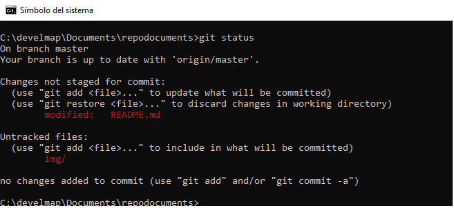
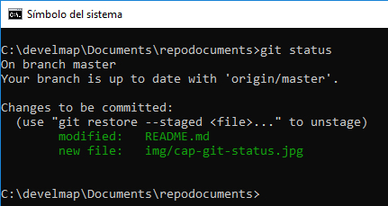
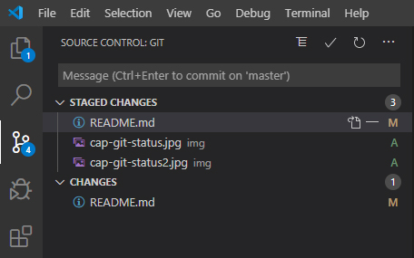
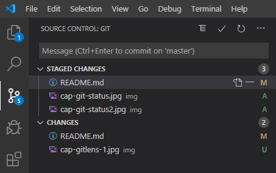
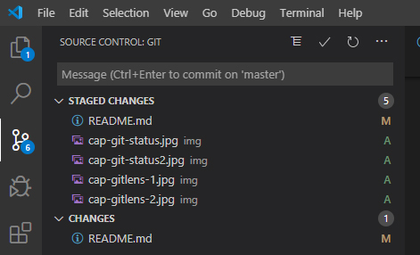
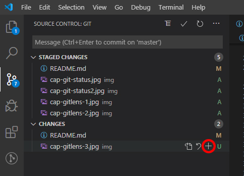

# Repodocuments

## 🚀 Empezando con un repositorio

Creo un repositorio en Github llamado [repodocumentos](https://github.com/e2molin/repodocuments). Lo creo con un fichero **readme.md** por defecto.

Empezamos  a trabajar con a ventana de comandos. Vamos a la carpeta local de Documentos y clonamos el repositorio creado

```bash
git clone https://github.com/e2molin/repodocuments.git
```

Esto nos crea dentro de la carpeta de Documentos una subcarpeta llamada **repodocuments** que contiene el readme.md y repositorio. Entro y modifico el README con algún contenido. Ahora puedo comprobar como está el repositorio con el comando

``` bash
#Añadir un fichero al stage
git status
```

Y en pantalla veremos



Lo que nos dice la salida es que hemos modificado el fichero readme.md del directorio de trabajo, y que hay un directorio que aún no hemos incorporado al repositorio. Para ello utilizamos el comando

``` bash
#Añadir todos los ficheros al stage. Hacer con cuidado para no subir cosas innecesarias. Mejor comprobar antes con un git status
git add .
```
Si ahora volvemos hacer un **git status** obtendremos que los ficheros ya se han incorporado al stage de trabajo



También podíamos haber incorporado un único fichero al índice del repositorio de trabajo, así:

``` bash
#Añadir el fichero cap-git-status2.jpg que se encuentra en la carpeta img
git add img/cap-git-status2.jpg
```

Con la extensión **GitLens** de **Visual Code**, también podemos ver cómo se encuentra nuestro repositorio mediante un interfaz gráfico. En la **imagen 1** veremos que hay ficheros subidos al índice del repo: el fichero readme.md (M:modified) y dos ficheros de imagen, que nuevos (A:added). Debajo aparece nuevamente el fichero readme.md indicándonos que ha cambiado, normal porque estoy continuamente escribiendo en él. En la imagen 2 vemos que al hacer una nueva caprura de pantalla e incorporarla, aparece un nuevo fichero en el apartado *Changes*, pero esta vez nos infica que no está incluido en el repo, ya qu es nuevo (U:untracked).




Para incorporar al stage los dos ficheros sin seguimiento, *untracked*, los añadimos por ejemplo así:

``` bash
#Añadir dos ficheros que se encuentra en la carpeta img
git add img/cap-gitlens-1.jpg
git add img/cap-gitlens-2.jpg
```

Y veremos que los ficheros pasan al modo (A:Added), y son añadidos al índice del repositorio.



También podríamos haber utilizado el interfaz de GitLens, seleciconado el fichero y pulsando el símbolo ➕.



Y por lo tanto poderemos guardarlo como versión en nuestro repositorio local

``` bash
#Hacer un commit al repositorio local con mensaje
git commit -m "first commit"
```

Seguidamente podemos subir nuestro repositorio a GitHub. Para ello tecleamos

``` bash
#Subir nuestro repositorio local (origin) al GitHub, en este caso la rama (branch) master
git push -u origin master
```

Y podemos comprobar que se ha actualizado el repositorio, excepto el fichero readme.md, que se mantiene tal cual estaba en el punto en el que lo añadimos al indice. En el interfaz de GitLens vemos que está en el apartado changes, con el atributo (M:modified), y si hacemos un git status nos aparecerá como modified. Por eso cuando hicimos el *commit*, no se guardó la última versión; tendríamos que haber hecho un *git add* con antelación y después el *commit*.

Aprovechamos este punto para indicar que podemos hacer un *commit* con **GitLens** pulsando el botón del *check* ✔ que aparece arriba. Tenemos que fijarnos que si queremos subir todos los ficheros al repositorio, en el apartado de *Changes* no tiene que haber ningún fichero antes de aplicar el *commit*.
