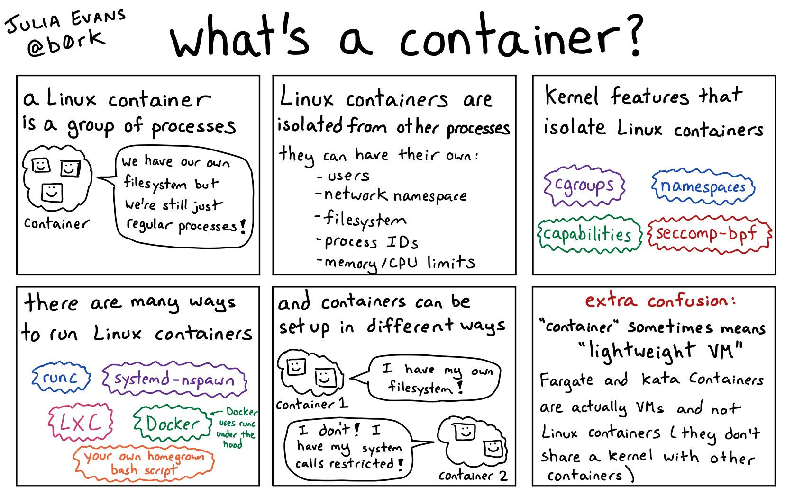

# Desarrollo

## Contenedores Docker 🐋
Esta termino,o gía de *contenedor* proviene del  mundo Linux. En Linux un contenedor es un conjunto de procesos que corren con su propio sistema de ficheros y sus propios procesos. Corren de manera aislada sin afectar al resto del sistema. Pueden tener sus propios usuarios, namespaces, sistemas de ficheros, id de procesos y sus límietes de CPU y memoria.

El kernel de Línex los aisla. Es similar a tener corriendo una máquna virtual ligera, por lo que se les suele llamar también *lightweight VM*. Existen muchos programas que permiten crear y correr contenedores. Uno de ellos es **Docker**.

