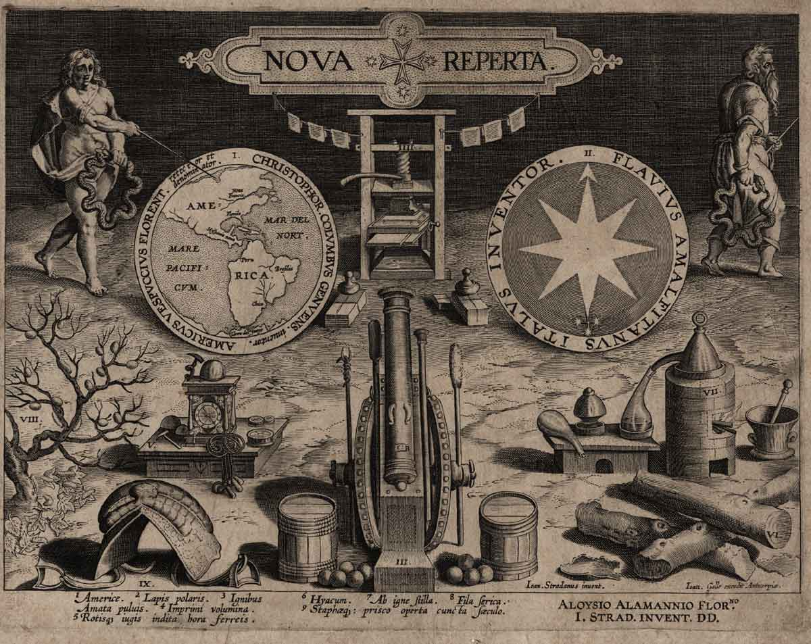

# Imágenes sala de exposiciones: sistemas de impresión
##  Nova Reperta
### Lámina 9: Taller de calcografía

*Grabado a buril. 22x28 cm, ca.1600*

La imagen corresponde al grabado número 19 de la obra *Nova Reperta* del pintor **Jan van der Straet**. Conocido como *Johannes Stradanus* o *Stradano*, nace enla ciudad de Brujas en 1523. Se educa en Flandes aunque su vida profesional se desarrolla íntegramente en Italia, en la Florencia de los Medicis. Ingresa en la **Academia de Bellas Artes de Florencia** en 1563. Muchos de sus diseños fueron reproducidos por algunos de los más prestigiosos grabadores de su tiempo: Adrien y Hans Collaert, Philip Galle o Pieter Jalhea Furnius.

La obra *Nova Reperta* se compone de veinticuatro grabados. Se trata de un compendio de los principales avances de la época: el descubrimiento de América, la invención de la imprenta, el grabado en cobre, la pintura al óleo, las gafas, la silla de montar, la pólvora, la brújula, el reloj, la destilación, la producción de seda, los molinos de agua y viento, la prensa de aceite, la invención de las gafas, el pulido de las armaduras o el astrolabio.

La lámina que representa el invento del grabado en metal, también llamado grabado en hueco, buril, talla dulce o calcografía. Esta técnica fue inventada, según el historiador **Giorgio Vasari**, por el orfebre florentino **Tomasso Finiguera** (1426-1464).

La lámina reproduce un taller calcográfico, en el que se representan las distintas fases de las que consta esta novedosa técnica de reproducción. A la izquierda de la composición, aparece un hombre con gafas grabando una plancha de cobre, sujetándola de forma inclinada para captar mejor la luz, junto a dos aprendices; sobre la mesa se ilustran algunos útiles para grabar, como cinceles y buriles de diferentes tamaños. En el centro del taller, un operario prepara la lámina para su impresión, calentándola para conseguir un óptimo entintado; en la misma mesa, otro artesano aplica la tinta a la matriz mediante el uso de un tampón. A la izquierda de la imagen, se representa el proceso de impresión, en el que el impresor se prepara para colocar la lámina sobre una hoja de papel humedecido que hará pasar bajo el rodillo del tórculo. El papel absorberá la tinta de la plancha, quedando estampada la imagen. Al fundo se muestran estampaciones ya terminadas, colgadas de la pared mediante unas cuerdas.

En la parte inferior figura una leyenda en latín:

 > SCULTURA IN AES. Sculptor noua arte, bracteata in lamina / Sculpit figuras, atque prelis imprimit

##  Atelier d’imprimerie
### Atelier d’imprimerie gravure sur bois par Abraham Van Werdt

La imagen muestra un grabado en madera de **Abraham von Werdt** (1594-1671), que ilustra la actividad en un taller de impresión del siglo XVII.

En la esquina inferior izquierda, aparece un personaje arrodillado junto a pliegos de papel. Se trata de un **almacenero**, que es el encargado de preparar las pilas de papel, de entregarlas a los impresores y del secado y alzado de los pliegos impresos.

Al fondo aparecen los **cajistas**, operarios especializados, encargados de la composición. El cajista contaban letras, hacía los cálculos de los tipos que entraban en cada línea y establecía el número de páginas del libro, el número de planas y de hojas de papel necesarias. Además del trabajo técnico conocía el uso correcto de la ortografía de las lenguas en las que era capaz de componer.

En primer término aparecen dos personajes fundamentales en una imprenta, el batidor y el tirador. El **batidor** se encarga  del entintado de las formas. El **tirador** es el operario encargado de la correcta colocación del papel y de dar el golpe de barra.

## ⛲ Fuentes

* [Université de Liège (Belgique) - Collections artistiques](http://www.wittert.ulg.ac.be/fr/flori/opera/vanderstraet/vanderstraet_reperta.html)
* [Wikipedia. Grabado a buril](https://es.wikipedia.org/wiki/Grabado_a_buril)
* [Museum für Druckkunst, Leipzig](https://www.druckkunst-museum.de/en/)

