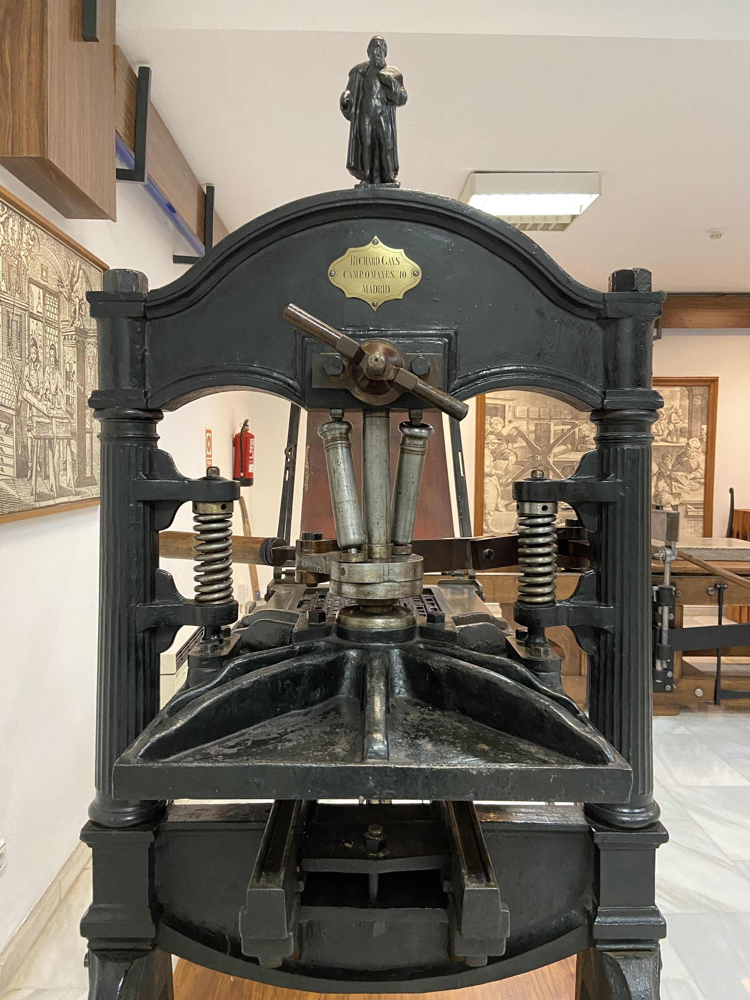
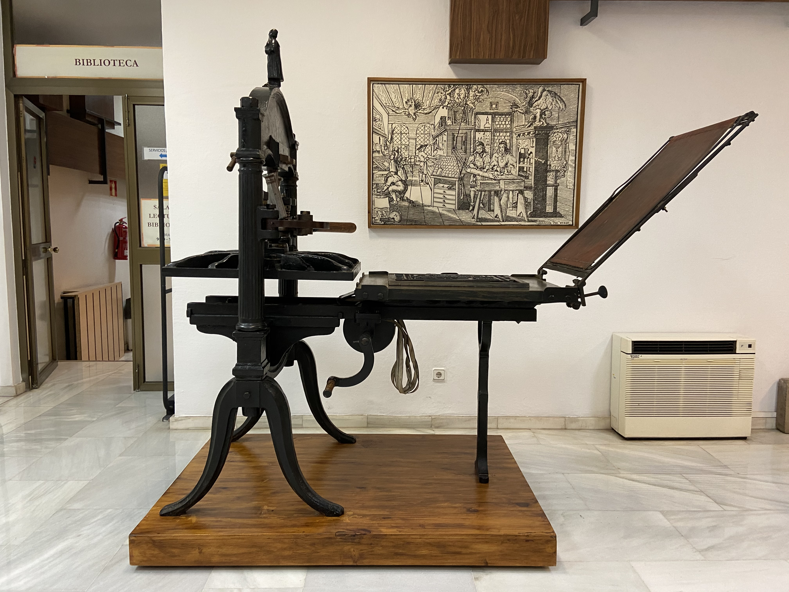
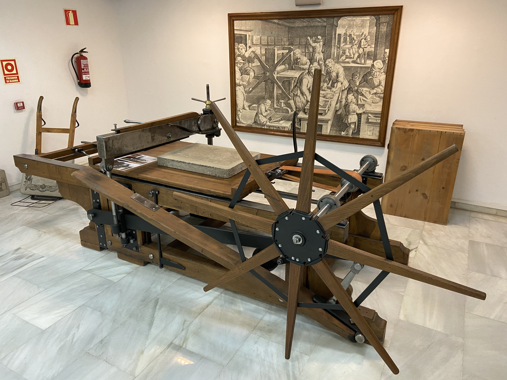
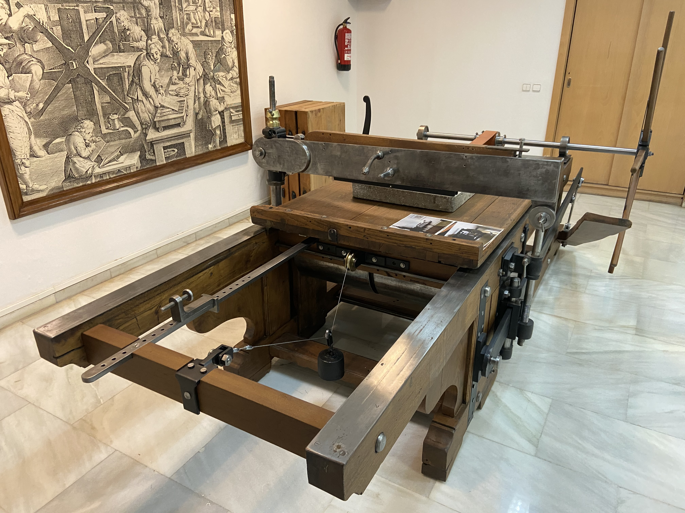
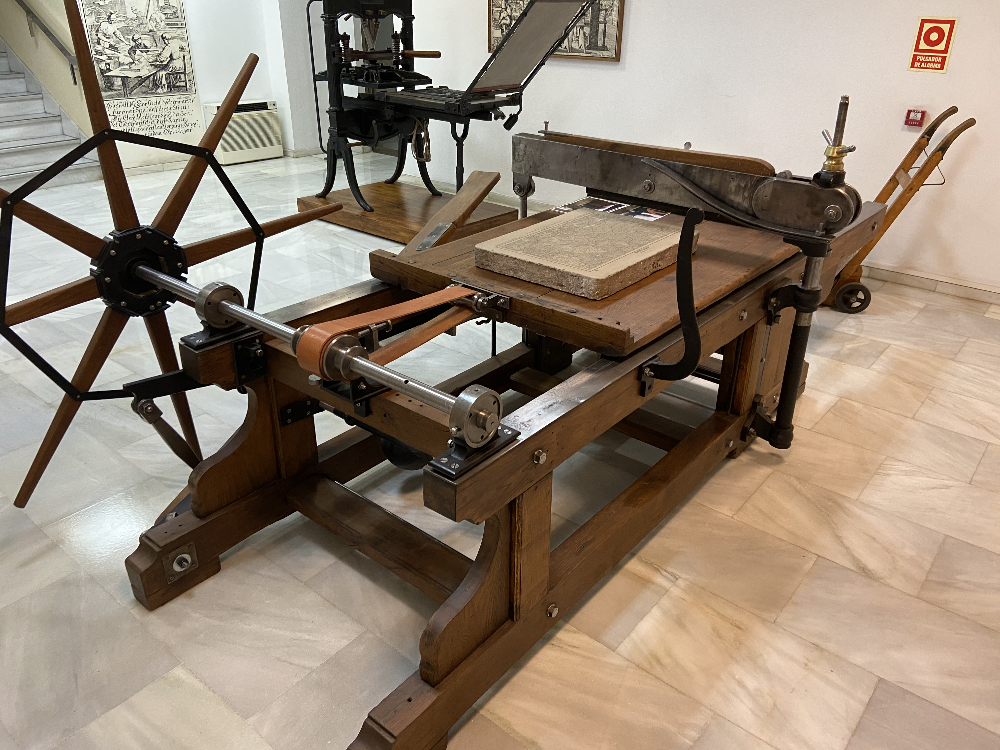
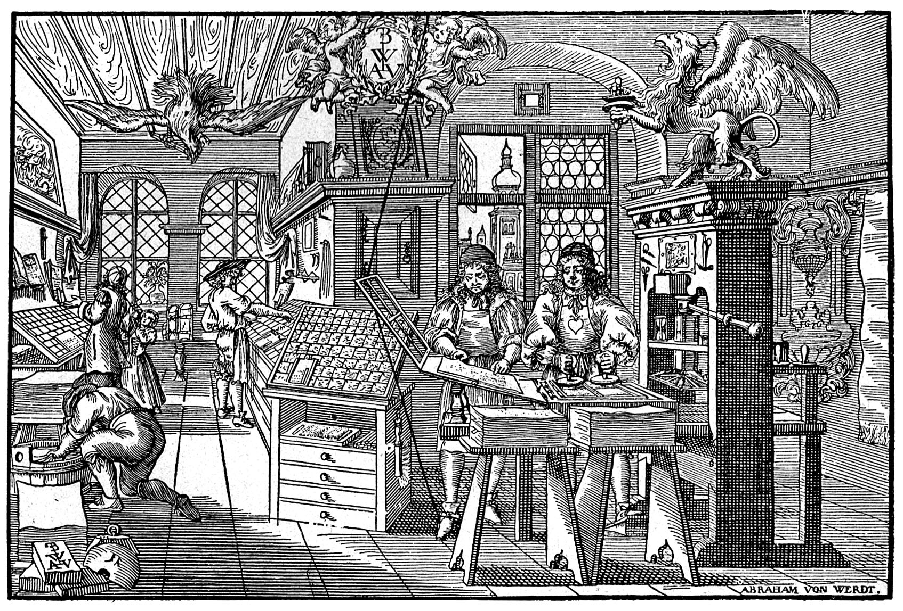

# Imágenes sala de exposiciones: sistemas de impresión

* 👈🏻Prensa tipo Krause de ca.1860
* 👉🏻Prensa tipo Brisset de ca.1865

Ubicación: planta sótano del Edificio A

## ⚙️ Prensa de imprimir **Krause**

Las prensas de imprimir apenas sufrieron mejoras desde su invención hasta el siglo XIX. Su construcción seguía siendo de madera y sus componentes apenas variaron. **Stanhope** construye a principios del siglo XIX la primera prensa en hierro. En esta presa fabricada por **Krause** en Alemania, incorpora algunas mejoras como la desaparición del husillo roscado, que se sustituye por un sistema articulado y unos muelles para el retorno de la pletina. La tirada aumentaba de velocidad y el hierro aportama mayor robustez. Estas máquinas cada vez fueron siendo sustituídas por las nuevas prensas plano cilíndricas y las minervas. Su utilidad hoy en día se reduce a artistas que realizan estampados xilográficos o linóleos.

Esta prensa fue importada por **Richard Gans**, una empresa importadora de mecanismos de impresión activa en Madrid entre 1888 y 1975. Comenzó su actividad en un local de la calle Campomanes número 10, en 1881, y se traslada a Princesa en 1886. Esto nos permite datar en este periodo el aparato.

Vista frontal             |  Vista lateral
:-------------------------:|:-------------------------:
  |  

## ⚙️ Prensa de imprimir **Brisset**

El grabado en hueco o calcografía existe desde el siglo XV, y permitñia reproducir dibujos grabados sobre una plancha de cobre, estampándose sobre el papel mediante un tórculo o prensa que le aplicaba una gran presión. El problema es que esta gran presión acababa deteriorando la plancha, por lo que el número de ejemplares de cada tirada era bastante escaso. El alemán nacido en Praga **Aloys Senefelder** (1771-1834) fue el creador de la litografía en 1796. Su nueva técnica consistía en dibujar con trazos grasos sobre una piedra caliza muy pulida. Despúes se humedecía la piedra, reteniendo sólo la humedad de las zonas no dibujadas. Luego se aplicaba tinta, que sólo permanecía en las zonas no húmedas. La presión necesaria para la estampación era mucho menor, lo unido al material de la piedra ayudaba a que se pudieran realizar grandes tiradas. Las primeras piedras litográficas aparecieron en Rotterdam en 1809.

A esta prensa se la conocía como *bête à cornes*, la *bestia con cuernos*. Fue inventada por Eugène Brisset en 1865 en sus talleres de Paris. Tuvo una gran importancia para introducir la cromolitografía a mediados de siglo, la utilización de varias piedras, aportando cada una de ellas un color distinto.

Vista frontal           | Vista lateral
:-----------------------|:-------------------------:
  |  
Vista Posterior         |  Piedra litográfica
  |  

## 🎨 Nova Reperta
### Lámina 9: Taller de calcografía

🖼️*Grabado a buril. 22x28 cm, ca.1600*

La imagen corresponde al grabado número 19 de la obra *Nova Reperta* del pintor **Jan van der Straet**. Conocido como *Johannes Stradanus* o *Stradano*, nace enla ciudad de Brujas en 1523. Se educa en Flandes aunque su vida profesional se desarrolla íntegramente en Italia, en la Florencia de los Medicis. Ingresa en la **Academia de Bellas Artes de Florencia** en 1563. Muchos de sus diseños fueron reproducidos por algunos de los más prestigiosos grabadores de su tiempo: Adrien y Hans Collaert, Philip Galle o Pieter Jalhea Furnius.

La obra *Nova Reperta* se compone de veinticuatro grabados. Se trata de un compendio de los principales avances de la época: el descubrimiento de América, la invención de la imprenta, el grabado en cobre, la pintura al óleo, las gafas, la silla de montar, la pólvora, la brújula, el reloj, la destilación, la producción de seda, los molinos de agua y viento, la prensa de aceite, la invención de las gafas, el pulido de las armaduras o el astrolabio.

La lámina que representa el invento del grabado en metal, también llamado grabado en hueco, buril, talla dulce o calcografía. Esta técnica fue inventada, según el historiador **Giorgio Vasari**, por el orfebre florentino **Tomasso Finiguera** (1426-1464).

La lámina reproduce un taller calcográfico, en el que se representan las distintas fases de las que consta esta novedosa técnica de reproducción. A la izquierda de la composición, aparece un hombre con gafas grabando una plancha de cobre, sujetándola de forma inclinada para captar mejor la luz, junto a dos aprendices; sobre la mesa se ilustran algunos útiles para grabar, como cinceles y buriles de diferentes tamaños. En el centro del taller, un operario prepara la lámina para su impresión, calentándola para conseguir un óptimo entintado; en la misma mesa, otro artesano aplica la tinta a la matriz mediante el uso de un tampón. A la izquierda de la imagen, se representa el proceso de impresión, en el que el impresor se prepara para colocar la lámina sobre una hoja de papel humedecido que hará pasar bajo el rodillo del tórculo. El papel absorberá la tinta de la plancha, quedando estampada la imagen. Al fondo se muestran estampaciones ya terminadas, colgadas de la pared mediante unas cuerdas.

En la parte inferior figura una leyenda en latín:

 > SCULTURA IN AES. Sculptor noua arte, bracteata in lamina / Sculpit figuras, atque prelis imprimit

## 🎨 Atelier d’imprimerie
### Atelier d’imprimerie gravure sur bois par Abraham Van Werdt

🖼️*Grabado en madera, ca.1639*

La imagen muestra un grabado en madera de **Abraham von Werdt** (1594-1671), que ilustra la actividad en un taller de impresión del siglo XVII. En la parte superior derecha aparece un grifo sujetando entre sus garras un tintero, y a la izquierda eun ave fénix. El gremio de impresores alemanes solía adoptar como emblemas animales fantásticos. En el centro dos *putti* sujetan el escudo con las iniciales del autor. **Abraham von Werdt** fue un grabador de origen holandés que trabajó en la ciudad de Nuremberg

En la esquina inferior izquierda, aparece un personaje arrodillado junto a pliegos de papel. Se trata de un **almacenero**, que es el encargado de preparar las pilas de papel, de entregarlas a los impresores y del secado y alzado de los pliegos impresos.

Al fondo aparecen los **cajistas**, operarios especializados, encargados de la composición. El cajista contaba las letras, hacía los cálculos de los tipos que entraban en cada línea y establecía el número de páginas del libro, el número de planas y de hojas de papel necesarias. Además del trabajo técnico conocía el uso correcto de la ortografía de las lenguas en las que era capaz de componer. Llama la atención la cantidad de espacio destinado al almacenamiento de los tipos.

Los tipos se almacenaban en las llamadas cajas tipográficas. Los tipos de caja alta (mayúsculas) se guardaban en la parte superior, mientras que las minúsculas se situaban en la inferior. De ahí viene el nombre inglés para las mayúsculas, *uppercase*, y para las minúsculas, *lowercase*.

En primer término aparecen dos personajes fundamentales en una imprenta, el batidor y el tirador. El **batidor** se encarga  del entintado de las formas, humedeciéndolas con una especie de tampones llamados balas. El **tirador** es el operario encargado de la correcta colocación del papel sobre el tímpano, bajar la frasqueta y de dar el golpe de barra.

## ⛲ Fuentes

* 👨‍🎓 [Université de Liège (Belgique) - Collections artistiques](http://www.wittert.ulg.ac.be/fr/flori/opera/vanderstraet/vanderstraet_reperta.html)
* 🏛️ [Museum für Druckkunst, Leipzig](https://www.druckkunst-museum.de/en/)
* 🏛️ [Dutch Museum of Lithography, Valkenswaard, Países Bajos](http://www.steendrukmuseum.nl/en)
* 🏛️ [Museum Plantin Moretus, Antwerp, Bélgica](https://www.museumplantinmoretus.be/en)
* 📚 [Wikipedia. Grabado a buril](https://es.wikipedia.org/wiki/Grabado_a_buril)
* 📚 [Wikipedia. Imprenta y fundición tipográfica Richard Gans](https://es.wikipedia.org/wiki/Imprenta_y_fundici%C3%B3n_tipogr%C3%A1fica_Richard_Gans)
* 📚 [Wikipedia. Aloys Senefelder](https://es.wikipedia.org/wiki/Aloys_Senefelder)

