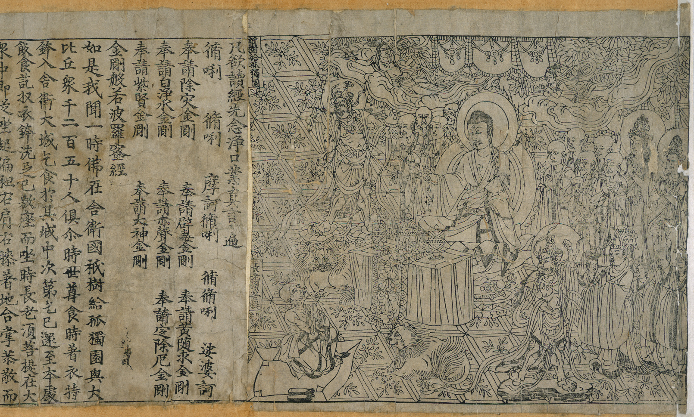

# La impresión de libros

## Guttenberg

Consideramos a la imprenta el motor de la primera revolución cultural de Europa. El orfebre alemán Johannes Gutenberg inventó los primeros tipos móviles, unos moldes en madera con las letras del alfabeto. Posteriormente los rellenó con plomo y mediante una prensa permitía estampara gran velocidad los textos escritos. Se arruinó intentando sacar a delante su primer proyecto, la impresión de 150 Biblias, de las que han llegado a nuestros días sólo 48. En España hay dos: una entera en la Biblioteca Pública Provincial de Burgos y otra, sólo el Nuevo Testamento, en la Biblioteca Universitaria y Provincial de Sevilla.

## La imprenta en China
El libro más impreso más antiguo que se conoce es **El sutra del diamante** del año 868, noveno año de la era Xiantong de la dinastía Tang. Su autor fue **Wang Chieh** que talló en unos bloques de madera invertidos y en relieve los textos e ilustraciones del libro. Después los entintó con pintura y agua y los estampó en papel. 

Se trata de una impresión del **Lotus Sutra**, cuyo nombre en sánscrito es *Saddharma Puṇḍarīka Sūtra* y sus primeros ejemplares manuscritos datan del primer siglo antes de Cristo. Narra las últimas enseñanzas de Buda para obtrener la salvación. Es uno de los escritos más influyentes del *Mahāyāna*, una de las dos ramas del Budismo junto con el * Theravada*, y tiene una gran cantidad de seguidores en Asia, incluyendo China, Corea y Japón.

El documento fue encontrado en las *Cuevas de los Mil Budas*, un centro religioso budista, cerca de Dunhuang, una ciudad oasis en un cruce de caminos de la Ruta de la Seda. Un monje budista, Wang Yuanlu descubrió una cámara sellada con decenas de miles de documentos, entre ellos este primer documento impreso. Se trata de un rollo horizontal de casi cinco metros.

En el año 1041 otro impresor chino, **Phi Sheng**, inventó unos tipos móviles en porcelana con caracteres chinos, aunque dada la enorme cantidad de ideogramas y caracteres chinos el innventó no terminó de triunfar.

***

## Referencias
* Descripción en la página de la British Library [aquí](https://www.bl.uk/collection-items/the-diamond-sutra)

## Sguir investigando
* https://www.unaventanadesdemadrid.com/madrid/imprenta-municipal.html

