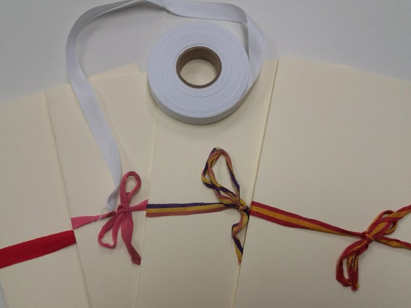

# Conceptos

## Balduque

El **balduque** es la cinta plana, de seda, lino o algodón, que se usa para enlegajar documentación, esto es, con la que se envuelven los expedientes formando legajos. Su origen está en la ciudad neerlandesa de Bolduque, Bois-le-Duc o Hertogenbosch, que era el lugar en el que se fabricaba esta cinta. En un principio su color era rojo, pero en nuestros archivos también conservamos balduque de otros colores, la bandera republicana, la bandera de España...

Actualmente son todos blancos por motivos de preservación, ya que la cinta blanca no destiñe y no transmite color a la documentación. Los ingleses acuñaron el concepto *red tape* para referirse a las cinta roja que envuelve un paquete de documentación de especial importancia.