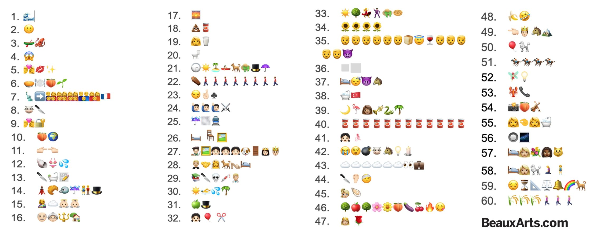

# Emoji y Pintura

[Fuente](https://www.beauxarts.com/lifestyle/600-ans-dhistoire-de-lart-en-emojis-a-dechiffrer/)

1. La Grande Vague de Kanagawa, Hokusai, 1830–1831 – 1 point

2. La Joconde, Léonard de Vinci, 1503–1509 – 1 point

3. Le Radeau de la Méduse, Théodore Géricault, 1818–1819 – 2 points

4. Le Cri, Edvard Munch, 1893 – 1 point

5. Le Baiser, Gustav Klimt, 1908–1909 – 2 points

6. Le Déjeuner sur l’herbe, Edouard Manet, 1863 – 1 point

7. La Liberté guidant le peuple, Eugène Delacroix, 1830 – 2 points

8. Le Bœuf écorché, Rembrandt, 1655 – 3 points

9. Le Verrou, Honoré Fragonard, 1777 – 2 points

10. L’Origine du monde, Gustave Courbet, 1866 – 3 points

11. La Création d’Adam (chapelle Sixtine), Michel-Ange, 1508–1512 – 1 point

12. La Naissance de Vénus, Sandro Botticelli, 1484–1485 – 2 points

13. La Mort de Marat, Jacques-Louis David, 1793 – 2 points

14. Rue de Paris, temps de pluie, Gustave Caillebotte, 1877 – 3 points

15. La Madone Sixtine, Raphaël, 1512–1513 – 2 points

16. American Gothic, Grant Wood, 1930 – 1 point

17. Impression, soleil levant, 1874 – 1 point

18. La Merda d’artista (Merde d’artiste), Piero Manzoni, 1961 – 3 points

19. La Laitière, Johannes Vermeer, vers 1658 – 2 points

20. Fontaine, Marcel Duchamp, 1917 – 2 points

21. Un dimanche après-midi à l’Île de la Grande Jatte, Georges Seurat, 1884–1886 – 3 points

22. Un enterrement à Ornans, Gustave Courbet, 1849–1850 – 2 points

23. Le Tricheur à l’as de trèfle (une version existe aussi avec l’as de carreau), Georges de La Tour, vers 1632 – 2 points

24. Le Serment des Horaces, Jacques-Louis David, 1785 – 3 points

25. Pluie, vapeur, vitesse, J.M. William Turner, 1844 – 3 points

26. La Chambre de Van Gogh à Arles, Vincent Van Gogh, 1888 – 2 points

27. Les Ménines, Diego Vélasquez, 1656 – 3 points

28. Les Époux Arnolfini, Jan van Eyck, 1434 – 3 points

29. La Leçon d’anatomie du docteur Tulp, Rembrandt, 1632 – 2 points

30. A Bigger splash, David Hockney, 1967 – 2 points

31. Le Fils de l’homme, René Magritte, 1964 – 1 point

32. Girl with ballon (Petite fille au ballon), Banksy, 2002 – 2 points

33. Le Bal du moulin de la galette, Auguste Renoir, 1876 – 3 points

34. Les Tournesols, Vincent Van Gogh, 1888 — 1 point

35. La Cène, Léonard de Vinci, 1495–1498 – 2 points

36. Carré blanc sur fond blanc, Kazimir Malévitch, 1918 – 2 points

37. Le Cauchemar, Johann Heinrich Füssli, 1781 – 3 points

38. Le Bain turc, Jean-Auguste-Dominique Ingres, 1863 – 2 points

39. La Charmeuse de serpents, Henri Rousseau, 1907 – 2 points

40. Campbell’s Soup Cans (Boîtes de soupe Campbell), Andy Warhol, 1962 – 1 point

41. La Petite danseuse de quatorze ans (dite la Petite danseuse), Edgar Degas, 1875–1880 – 2 points

42. Guernica, Pablo Picasso, 1937 – 3 points

43. Le Voyageur contemplant une mer de nuages, Caspar David Friedrich, 1818 – 3 points

44. Autoportrait à l’oreille bandée, Vincent Van Gogh, 1889 – 2 points

45. La Jeune fille à la perle, Johannes Vermeer, vers 1665 – 2 points

46. Le Jardin des délices, Jérôme Bosch, 1503–1515 – 3 points

47. Portrait de Marie-Antoinette à la rose, Elisabeth Vigée Le Brun, 1783 – 2 points

48. Comedian (Humoriste) (dite la banane scotchée), Maurizio Cattelan, 2019 – 2 points

49. Bonaparte franchissant le Grand-Saint-Bernard, Jacques-Louis-David, 1801 – 3 points

50. Balloon dog, Jeff Koons, 1994–2000 – 2 points

51. Le Derby d’Epsom, Théodore Géricault, 1821 – 3 points

52. La Fée électricité, Raoul Dufy, 1937 – 2 points

53. Le Téléphone aphrodisiaque ou Le Téléphone Homard, Salvador Dalí, 1936 – 1 point

54. Le Violon d’Ingres, Man Ray, 1924 – 3 points

55. Gabrielle d’Estrées et sa soeur la duchesse de Villars, école de Fontainebleau, vers 1594 – 3 points

56. La Ronde de nuit, Rembrandt, 1642 – 2 points

57. Olympia, Édouard Manet, 1863 – 3 points

58. La Vénus d’Urbin, Titien, 1538 – 3 points

59. La Mélancolie, Albrecht Dürer, 1514 – 3 points

60. Des Glaneuses, Jean-François Millet, 1857 – 2 points