# Los mapas del Barroco

Fuente: https://library.harvard.edu/onlineexhibits/baroque/introduction.html

La principal utilidad de un mapa es la de representar un nterritorio o la de ubicarnos en el espacio con el objetivo de encontrar el camino hacia nuestro destino. Pero esta quizás esta es una visión muy actual del mapa. Los mapas siempre han sido un medio de comunicación para transmitir mensajes más o menos encubiertos de multitud de formas. 

La cartografía elaborada durante la segunda mitad del siglo XVII y primera mitad del XVIII reflejan en su composición el movimiento artístico predominante en esta época, el **Barroco**. El Barroco surgió como una reacción a las estrictas normas clásicas del Renacimiento; en las artes plásticas, el Barroco se caracterizó por el gusto por la complicación formal, las formas curvas y la abundancia de adornos. En la cartografía, el gran nivel de detalle de la escuela holandesa  permite a los mapas la adopción de las características principales de este movimiento.

## Nova Orbis Tabula in Lucem Edita - Frederick de Wit, 1670

Este es uno de los más atractivos mapas de Frederick De Wit, donde se muestra claramente la importancia de la ornamentación para acompañar a la cartografía. Es una muestra del *horror vacui*, miedo al vacío, a dejar zonas sin decorar. 

La profusión de decoración también era un recurso para elevar el precio de las obras, ya que estas representaciones generalmente iban acompañadas de la utilización de materiales como el pan de oro o caros pigmentos como el color azul, que luego justificaban el precio al que se vendían los mapas a los clientes finales.

Frederick de Wit nace en Guda cerca de 1629 aunque toda su carrera profesional la ejerce en Amsterdam. Su imprenta llamada *The Three Crabs* pasa a llamerse posteriormente *The White Chart*. A partir de la década de 1660 elabora principalmente atlas y mapas de ciudades holandesas. A su muerte su mujer María continúa con el negocio, pero ante el escaso interés de su hiojo la emrpesa acaba cerrando. Sus planchas son adquirida por Pierre Mortier, que durante el sglo XVIII se convertiría en la firma Covens & Mortier, una de las imprentas cartográficas más exitosas.

Los mapas de los casquetes polares se muestran sobre y bajo las esferas, aprovechando el espacio disponible al máximo.

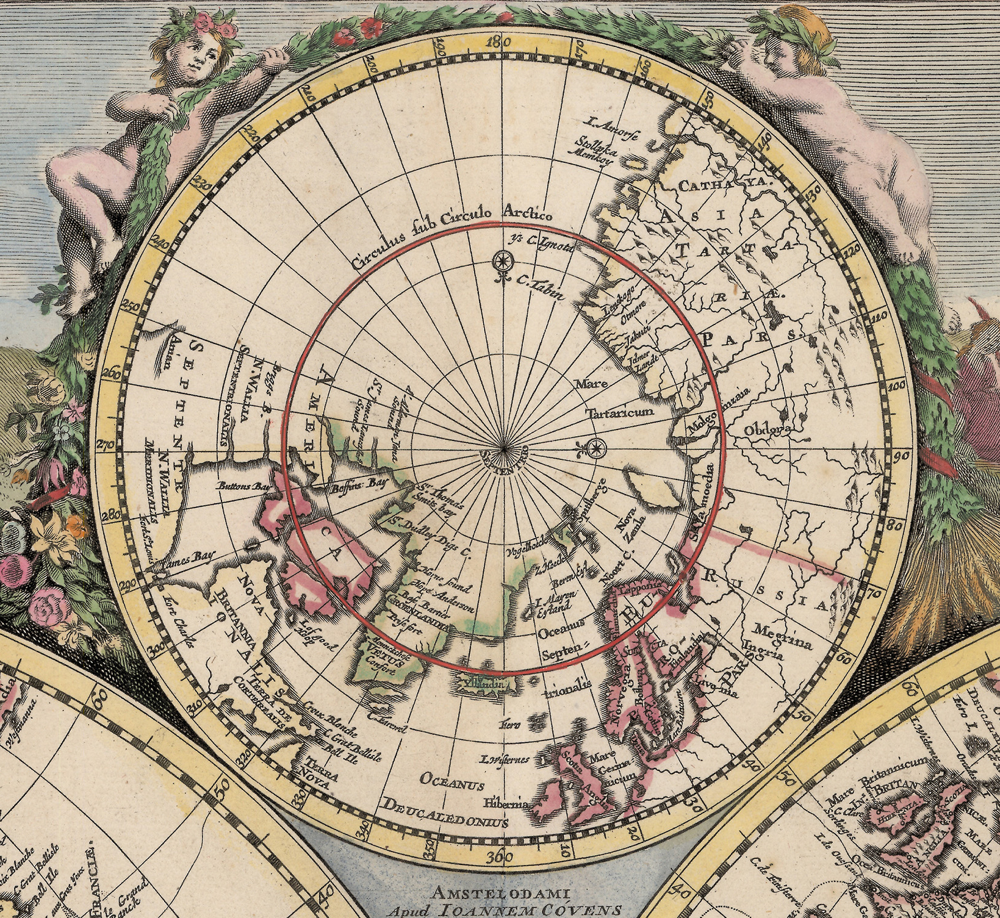
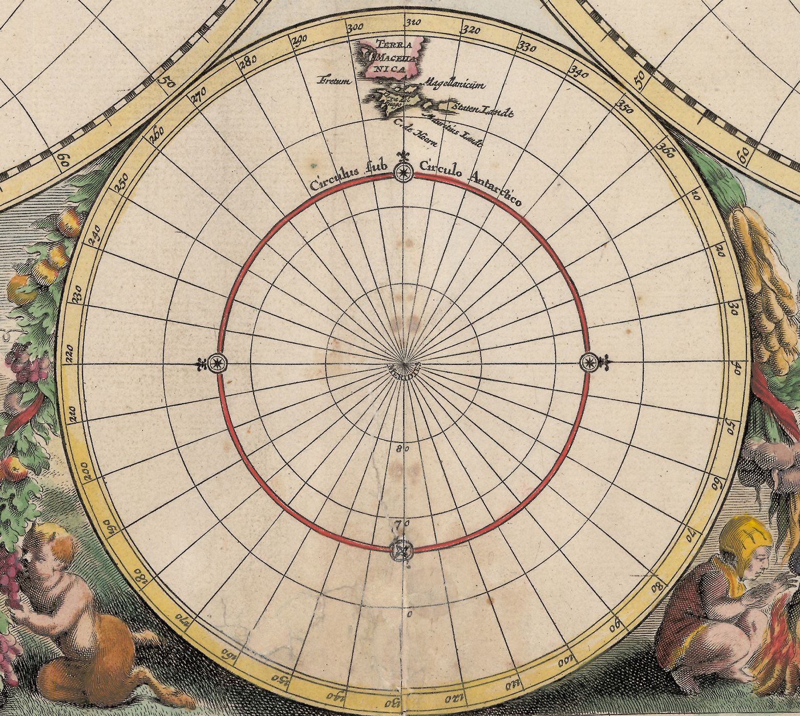

En las cuatro esquinas figuran las cuatro estaciones con sus respectivas tareas agrícolas y en la que se observan los signos del Zodíaco.

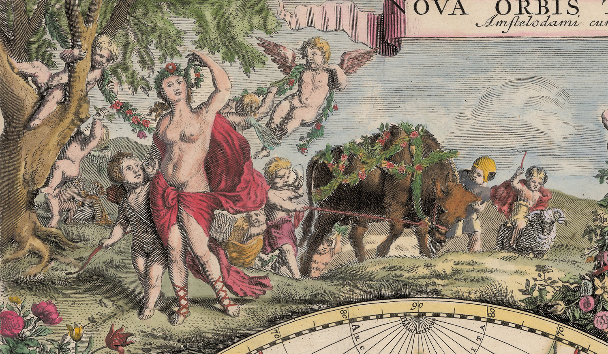
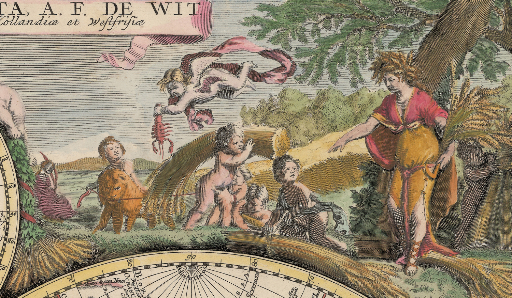
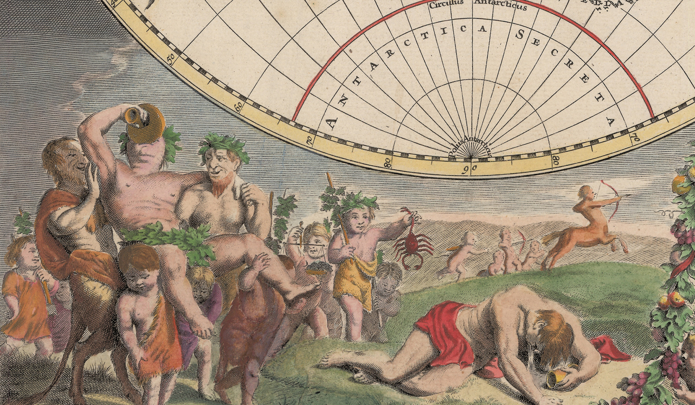
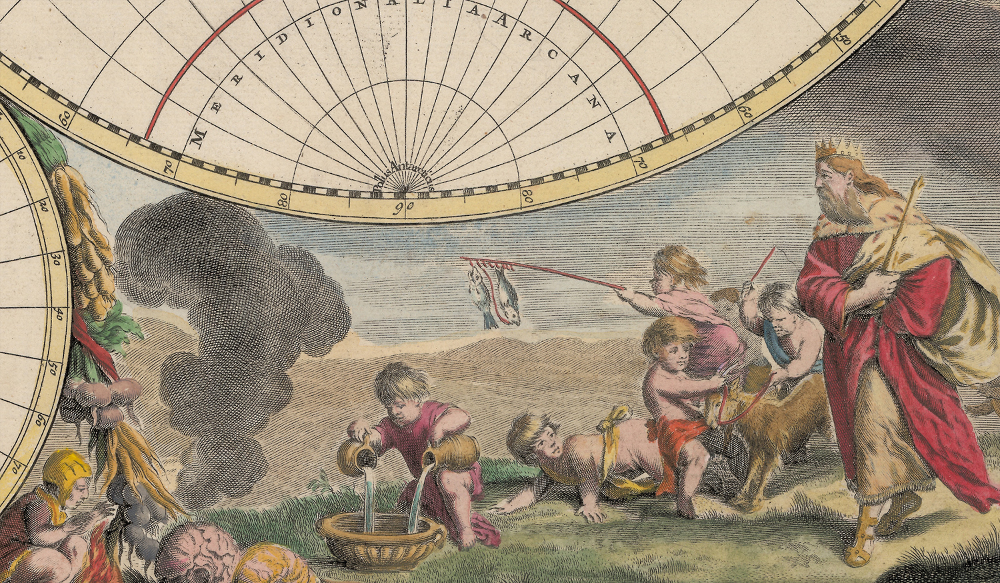

## Novissima totius terrarum orbis tabula - Visscher, 1690
Mapa del mundo del doble hemisferio. Los cartógrafos aprovechaban los espacios curvos marginales en las secciones centrales de la hoja con la inclusión de cartas celestes y proyecciones polares. Los márgenes laterales y esquinas podrían servir de escenario para ilustrar temas religiosos, cosmológicos o astrológicos. Las áreas periféricas de este mapa de doble hemisferio de Visscher están adornadas con estaciones personificadas y los signos zodiacales que las acompañan: Aries, Tauro y Géminis (primavera); Cáncer, Leo, Virgo (verano); Libra, Escorpio y Sagitario (otoño); y Capricornio, Acuario y Piscis (invierno). Las dos figuras en la intersección de los hemisferios representan el triunfo del cristianismo sobre la idolatría pagana.

_A double hemisphere world map invites graphic embellishments that take advantage of the sheet’s marginal curved spaces. Designers often responded to this challenge by including celestial charts or polar projections in the central sections. The other margins could serve as the arena for illustrating religious, cosmological, or astrological themes. The peripheral areas of this double hemisphere map by Visscher are adorned with personified seasons and their accompanying zodiacal signs: Aries, Taurus, and Gemini (spring) ; Cancer, Leo, Virgo (summer) ; Libra, Scorpio, and Sagittarius (autumn) ; and Capricorn, Aquarius, and Pisces (winter). The two figures at the intersection of the hemispheres represent the triumph of Christianity over pagan idolatry._

[Ver mapa completo](https://iiif.lib.harvard.edu/manifests/view/ids:24508170 "Novissima totius terrarum orbis tabula - Visscher, 1690")

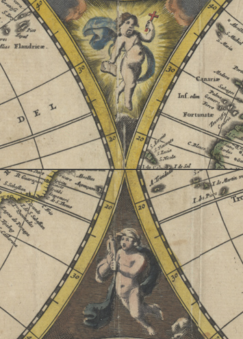

## Le Globe Terrestre representé en deux plans-hemispheresMapa - Nolin, 1767

Además de mostrar los recientes descubrimientos y expediciones, que cita según la leyenda _habiles pilotes et savans voyageurs._, Nolin utiliza su mapa del mundo para incluir una narrativa bíblica que se remonta a los orígenes del universo. Los márgenes a ambos lados de los hemisferios representan los seis días de la Creación (antes de que Dios tomara un día de descanso), con las cuatro estaciones personificadas en la base de los hemisferios ayudando a la precesión de los equinoccios. Los márgenes exteriores retoman la historia con más episodios del Libro de Génesis: el Jardín del Edén, Adán y Eva, Caín y Abel, la progenie de Set y Caín, la muerte de Adán a la edad de 930 y el Arca de Noé. Los paneles narrativos concluyen con el agradecimiento después de que el Arca se asentó en el Monte Ararat (destacado en el mapa al suroeste del Mar Negro).

_Nolin’s world map offers much more than a compilation of recent discoveries and observations of “habiles pilotes et savans voyageurs.” It presents that map in the context of a biblical narrative stretching back to the beginnings of the universe. The margins beyond the double hemispheres portray the six days of creations (before God took a day a rest), with the personified four seasons at the base of the hemispheres assisting the precession of the equinoxes. The outer margins take up the story with further episodes from the Book of Genesis—the Garden of Eden, Adam and Eve, Cain and Abel, the progeny of Seth and Cain, the death of Adam at the age of 930, and Noah’s Ark. The narrative panels conclude with the giving of thanks after the Ark settled atop Mount Ararat (prominently featured on the map southwest of the Black Sea)._

[Ver mapa completo](https://iiif.lib.harvard.edu/manifests/view/ids:10977366 "Le Globe Terrestre representé en deux plans-hemispheresMapa - Nolin, 1767")

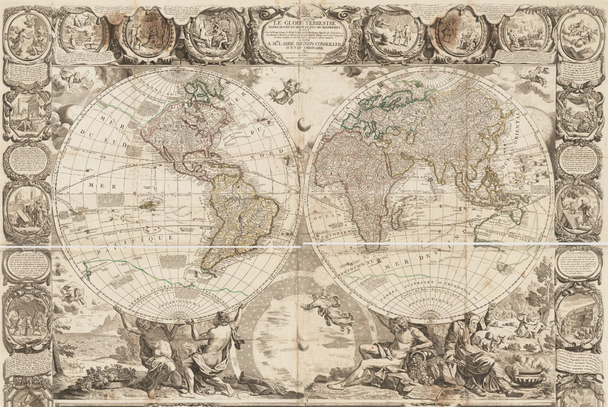
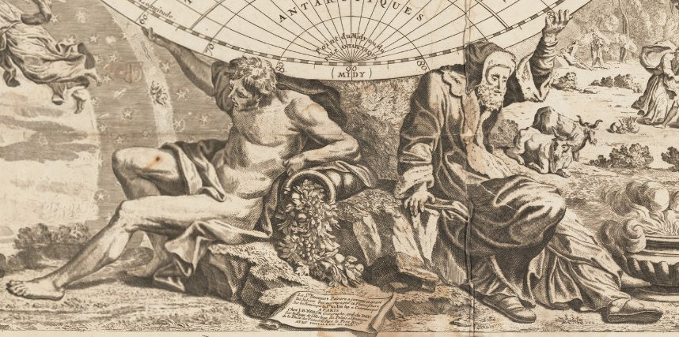
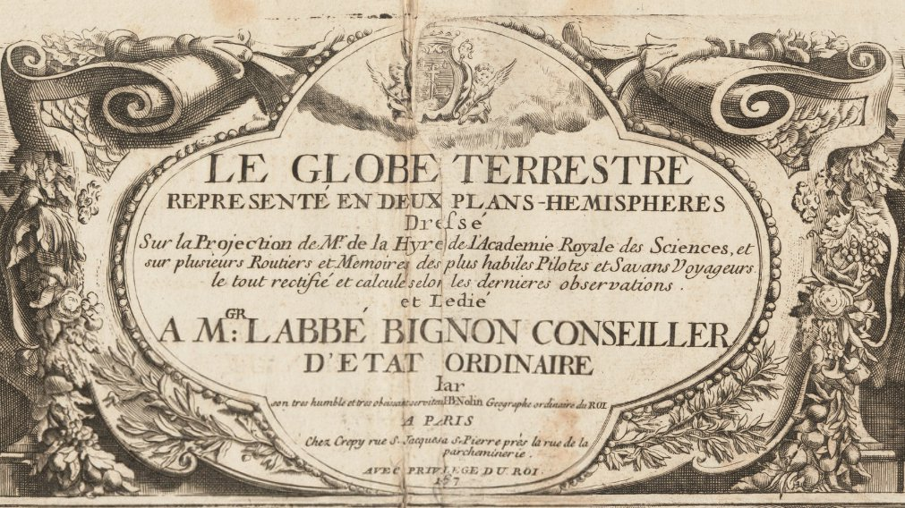

## Americae Nova decriptio - Visscher, 1652

Este mapa corresponde al sexto estado de plancha del mapa de 1614 de **Pieter van der Keere** con el mismo título. Las vistas y las figuras fuero trazadas a partir de las ilustraciones de Theodore de Bry obtenidas de sus conversaciones con viajeros al Nuevo Mundo. En los bordes del mapa figuran exploradores como Colón, Magallanes, Drake, Cavendish y Olivier van Noort. En la parte superior figuran vistas de ciudades como Cuzco o Ciudad de México, mientras que en los laterales se muestran personas con rasgos y vestimentas autóctonos de varias zonas.

**Nicolaes Visscher I** fue cartógrafo, grabador y editor. Hijo de **Claes Janszoon Visscher**, su hijo **Nicolaes Visscher II**  continuó el negocio familiar.

[Ver mapa completo](https://iiif.lib.harvard.edu/manifests/view/ids:24508172 "Americae Nova decriptio - Visscher, 1652")

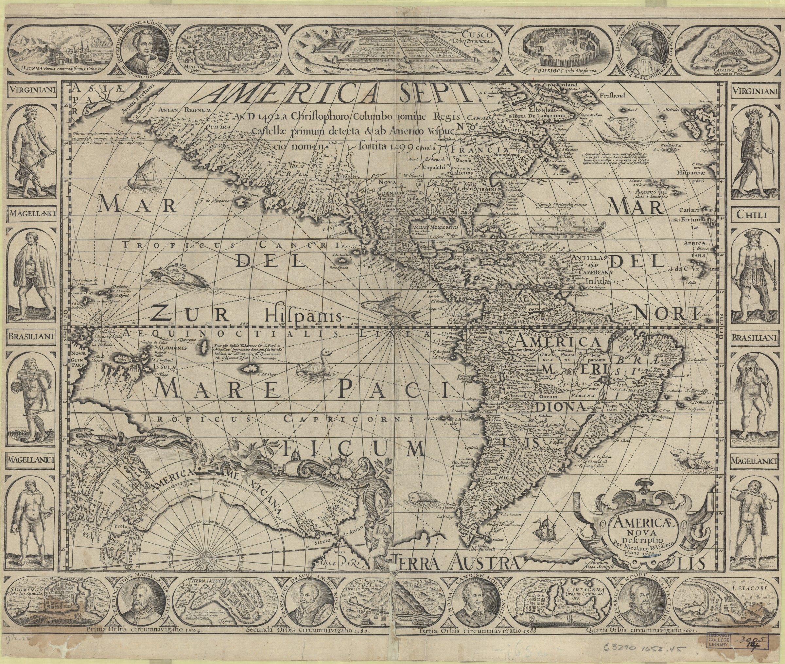

## Carte de la Mer du Sud et de la Mer du Nord - De Fer, 1713

Este mapa de **Nicolás de Fer** dispone de una extensa imaginería. El mapa muestra los recursos coloniales a explotar, el choque cultural (entre pueblos con ritos y tradiciones muy distintos). Las viñetas decorativas están adaptadas de ilustraciones en varios relatos de los primeros encuentros europeos en el Nuevo Mundo. **Nicolas Guerard** es responsable de los dos diseños destacados en la parte norteamericana de la hoja: una reinterpretación creativa de la descripción de **Hennepin** de las Cataratas del Niágara y una representación gráfica de la pesquería de bacalao. La imagen de los *castores* llamó la atención de **Herman Moll**, quien la incorporó a su mapa *A New and Exact Map of the Dominions of the King of Great Britain on ye Continent of North America* de 1715. 

[Ver mapa completo](https://iiif.lib.harvard.edu/manifests/view/ids:24726486 "Carte de la Mer du Sud et de la Mer du Nord - De Fer, 1713")

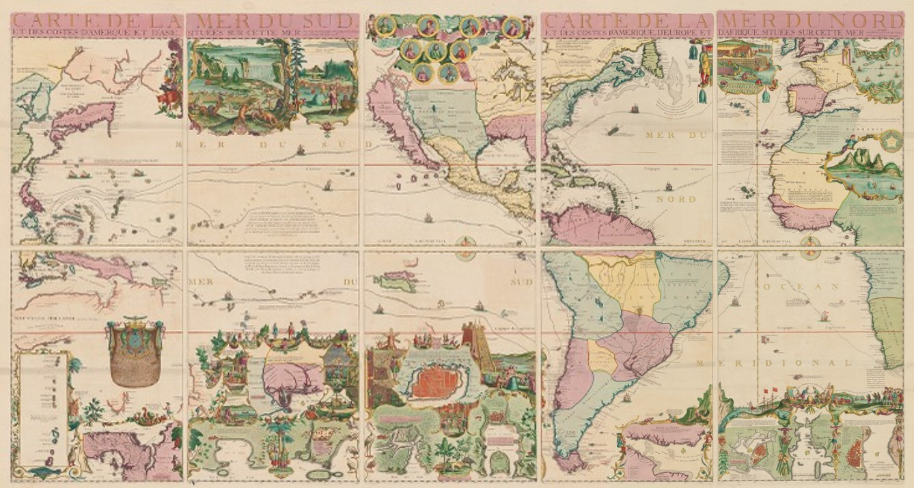
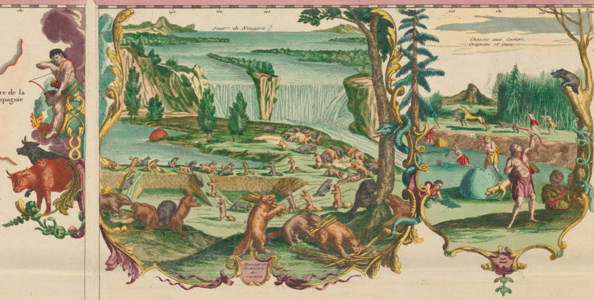
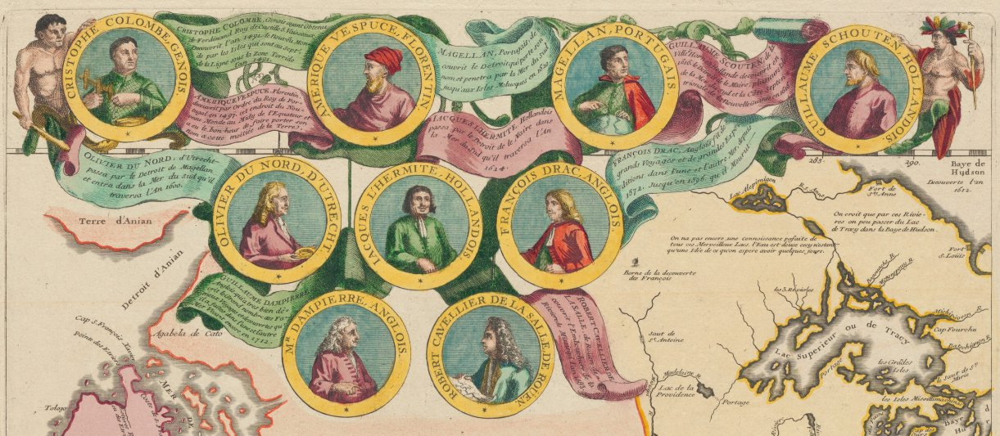
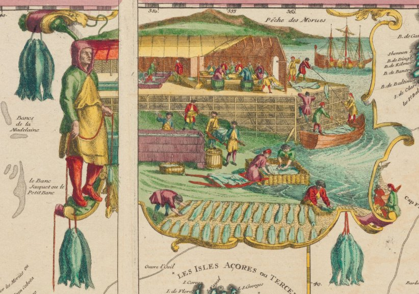

## Imperium Japonicum, per regiones digestum sex et sexaginta - Reelant, 1740

Adriaan Reelant (Reland), profesor de lenguas orientales en la Universidad de Utrecht, creo este mapa del Japón y sus 66 provincias usando como fuente una gran variedad de mapas japoneses realizados por Ishikawa Ryusen (de la colección particular de **Benjamin Dutry**, un antiguo director de la East India Company), una carta del puerto de Nagasaki e imágenes del  Atlas Japannensis de Arnoldus Montanus. en el Japón de la era Tokugawa (1603-1868), el contacto con europeos estaba estructamente limitado al comercio con la **Dutch East India Company** y sólo a través del puerto de Nagasaki. Este acuerdo comercial se simboliza a través de la porcelana junto a la cartela. A pesar de la simbología cristiana, los misioneros no eran bien recibidos en el Japón de Tokugawa. La singularidad cultural de Japón se enfatiza mediante los caracteres chino-japoneses identificando las provincias, la heráldica nobiliaria (incluidas las flores de triples malvas del clan Tokugawa) y las imágenes de los samurai, palanquines y pagoda.

[Ver mapa completo](https://iiif.lib.harvard.edu/manifests/view/ids:24508175 " Imperium Japonicum, per regiones digestum sex et sexaginta - Reelant, 1740")

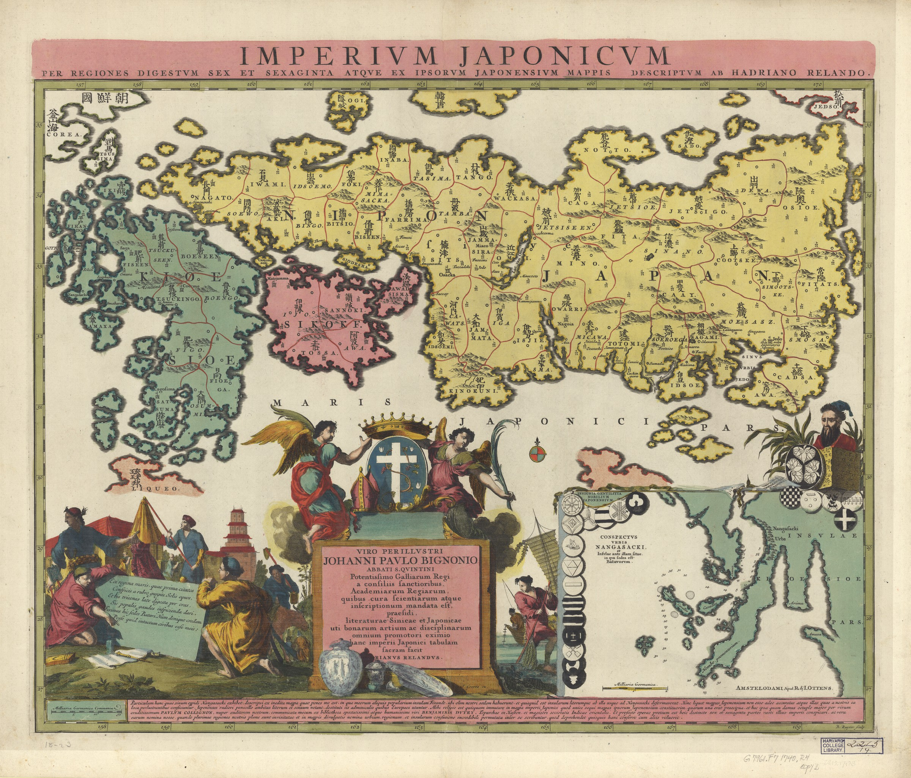
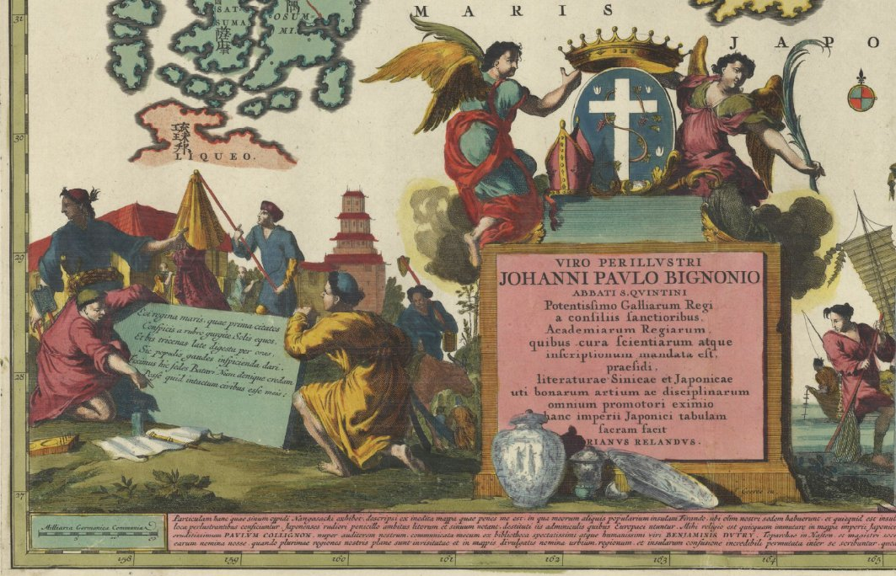

## Plan tres exact et vüe de la ville, baye, et des nouvelles fortifications de Gibraltar - Seutter, 1760

El mapa de Gibraltar de Seutter representa este enclave en el sur de la península ibérica. En la cartela muestra la confrontación entre la guerra (personificada por Marte en su armadura) y la paz (representada por Juno con su cetro y pavo real). España aceptó formalmente la soberanía de Inglaterra sobre el enclave en el Tratado de Utrecht de 1713, pero durante todo el siglo XVIII intentó recuperarlo. La cartela representa de manera gráfica el fin de las hostilidades con Mercurio y su caduceo (vara con las serpientes enroscadas y enfrentadas, símbolo del comercio) y una cornucopia (cuerno de la abundancia). La presencia de Neptuno a modo de juez del destino, indica que por encima de las decisiones humanas en sus manos está el destino de los barcos que navegan a través de los Pilares de Hércules.

[Ver mapa completo](https://iiif.lib.harvard.edu/manifests/view/ids:9087539 "Plan tres exact et vüe de la ville, baye, et des nouvelles fortifications de Gibraltar - Seutter, 1760")

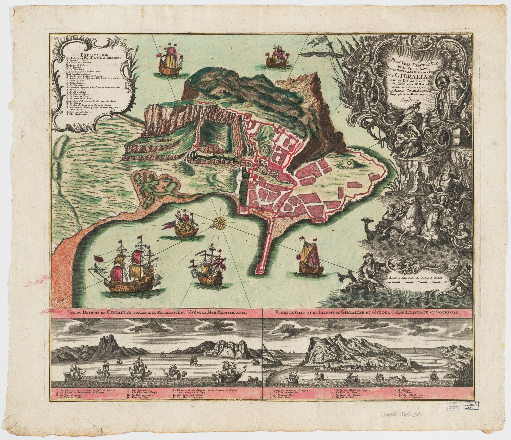
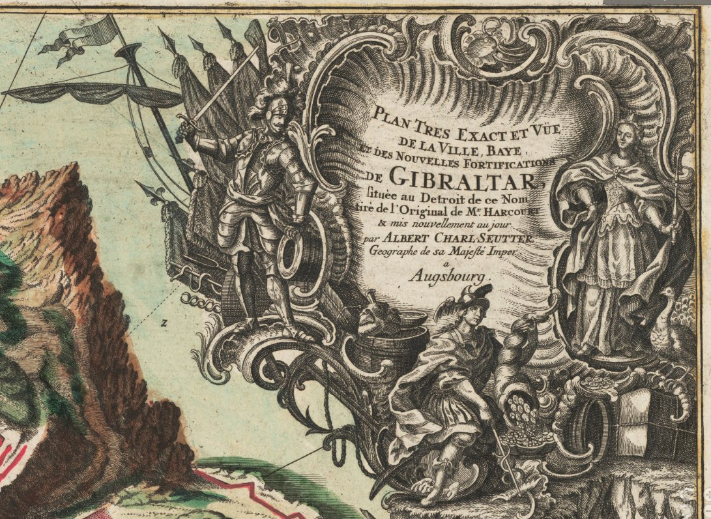
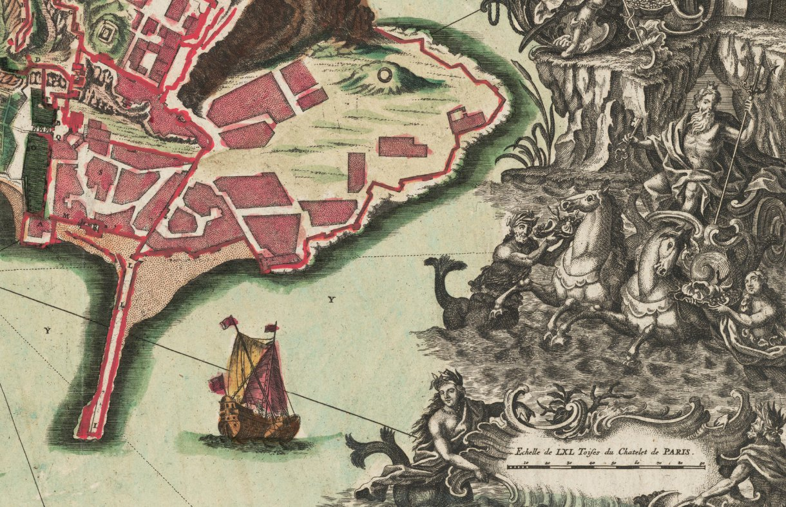

## Carte von Ertzgebürgischen Creysse in Churfurstenthum Sachssen - Schenk, 1758

Mapa de Erzgebirge (las montañas de oro), situado en la frontera entre Sajonia y Bohemia. El mapa muestra el modo de vida de aquella región, cuya principal ocupación es la extracción de plata, cobalto, plomo y otros metales. El mapa se apoya en los trabajos topográficos de Adam Friedrich Zürner, y la minuciosa descripción de los trabajos de minería en la esquina inferior derecha de la hoja proviene de las ilustraciones de la obra *Bericht vom Bergwerck* de Georg Engelhard Löhneyss. El dibujo de instrumentos en la parte superior se utiliza para reafirmar la utilización  de técnicas topográficas.

[Ver mapa completo](https://iiif.lib.harvard.edu/manifests/view/ids:24508174 "Carte von Ertzgebürgischen Creysse in Churfurstenthum Sachssen - Schenk, 1758")

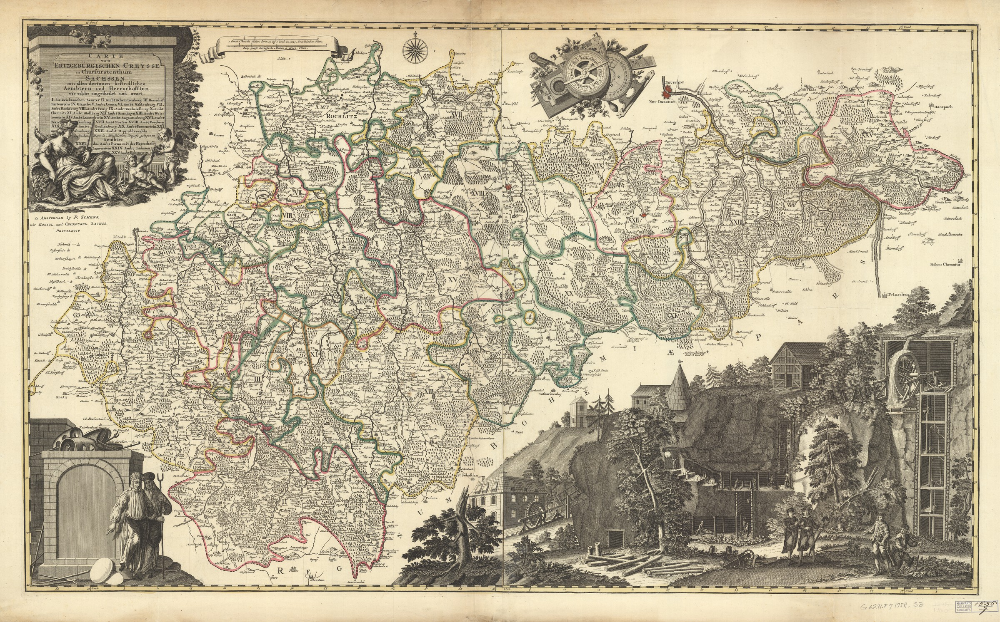
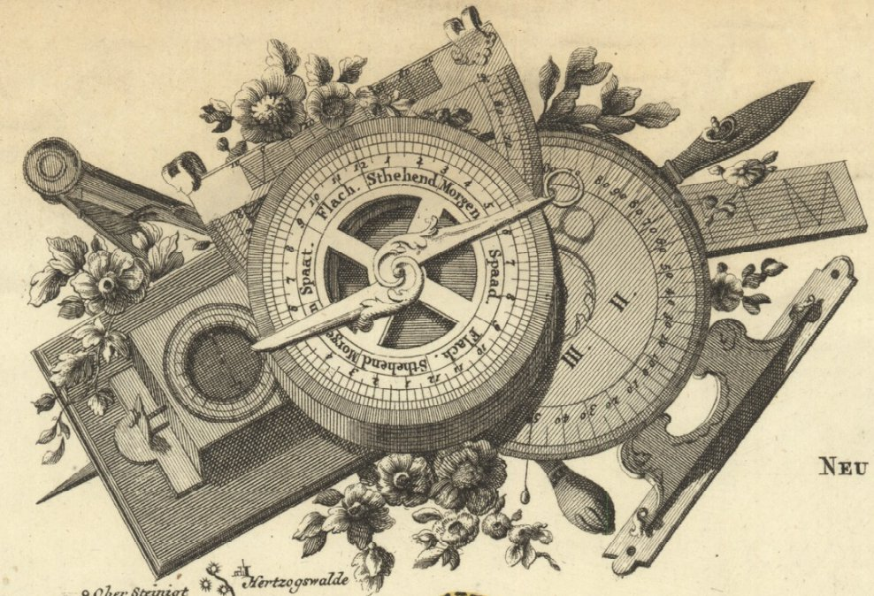
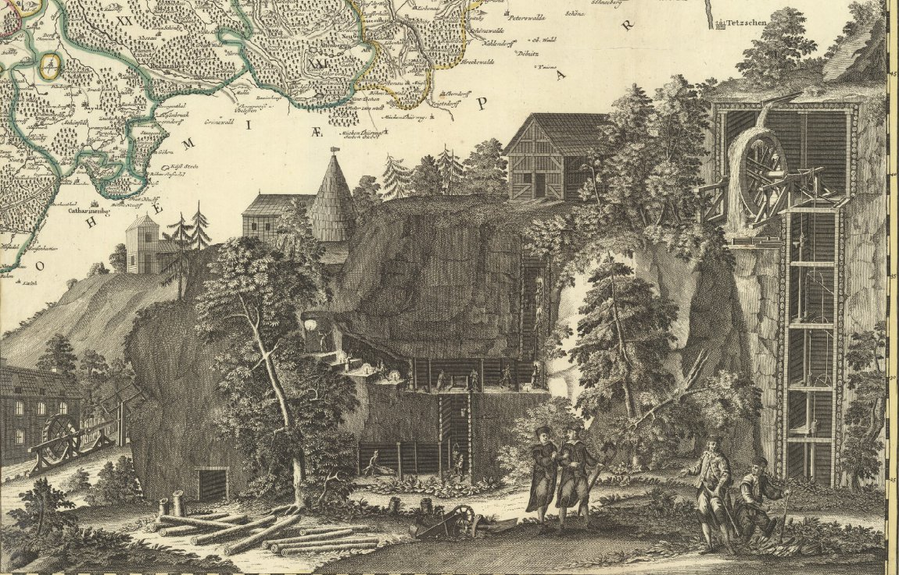

## Mapa de Amberes - Visscher, 1675

Los elementos decorativos del mapa de la ciudad de Amberes de **Nicolaes Visscher II** relegan el contenido cartográfico a algo secundario. En los talleres de imprenta del siglo XVII, los grabadores encargados de embellecer los mapas tenían a su disposición un amplio inventario de vistas de ciudades y no tenían problemas en encontrar elementos decorativos para incluir en los mapas. Además de las vistas de la ciudad de Amberes desde tres puntos de vista diferentes, el documento incluye diez paneles con edificios de la ciudad. Las cuatro ilustraciones principales, la Catedral de Nuestra Señora, la Bolsa de Valores, el Ayuntamiento y el Cuartel General de la Liga Hanseática, provienen del libro *Descrittione di tutti I Paesi Bassi* de *Ludovico Guicciardini*, cuya primera edición data del año 1567.

**Nicolaes Visscher II** fue cartógrafo, grabador y editor. Último de la saga de los *Visscher* que comenzó su abuelo
**Claes Janszoon Visscher** y su padre **Nicolaes Visscher I**. Tras su muerte su mujer **Elisabeth** continuó el negocio familiar. Después, sus trabajos y planchas fueron adquiridos por **Peter Schenk**.

[Ver mapa completo](https://iiif.lib.harvard.edu/manifests/view/ids:10134964 "Mapa de Amberes - Visscher, 1675")

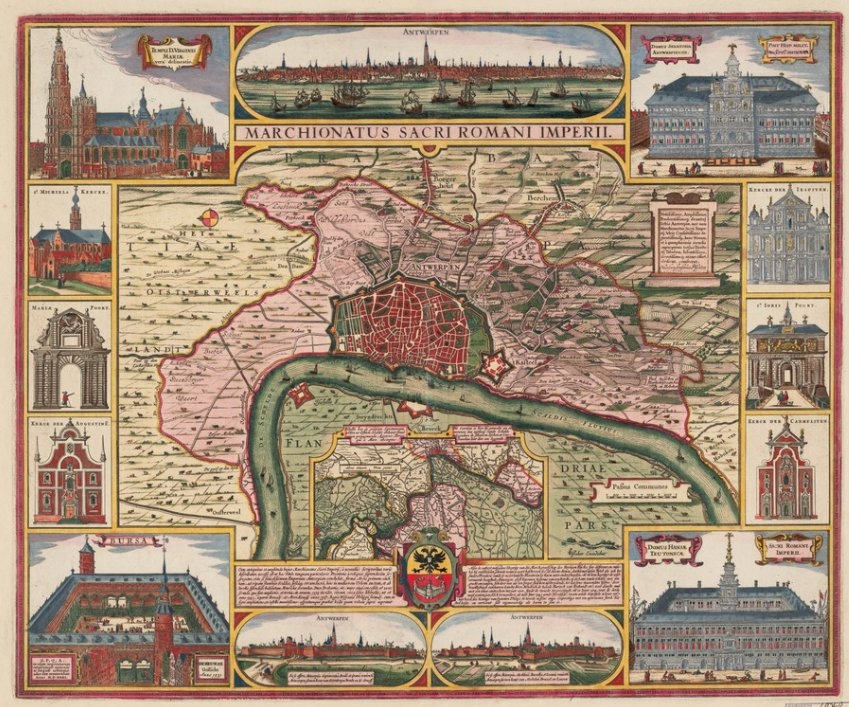

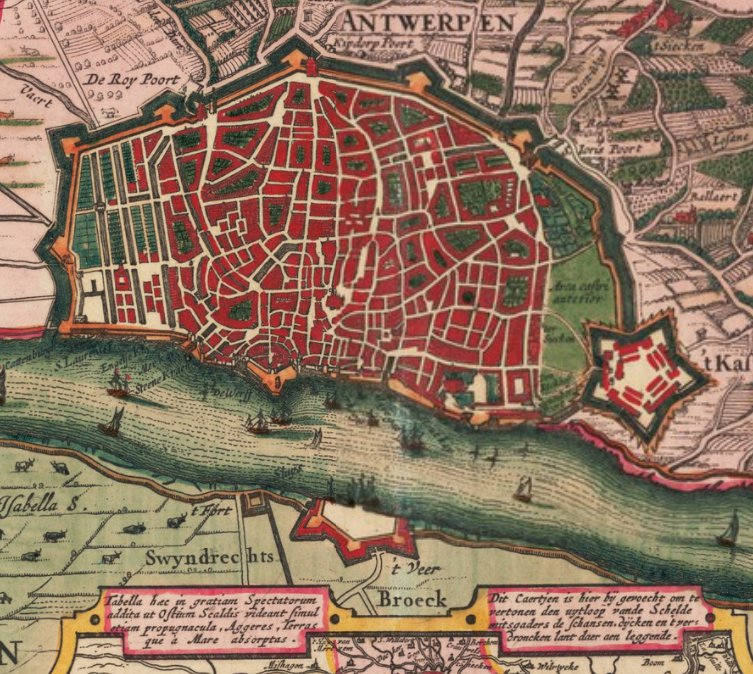

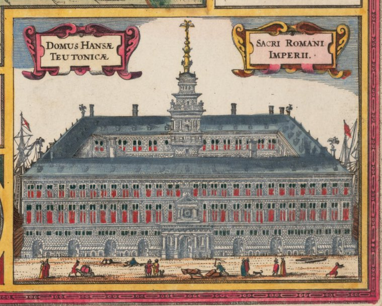

## Nova et exacta tabula geographica Salae et Castellaniae Iprensis - Jean Blaeu, 1663

Esta imagen de la ciudad de Ypres apareció por primera vez en la obra *Flandria illustrata* de **Antonius Sanderus**, teólogo e historidos cuyas ilustraciones de las ciudades flamencas apaarcen en numerosas obras, con detalladas descripciones de monumentos, abadías, catedrales y castillos. Durante el comienzo de la década de 1630, Sanderus viajó por todo Flandes contratando artistas y topógrafos para crear su obra magna. En este mapa participa **Vedastus du Plouich**.

En un principio su obra estaba destinada a ser publicada por **Henricus Hondius II**, hijo del iniciador de la saga **Jodocus Hondius**, pero la iglesia católica se mostró reacia a que un editor protestante publicara una obra de uno de sus clérigos. Hondius vendió sus derechos a su competidor **Joan Blaeu**, que acabó publicando la obra en Colonia.

**Antonius Sanderus** utilizó todo su patrimonio en realizar esta gran obra sobre Flandes, lo que le llevó a la ruina. Acabó sus días en la abadía benedictina de Afflighem.

[Ver mapa completo](https://iiif.lib.harvard.edu/manifests/view/ids:25031893 "Mapa de Ypres - Blaeu, 1663")

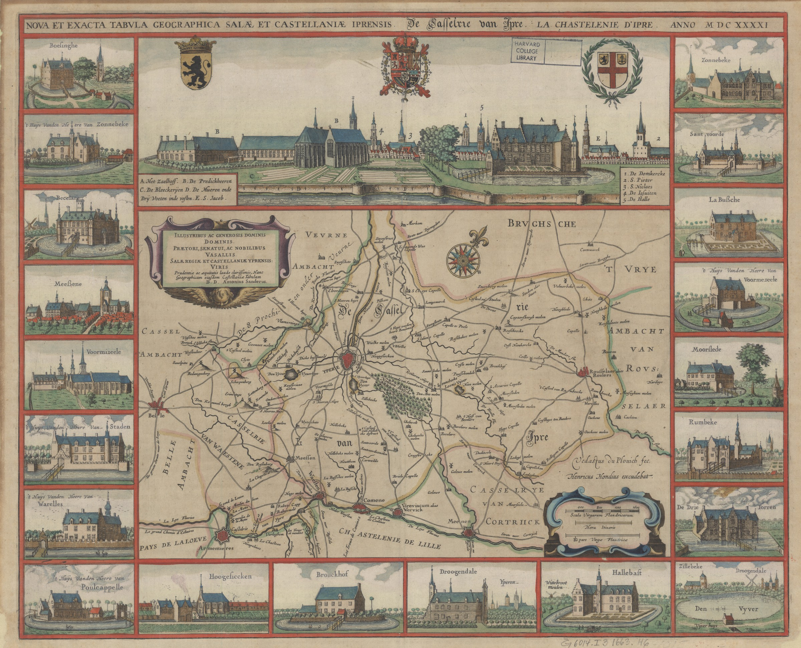

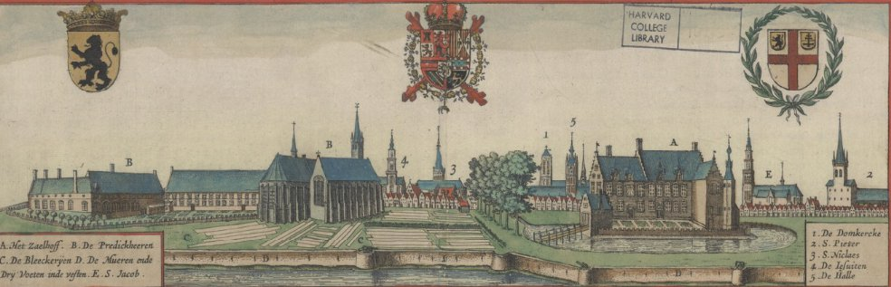

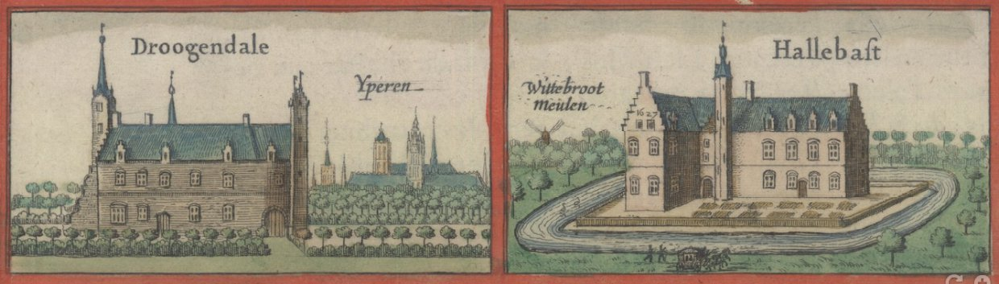

## Topographische Vorstellung der neuen russischen Haupt-Residenz und See-Stadt St. Petersburg - Homann, 1718

El zar pedro I el Grande comenzó a construir la ciudad de San Petersburgo en 1703, con el objetivo de convertirla en la nueva capital de su imperio. Situada a orillas del golfo de Finlandia, el zar pretendía convertir esta pequeña ciudad en el gran acceso de Rusia y su flota al mar Báltico para combatir el dominio sueco de estas aguas.

El recuadro con el mapa de ubicación en la esquina superior izquierda incluye una imagen de **Pedro el Grande** con una pancarta que alude a una cita de **Ovidio** (*dame ciudadanos y llena las paredes vacías*) yuxtapuesta con el mismo nombre de la ciudad, San Pedro, sosteniendo Llaves de las puertas del paraíso.

La cartela representa una apoteosis del zar Pedro I, cuyo retrato está rodeado de figuras alegóricas que representan una amplia gama de las artes y las ciencias promovidas durante su reinado: geografía, astronomía, historia, matemáticas, navegación (sujetando una maqueta de uno de los grandes navíos de su flota), poesía, geometría e ingeniería. La figura en la parte superior derecha tiene una leyenda en su mano con otra cita de **Ovidio**: *Traiga las artes de la paz a los que están acostumbrados a la guerra*.

Johann Baptist Homann fue un cartógrafo y geógrafo bávaro. Miembro de la academia prusiana de las ciencias, dispuso de *privilegia impressoria* ortorgado por el emperador Carlos VI para todo el Sacro Imperio.

[Ver mapa completo](https://iiif.lib.harvard.edu/manifests/view/ids:8543965 "Mapa de San Petersburgo - Homann, 1718")

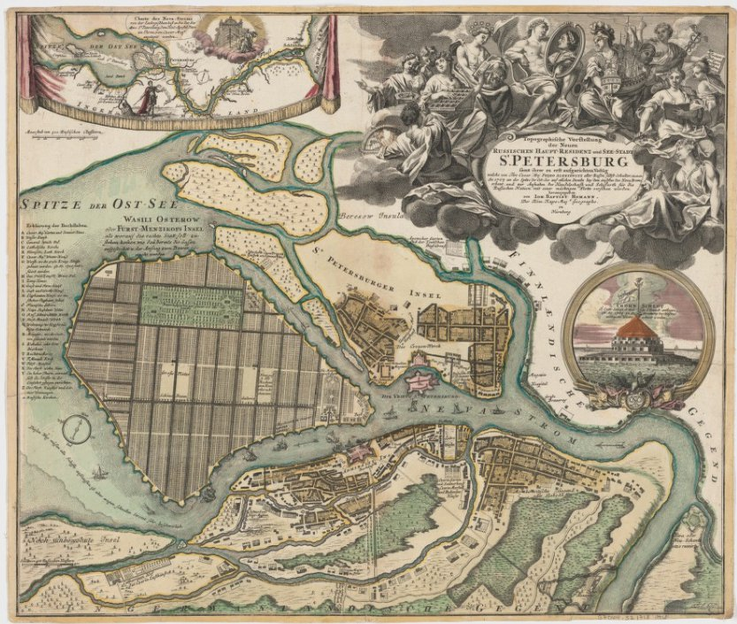

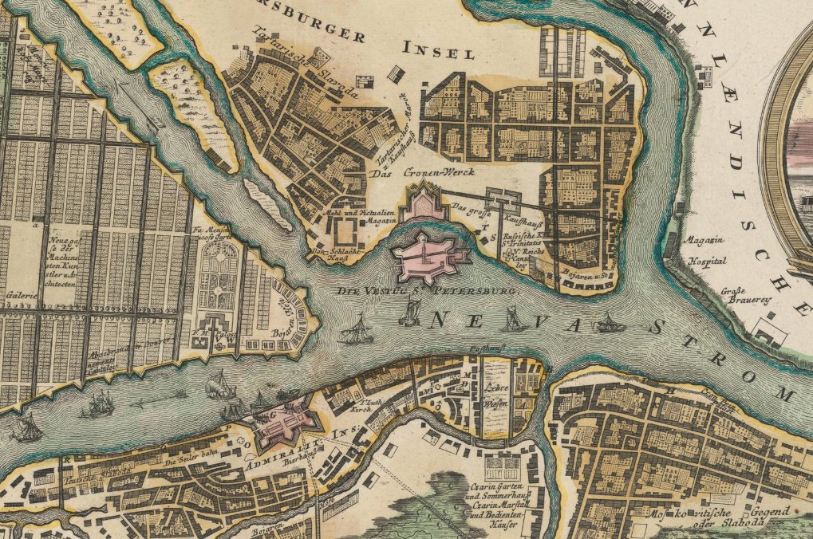

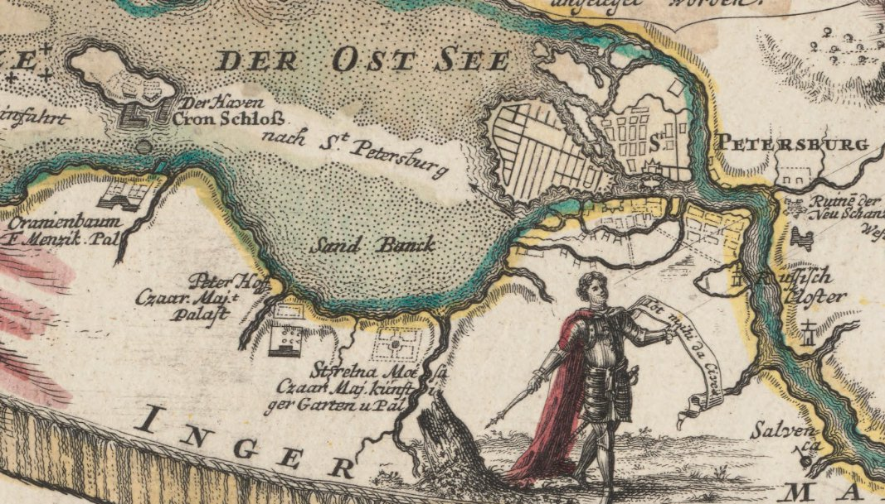

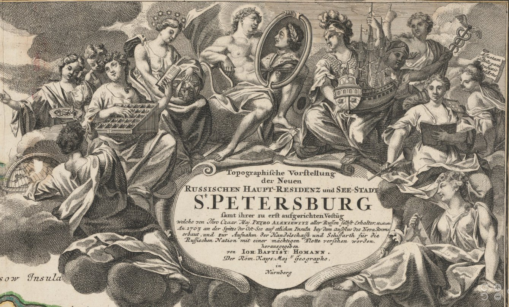

## Sena vetvs civitas virginis. Siena : Bernardino Serretti, ca 1600

En muchos caosos, obra cartográfica y pictórica iban de la mano. Esta espectacular imagen en perspectiva de la ciudad de Siena fue realizada por el cartógrafo **Bernardino Serretti** hacia el año 1600, con la colaboración en las imágenes del pintor sienés **Francesco Vanni**. La obra destaca las murallas de la ciudad, que garantizan la seguridad física ante cualquier enemigo, y un panteón en la parte superior lleno de santos y beatos que garantizan la integridad espiritual.

La Virgen María preside un elenco de los personajes beatificados y canonizados de Siena. Los santos Catalina (revelando los estigmas), Bernardino (con su túnica franciscana) y Galgano (que intercambiaron su espada por una cruz) están más cerca de María, flanqueados por fundadores de órdenes religiosas, mártires (que se muestran aquí sosteniendo frondas de palma), y aquellos que llevaron vidas de virtud intachable. También incluye una amplia variedad de órdenes mendicantes y monásticas representadas entre los guardianes espirituales de Siena incluyendo a los dominicos, franciscanos, carmelitas, cartujos y cistercienses.

[Ver mapa completo](https://iiif.lib.harvard.edu/manifests/view/ids:2655481 "Mapa de Siena - Serreti, 1600")

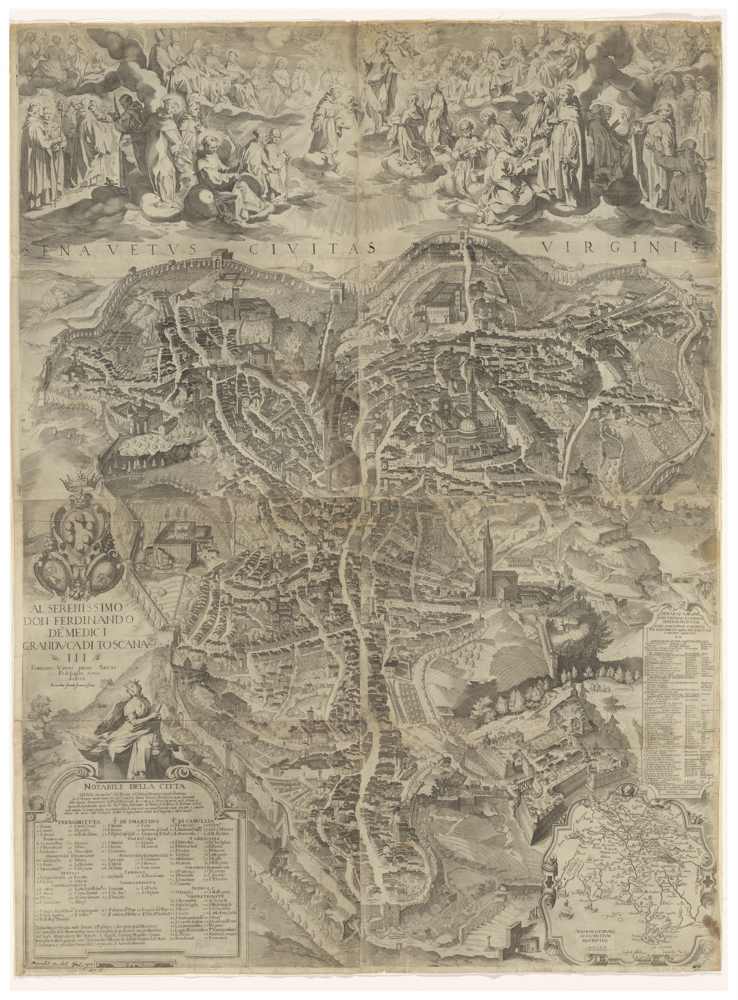

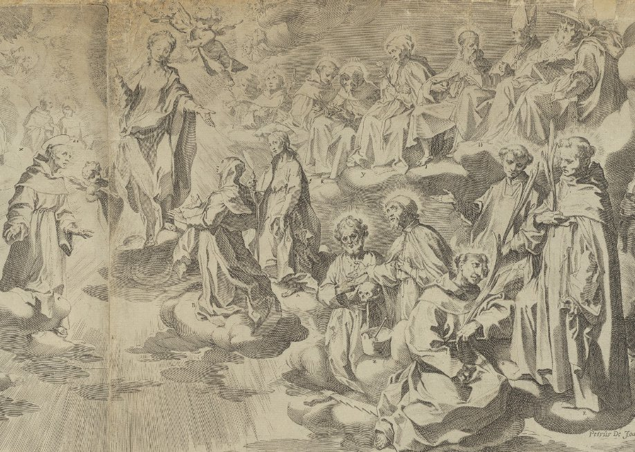

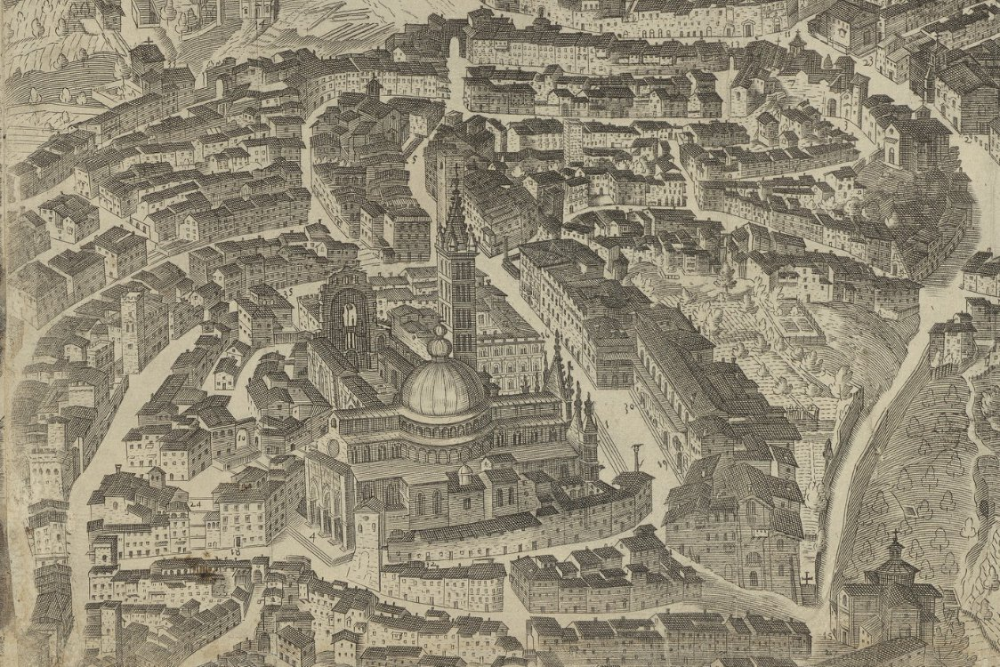

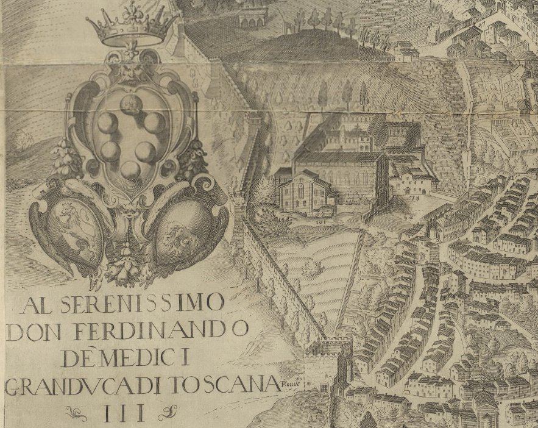

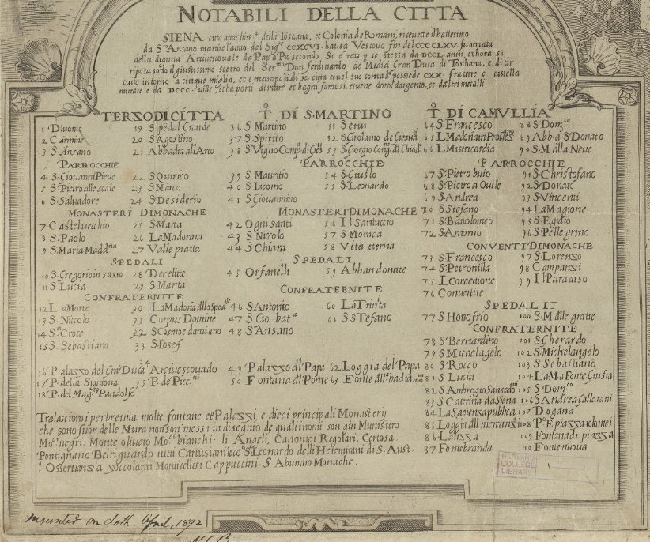

##  Cambridgshire. [London], J. Sudbury and G. Humbell, 1610

Este mapa fue publicado dentro de la obra de John Speed *Theatre of the Empire of Great Britaine*, en cuyo prólogo reconoce tomar prestado de otros autores tanto ilustraciones como mapas generales y vistas en detalle, que inserta dentro de los mapas principales. En este mapa del Condado de Cambridgshire, que es obra del cartógrafo **Christopher Saxton**, inserta en un recuadro el mapa en detalle de la ciudad de Cambridge obra del cartógrafo **John Hamond**. Para la orla, empleó detalles estilísticas que admiraba del trabajo de los cartógrafos holandeses (incluido Jodocus Hondius, de quien grabó las planchas). En el caso los escudos de armas de las diferentes universidades de Cambridge embellecen los paneles laterales e inferiores.

> Los mapas orlados tan característicos del siglo XVII dan una gran importancia a la estética y no sólo al contenido cartográfico. El elemento estético era fundamental para obtener el favor de un público cada vez más amplio, no sólo interesado en la exactitud y actualidad de la información, sino también en la belleza de su presentación. En los mapas orlados se añadían bordes decorados (la orla) representando vistas de ciudades, personajes vestidos con su atuendo regional, escudos de armas, personajes célebres, etc. De esta manera se podía también satisfacer la curiosidad de una clientela con menos facilidades para el turismo que nosotros.
>>Fuente: Los mapas orlados del siglo XVII: la importancia de la estética [1]

[1]: http://mastervcs.edu.umh.es/2018/02/12/los-mapas-orlados-del-siglo-xvii-la-importancia-la-estetica/

[Ver mapa completo](https://iiif.lib.harvard.edu/manifests/view/ids:7766498 "Mapa del condado de Cambridge -  J. Sudbury and G. Humbell, 1610")

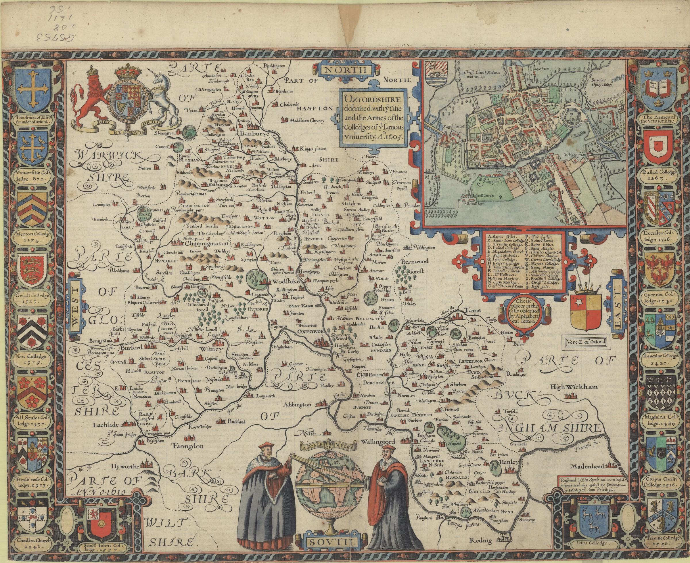

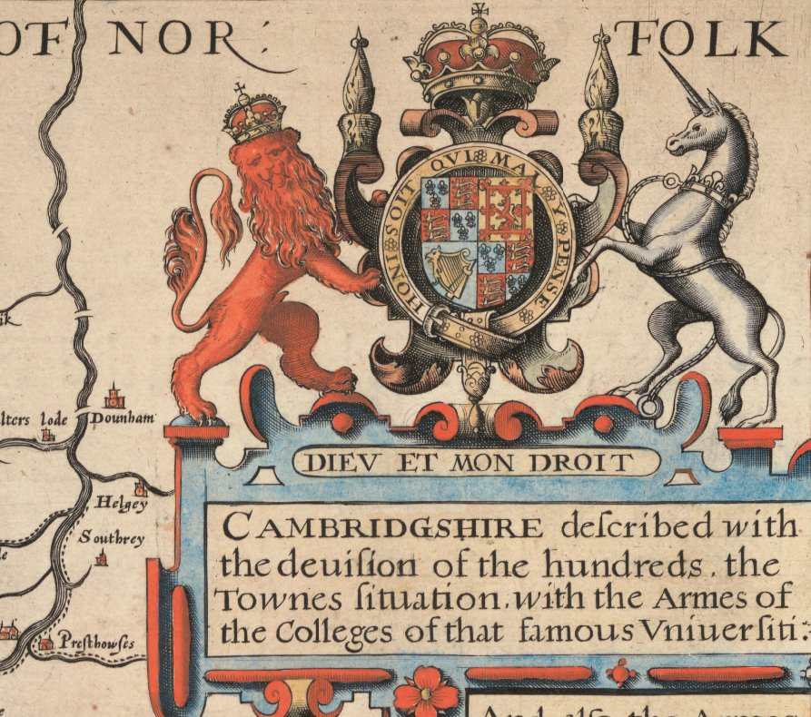

Detalle con el la escala y bajo el que se aprecia el nombre del autor, **John Speed**, y el lugar de venta por **John Sudbury** y **G. Humbell** la dirección *Popes head Alley*, lugar que aún existe en Londres en un callejón detrás del Banco de Inglaterra.

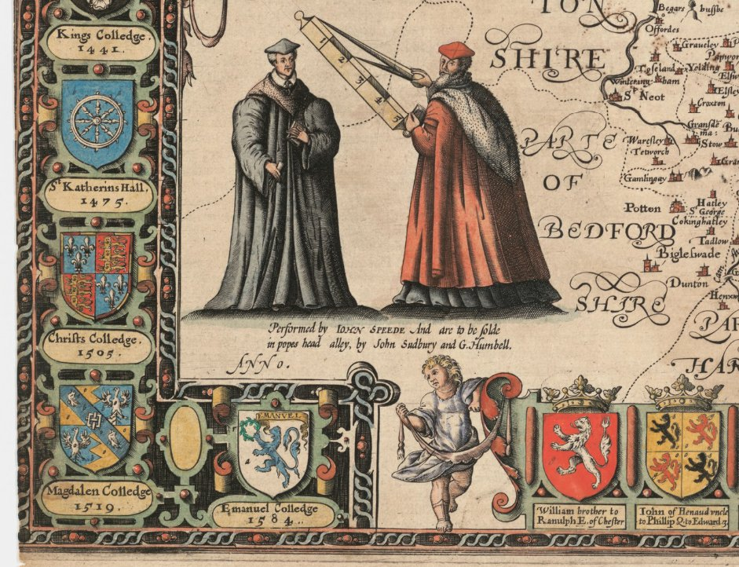

## Amsterdam, Johannes de Ram, [1690]

Durante el siglo XVII, Amsterdam se convirtió en la capital comercial del mundo. La ciudad era el puerto de entrada de mercancías de la *Vereenigde Oostindische Compagnie* o **VOC**, Compañía Unida de las Indias Orientales, una corporación que tenía el monopolio de las actividades comerciales con Asia.

[Ver mapa completo](https://iiif.lib.harvard.edu/manifests/view/ids:7766500 "Amsterdam, Johannes de Ram, [1690]")

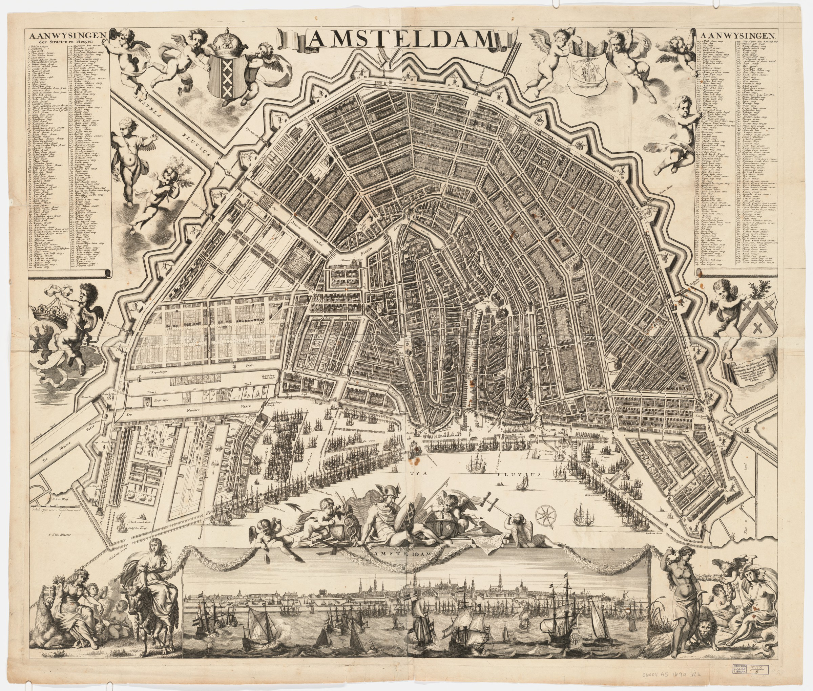

Una vez más el mapa no sólo cumple el objetivo de mostrar la cartografía urbana de la ciudad, con sus innumerables canales y edifios más imporantes, sino que además trata de enfatizar el papel de la ciudad. El dios del comercio Mercurio, con su sombrero alado y su caduceo reposa sobre la vista de la panorámica del puerto de la ciudad. Le acompañan varios *putti* (querubines) que se muestran manejando utensilios relacionados comon la navegación, como la plomada, la ballestilla o un compás. A ambos lados, figuras representando a los cuatro continentes (Europa montando el toro, Asia con su incensario y camello, África con león y escorpión, y América con su cocodrilo, arco y flecha) ayudan a adornar la vista de Ámsterdam con guirnaldas. 

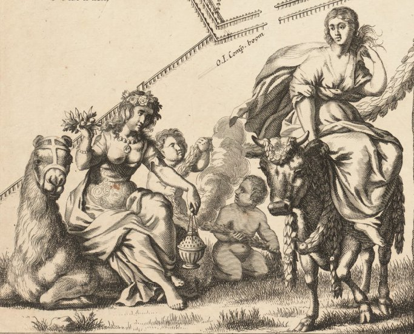
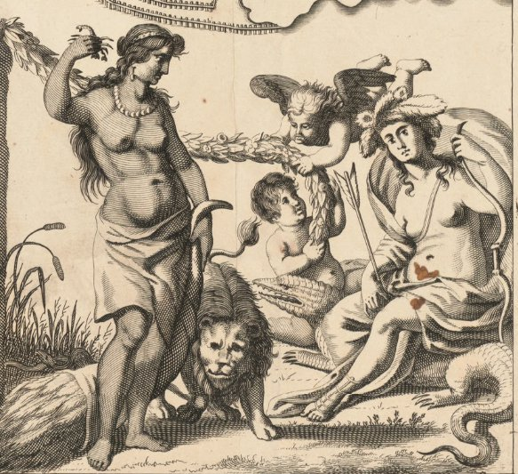

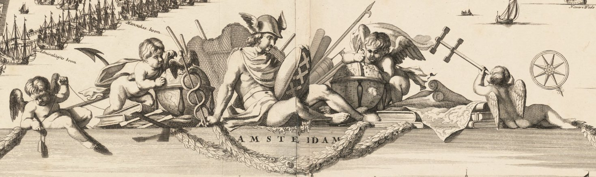

Detalle de la cartografía, con la plaza del Dam y el alzado de algunos edicios en perspectiva caballera.
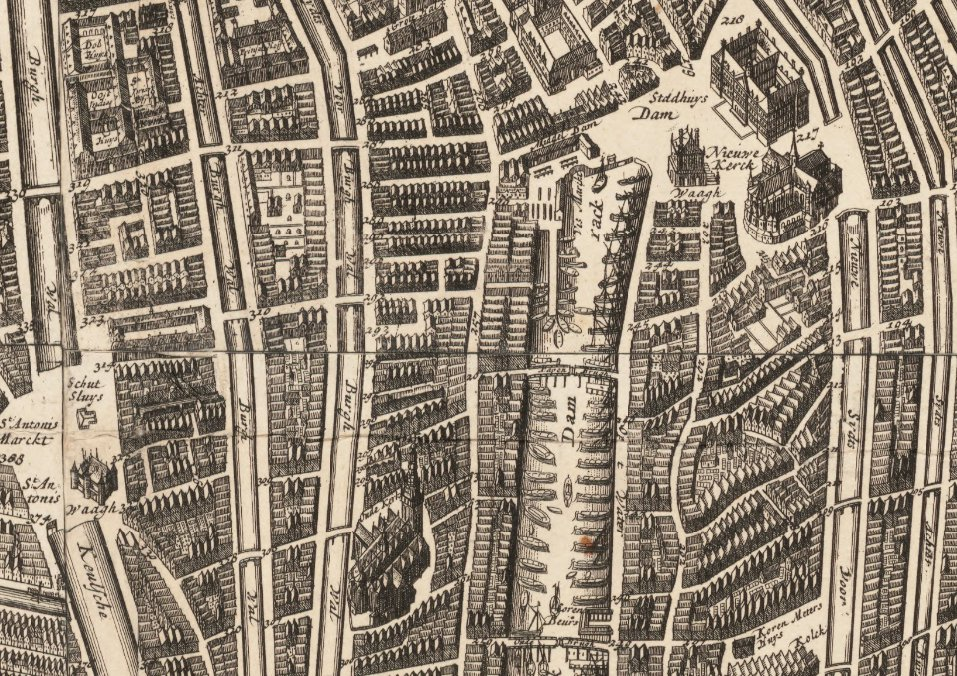

 ## Mapa del condado de Cornwall - Thomas Martyn, 1748

El contenido ornamental de los mapas a veces no sólo tenía intereses decorativos, sino también económicos, de cara a sufragar los gastos del trabajo topográfico. Este enorme mapa del condado de Cornwall del topógrafo Thomas Martyin, cuyos costes de realización por la escala y detalle debieron ser cuantiosos, se financió en parte por la decoración que acompaña a la cartografía. Se vendía por tres guineas. Los suscriptores pagaron parte del costo por adelantado, y el resto al recibir el mapa. Además, aquellos que deseaban que su escudo de armas figurase impreso, pagan un sobrecoste. Como resultado, parece que 164 subcriptores así lo hicieron.

[Ver mapa completo](https://iiif.lib.harvard.edu/manifests/view/ids:23971453 "Mapa del condado de Cornwall - Thomas Martyn, 1748")

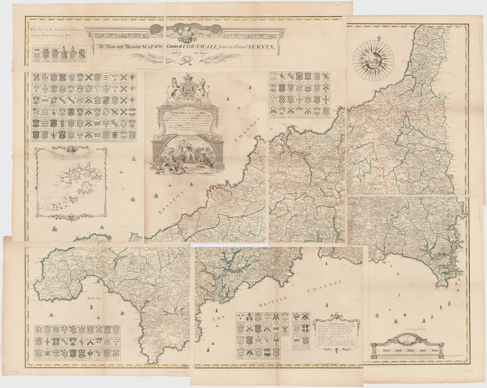

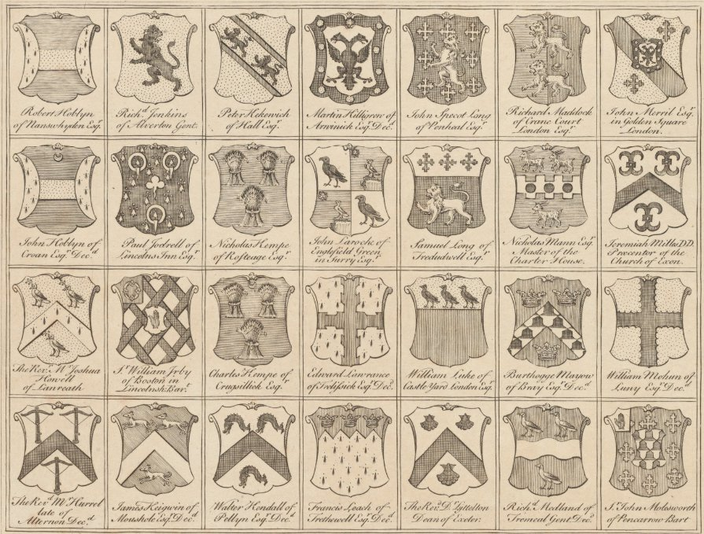

## Charta tēs Hellados, Rigas Vélestinlis - 1797

El poeta griego Rigas Vélestinlis preparó este enorme mapa de Grecia tomando prestada la cartografía de *Antiquae tabula nova* del año 1707 de **Guillaume Delisle**, elaborado noventa años atrás. Es un claro ejemplo de que en este caso la cartografía desfasada actúa como un simple soporte para el verdadero objeto del mapa, la reivindicación de la independencia griega del poder otomano. Los turcos no sólo prohibieron su difusión sino que ejecutaron a su autor un año después.

[Ver mapa completo](https://iiif.lib.harvard.edu/manifests/view/ids:24146534 "Charta tēs Hellados, Rigas Vélestinlis - 1797")

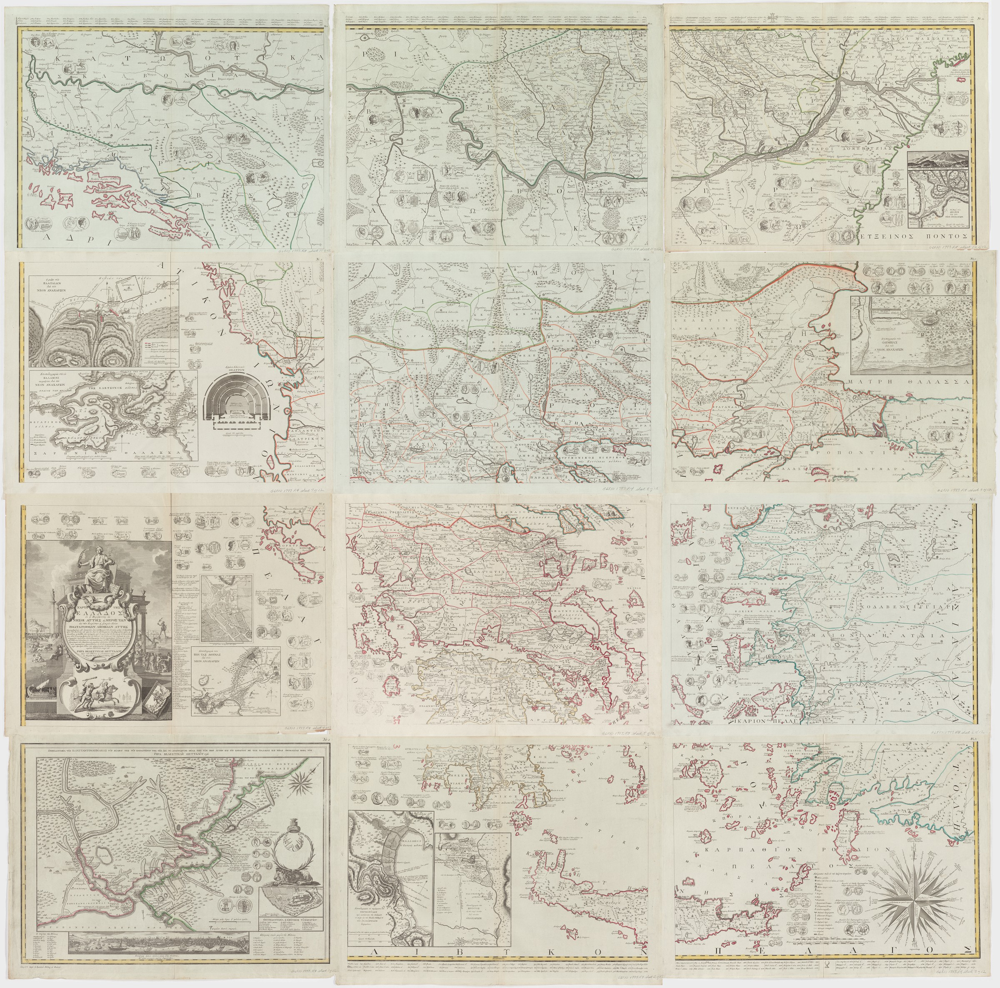

Rigas tomó prestada la imagen de un antiguo teatro griego y siete planos topográficos (Platea, Salamis, Atenas, Thermopylae, Esparta , Olympia, Delphi) de la obra de **Barbié du Bocage**. Sin embargo, amplió el alcance del mapa de Delisle para incluir mucho más de los Balcanes, e insertó imágenes alegóricas para sugerir la regeneración griega (el mito de Deucalion), la expansión (los Argonautas) y la lucha entre el Este y el Oeste (la lucha de Hércules con las Amazonas). Los otros elementos decorativos prominentes esparcidos por todo el mapa son 161 monedas griegas y bizantinas, simbólicas de la antigüedad de la civilización griega. 

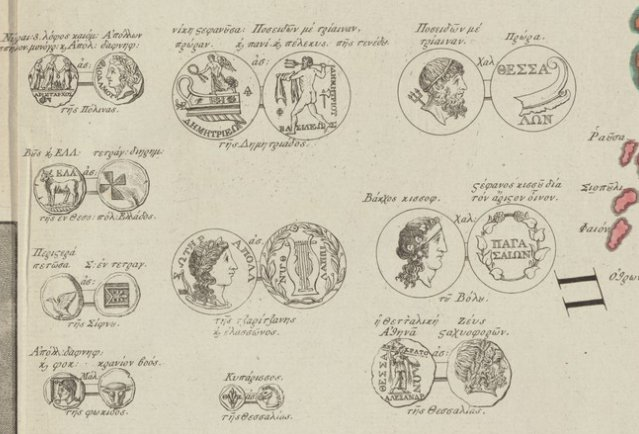
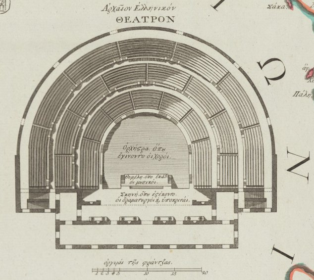
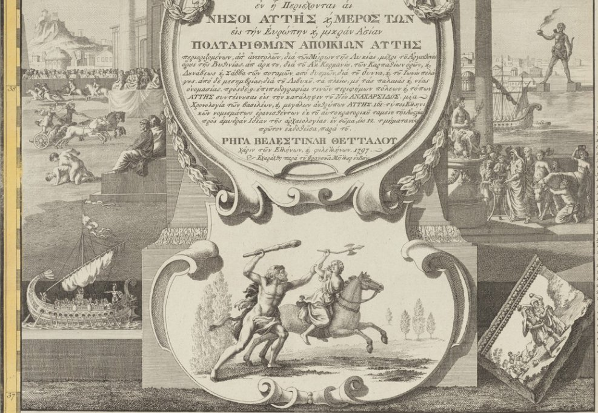
En la segunda edición del mapa (1800), después de haber ejecutado a Rgas, la figura alegórica de la civilización griega en la parte superior del cartucho (solo armado con una pluma y caduceo en el mapa de 1797) lleva un casco, una lanza y el escudo de Atenea. .

***

https://github.com/lovasoa/dezoomify#dezoomify

https://iiif.lib.harvard.edu/manifests/ids:24726486

https://ids.lib.harvard.edu/ids/iiif/24726486/0,0,4056,13619/2048,/0/default.jpg
