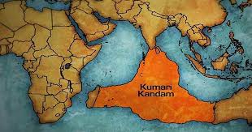
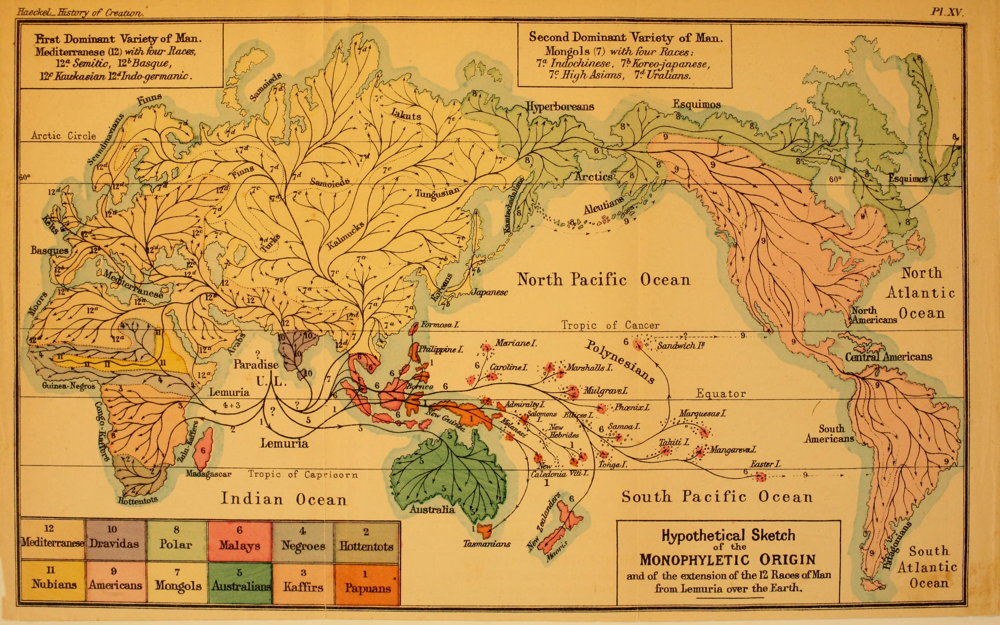
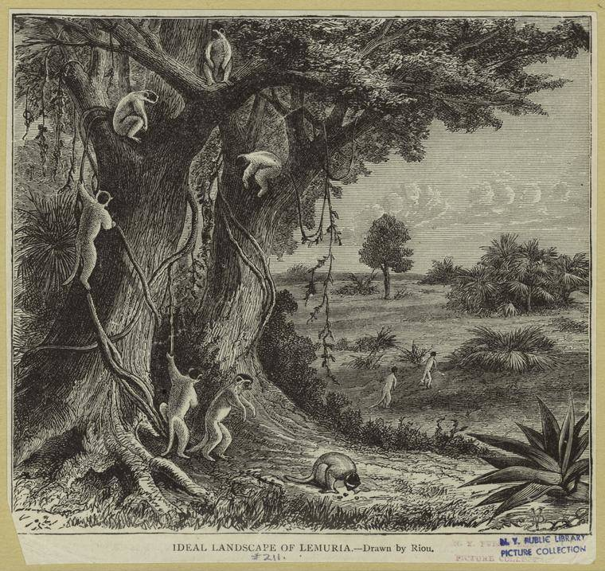
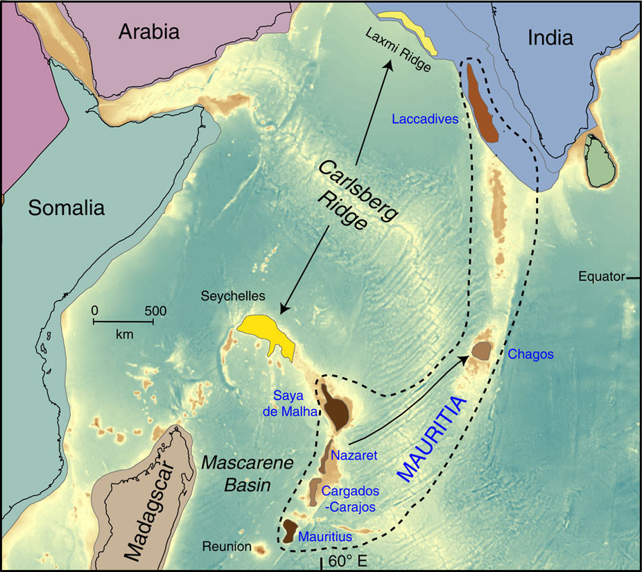

# Lemuria: la cuna de la vida

## Un continente perdido
Una de las teorías sobre el origen de la vida surgidas durante el siglo XIX fue la del continente perdido de **Lemuria**. Este continente perdido se situaba en el océano Índico.

A mediados del siglo XIX se consideró la existencia de este continente perdido habitado por los *Lemurians*, una raza de humanos hermafroditas ya extinta de largos brazos. Esta asombrosa teoría sobre el origen del hombre surge tras la publicación de un artículo, *The Mammals of Madagascar* por el zoólogo [**Philip Lutley Sclater**](https://es.wikipedia.org/wiki/Philip_Sclater "Philip Sclater en la Wikipedia"). Este artículo se centra en los **lemures**, una variedad de primates muy abundadntes en la isla de Madagascar, donde existen muchas más variedades de esta especie que en India o en África. Para Sclater esto significa que la isla era el punto de origen de estos seres. El autor también postulaba que la migración de estos primates hacia África y la India se produjo gracias a la existencia de este continente perdido que actuó como puente. La aparición de esta teoría alimentó otras como la del continente [**Kumari-Kandam**](https://es.wikipedia.org/wiki/Kumari_Kandam "Kumari-Kandam en la Wikipedia"), un continente legendario sumergido supuestamente en el Índico, y que los tamiles consideran el origen de su cultura.

La existencia de este continente fue utilizada por el biólogo alemán Ernst Haeckel para justificar la llegada del hombre a África, ya que en aquella época se pensaba que el origen del ser humano como especie se produjo en Asia. Fue por lo tanto Haeckel quien sugirió que el contienente perdidod e Lemuria había sido la cuna de la vida de la humanidad.

>Se supone que el hogar primordial probable o el *Paraíso* es Lemuria, un continente tropical que se encuentra actualmente por debajo del nivel del Océano Índico, cuya antigua existencia en el período terciario parece muy probable a partir de numerosos hechos en la geografía animal y vegetal.

Estas teorías florecieron en una época en la que los científicos aún no habían descubierto que la cuna de la Humanidad se sitúa en realidad en África, ni habían desarrollado todavía la teoría de la deriva continental. Sin estos conocimientos posteriores, se explica que muchos científicos tomaran como cuierta la teoría de Lemuria. Entre ellos la escritora rusa [**Helena Blavatsky**](https://es.wikipedia.org/wiki/Helena_Blavatsky "Helena Blavatsky en Wikipedia"), quien en su obra [La Doctrina Secreta](https://es.wikipedia.org/wiki/La_doctrina_secreta "La Doctrina Secreta"), propone que ena vez existieron siete razas antiguas de la Humanidad y que Lemuria había sido *El hogar de uno de ellos*. Esta raza hermafrodita de 15 pies de altura y cuatro brazos, floreció junto a los dinosaurios, para luego desaparecer.

## Descubrimientos de 2013
En el año 2013, los científicos encontraron fragmentos de granito en el océano al sur de la India a lo largo de una plataforma que se extiende cientos de millas al sur del país hacia las islas Mauricio. En este archipiélago al sur del Índico, los geólogos encontraron grandes cantidades de zirconio a pesar de que la isla solo existe desde hace 2 millones de años cuando, gracias a la tectónica de placas y los volcanes, surgió lentamente del Océano Índico como una pequeña masa de tierra. Sin embargo, el circón que encontraron allí data de hace 3 mil millones de años, eones antes de que la isla se hubiera formado. 

La razón es que el zirconio proviene de una tierra mucho más antigua que se hundió en el Océano Índico. Los geólogos han propuesto Mauritia como nombre para el continente perdido. Según la tectónica de placas y los datos geológicos, **Mauritia** desapareció en el Océano Índico hace unos 84 millones de años, cuando esta región de la Tierra aún estaba adquiriendo su forma actual.

Sin embargo esto no corrobora las teoría románticas sobre el continente perdido. Los lemures evolucionaron hace 54 millones de años, mucho después de la desaparición de este continente perdido. Estos primates en realidad llegaron a Madagascar desde África a nado, cuando la dustancia entre la isla y el continente era mucho menor, y su gran variedad insular se debe a la escasez de depredadores con respecto al resto del continente africano.