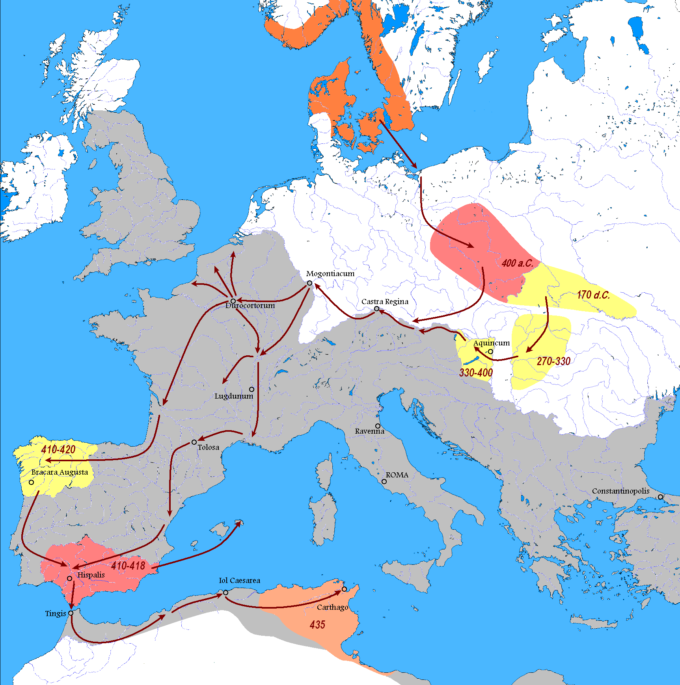

# Los Vándalos

Los vándalos eran un pueblo de la antigua Germania, originario de las tierras bálticas que hacia el aññ o Polonia, que deambularon por la zona de Europa central y en el 375 fueron empujados por los hunos hacia el límite nororiental del Imperio Romano.

Nuestro protagonista es Gunderico, hijo de Godegiselo, rey de los vándalos asdingos, los del pelo largo (se conoce que los otros eran calvos). Gunderico nació en el ¿379? en Germania o Panonia. En la Nochevieja del 406 los vándalos consiguen cruzar el Rin y llegar hasta Tréveris donde son parados por los *francos ripuarios* que estaban federados con el Imperio Romano. Estar federado o *foederati* con Roma era que se te pagaba para poner tus armas a su servicio. Cuando hubo dinero bien pero cuando la Hacienda flojeada se acabó pagando con tierras. Este hecho asentó a muchas tribus bárbaras en suelo imperial.

Volviendo a Gunderico, en 407 cogió el liderazgo de los asdingos a la muerte de su padre Godegiselo, parece que el “nombramiento” fue en Maguncia (actual Alemania). Al año siguiente penetran en la Galia para llegar en septiembre de 409 a Hispania. Después de vagar durante algún tiempo se instalan en la Gallaecia Asturiacensis, que comprendía parte de las actuales Asturias, León y parte de Salamanca. En el 416 un ejército visigodo manado por el emperador Honorio derrota a los alanos que ocupaban las provincias Lusitana y Cartaginense. Dos años después harían los mismo con los vándalos silingos que estaban en la Bética. Los alanos y silingos derrotados va a la Gallaecia Asturiacensis para buscar la protección de Gunderico al que reconocen como su rey. Se establece una numerosa coalición de vándalos y alanos.

En 419 la nueva fuerza vándala decide atacar a su vecinos suevos y los derrotan. La batalla, parece que, se produjo algún punto de la Cordillera Cantábrica. Un año más tarde deciden poner rumbo a la Bética, la provincia más rica de Hispania. En 422 Roma harta de los desmanes vándalos envía un ejército para su castigar estas tropelías (el Imperio Romano era un descalzaperros. Este contingente mandado por el general Castillo es derrotado por las huestes de Gunderico. El suroeste de Hispania quedaba abierto a las fauces vándalas. En 425 toman Cartagena, capital de la Cartaginense, e Híspalis, capital de la Bética. Se resiste fuertemente y aguanta Corduba.

Tras controlar los nuevos dominios los vándalos se asientan en Sevilla, donde moriría Gunderico en el 428, siendo sucedido por su cuñado y tío Genserico, que al parecer no tuvo un gran trato con los descendientes de nuestro regio protagonista. Sobre su muerte hay una curiosa leyenda: Según San Isidoro, su fallecimiento se produjo por la caída de un rayo. Un castigo divino mandado por Dios al profanar Gunderico la basílica sevillana de San Vicente. Esta invasión vándala es una de las hipótesis del origen del nombre  de Andalucía. Al asentarse allí esa parte de la Bética se conocería como Vandalia o Vandalusia (tierra de vándalos), que al llegar los árabes en 711 se transformaría en Al-Andalus y de ahí a Andalucía.

## Gunderico

Genserico nace en Panonia, creemos, que en 390, es hijo de Godegiselo, rey de los vándalos hasdingos. A la muerte del rey este es sucedido por Gunderico, que era medio hermano de nuestro protagonista. Durante su juventud Genserico forma parte de la élite guerrera que asesoraba al rey vándalo y alano (estos se había unido en el deambular por el suelo romano occidental en el 419), hasta que en 428 es aclamado rey en Sevilla. En el 429 es cuando Genserico decide saltar el actual estrecho de Gibraltar para asentarse en la provincia de África, que era el granero de Roma. Un año después sitian Hipona, cabe reseñar una gran pérdida pues durante este asedio muere San Agustín, uno de los padres de Europa. Con el noreste de África (actual Magreb) controlado, los vándalos fijan su vista en Cartago la cual conquistan en 439 y allí establecerán la capital. En tal descomposición estaba Roma occidental que una tribu de bárbaros se pasean por Hispania y por la despensa del Imperio.

Roma se ve incapaz para frenar el avance y en 442 firman un tratado de paz donde el Imperio guarda las islas del Mediterráneo, cortando una posible cabeza de puente a una invasión vándala en la Península Itálica. Esta entente se ve rota en 455 cuando es asesinado el emperador Valentianiano III (era una profesión de riesgo), Genserico aprovecha para dominar del todo África y hacerse con Sicilia, Córcega, Cerdeña y Baleares. El Mediterráneo occidental estaba bajo domino vándalo. No contento con esto nuestro Rey decide poner pie en Italia, visto el descalzaperros montado en Roma era lo previsible, parece que Eudoxia, viuda de Valentiniano III, pidió el socorro de Genserico (se duda de su veracidad o forma parte de la leyenda bizantina posterior).

Los vándalos derrotan al nuevo emperador, Petronio Máximo, y saquean la ciudad de Roma (hay más saqueos de la Ciudad Eterna, no solo el de Alarico), el cetro imperial quedaba en manos de Avito, el cual moriría al año y medio. De esta incursión los vándalos sacarían un compromiso entre el hijo mayor de Genserico y heredero al trono, Hunerico, y una hija de Valentiniano, se creaba una nueva estirpe real, el sueño de toda nobleza bárbara era emparentar con los Imperators romanos. Desde este instante las relaciones de Vandalia (permítanme el nombre) y Roma fueron muy tensas, menos en 472 que llegó al trono Olibrio que era cuñado de Hunerico, ambos estaban casados con hijas de Valentiniano III.

Otra tónica del reinado de Genserico fue su hostilidad hacia el catolicismo, todo el territorio conquistado era católico mientras los vándalos eran arrianos. El arrianismo no cree en la Santísima Trinidad y cree que Jesús esta superditado a Dios (a muy grandes rasgos). Después de todo este ajetreo entre dos continentes y de lucha con Roma, Genserico nos deja a la provecta edad de ochenta y siete años estableciendo un sistema sucesorio hereditario, debería gobernar el hijo que hubiese alcanzado la mayoría de edad.