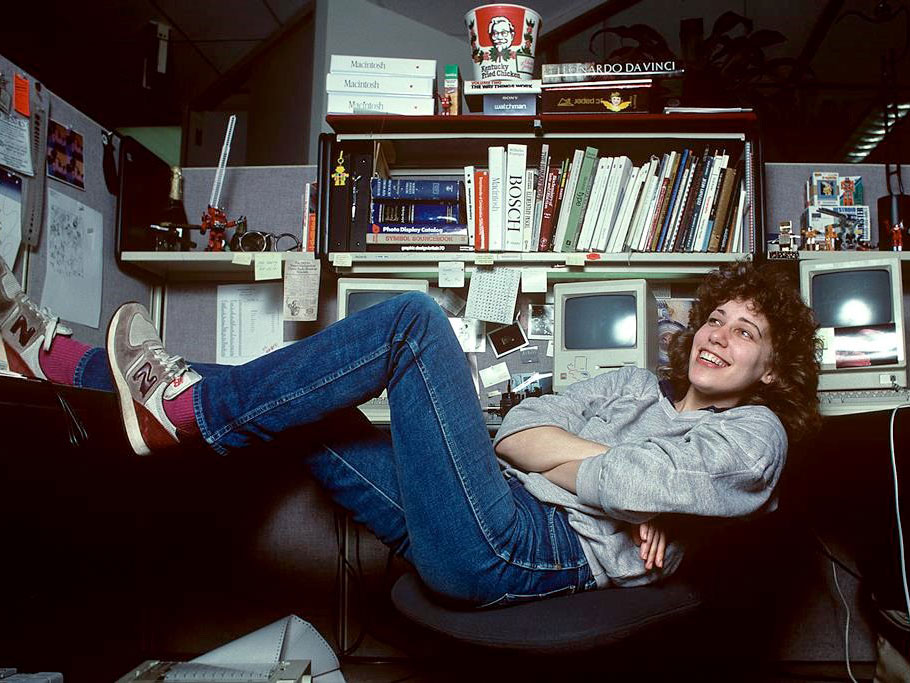
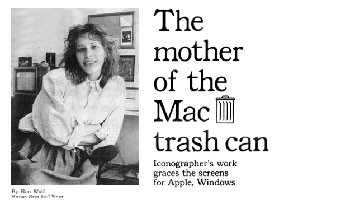
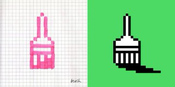
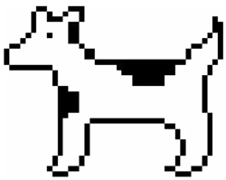
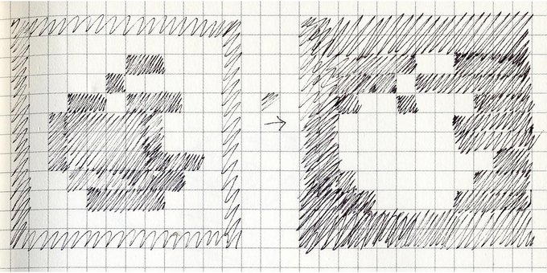
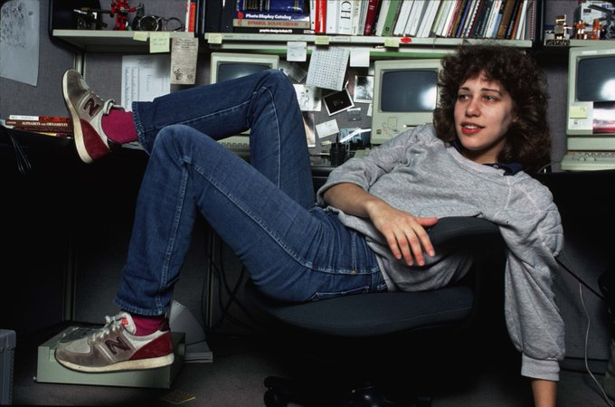
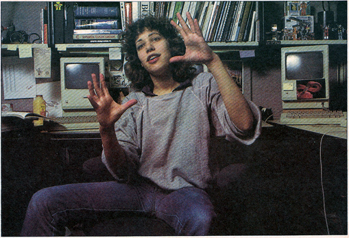
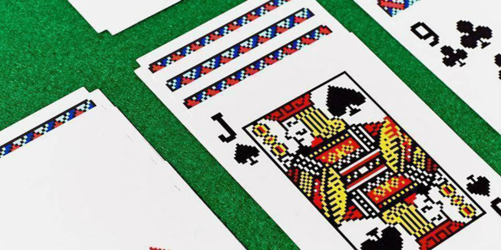

# Susan Kare

*Ithaca, 5 de febrero de 1954. Artista y diseñadora gráfica*

Es la diseñadora de distintas tipografías, iconos y material de marketing para el Macintosh OS. De hecho, algunos de sus primeros trabajos todavía se puede ver en muchas herramientas de gráficos de computadora y accesorios, especialmente los iconos tales como el lazo, la mano que agarra y el cubo de pintura.

Las tipografías para Mac, diseñadas por Susan Kare, fueron las primeras no monoespaciadas creadas para ordenado. El tipo de letra **Chicago** (el más destacado visto la interfaz de usuario tipo de letra en el entorno Classic de Mac OS, así como el tipo de letra utilizado en las tres primeras generaciones de la interfaz del iPod de Apple), el tipo **Ginebra**, el tipo **Mónaco** (co-creadora), el Perrovaca ó *Dogcow*, un perro con nariz y manchas que le hacen parecer una vaca Holstein, el Happy Mac (el ordenador sonriente que daba la bienvenida a los usuarios de Mac al arrancar sus máquinas durante 18 años, hasta que el Mac OS X 10.2 sustituyó con un logotipo gris de Apple), el icono de comando (⌘) en los teclados de Apple.

|  Happy Mac | Trash can |
|:-|:-|
|||
|Paint Brush|Perrovaca ó *Dogcow* de la tipografía Cairos|
||

Susan Kare había estudiado Bellas Artes y se había especializado en la escultura. No tenía experiencia con ordenadores y se inspiró en técnicas de bordado, mosaicos y puntillismo para sus primeros diseños. Su trabajo gustó y Apple la contrató para diseñar fuentes e iconos.🎨

Los primeros iconos para un Mac se hicieron a cambio de… un Mac. Susan Kare "cobró" un Apple II a cambio de su primer trabajo digital. Los iconos los diseñó pixel a pixel, a mano, en una libreta cuadriculada. ✍️

> El diseño de iconos es como resolver un puzzle: tienes que casar una idea con una imagen y se ha de poder entender y recordar". Kare encontró el balance entre la simplicidad y la abstracción: “tenía sus ventajas trabajar con 32x32píxeles: cuantos menos detalles, más universal”.

| Susan Kare ||
|-|:-:|
|  |  | $1600 |

En 1988 Susan Kare creó su propia empresa desde la que ha diseñado para Microsoft (las cartas para el mítico “Solitario”), Facebook (los regalos virtuales), Paypal... Ahora es directora creativa de Pinterest y también vende sus diseños a través de http://kareprints.com 🎨

El trabajo pionero de Susan Kare ha sido reconocido con algunos de los premios más prestigiosos y actualmente sus diseños se venden en el Museo de Arte Moderno de Nueva York. La pionera del diseño de iconos se ha convertido en un icono en si misma.

Conseguir comunicar con una rejilla de píxeles reducida y con un estilo propio resulta todo un reto que va más allá de las tendencias. Prueba de ello es que muchos de estos iconos siguen vivos y comunican con la misma eficacia a una generación de usuarios que no sabe, por ejemplo, lo que es un disquete. La magia de un icono bien diseñado.

## Referencias

* [Susan Kare, pionera del pixel art.](https://blog.kaleidos.net/susan-kare-pionera-pixel-art/)
* [Susan Kare en la Wikipedia.](https://en.wikipedia.org/wiki/Susan_Kare)
* [Artículo en El País.](https://elpais.com/elpais/2020/02/15/icon_design/1581759216_920577.html)

