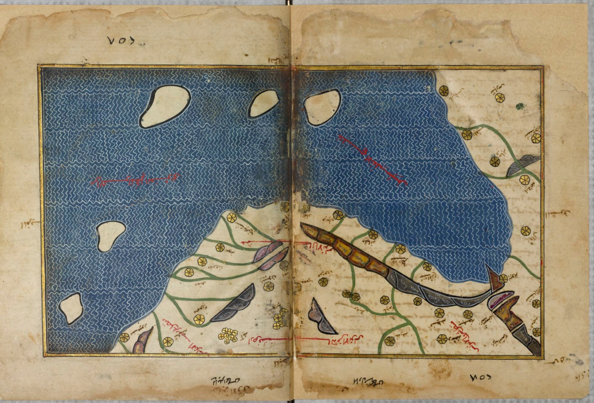
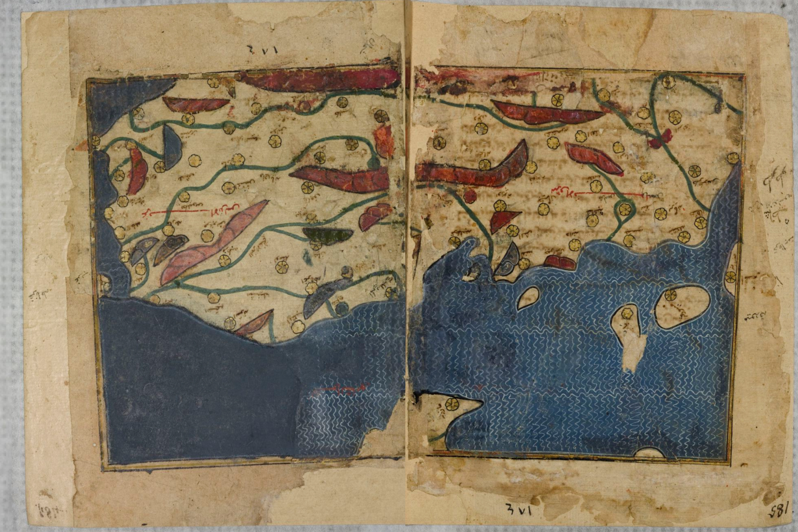
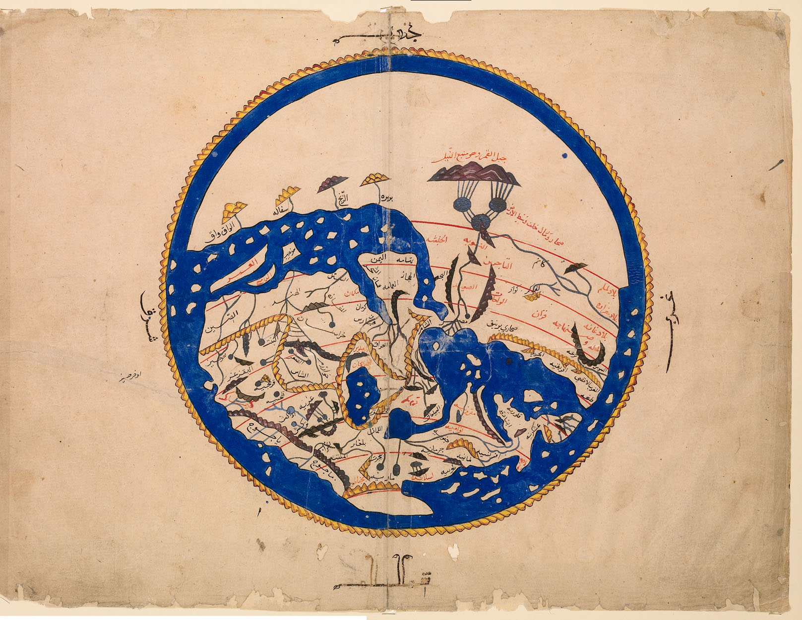
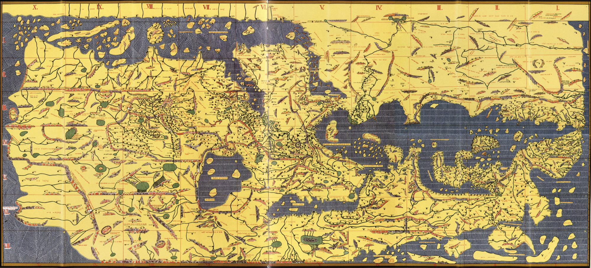
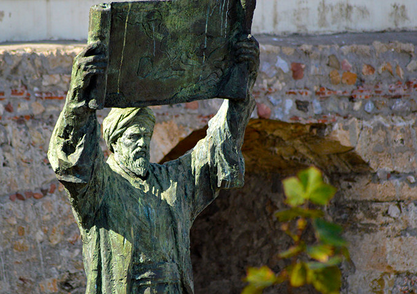
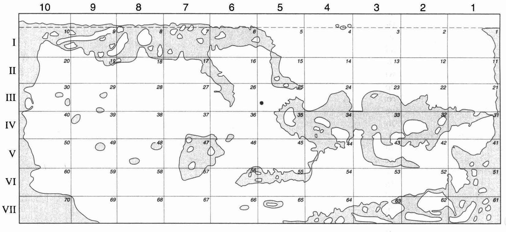
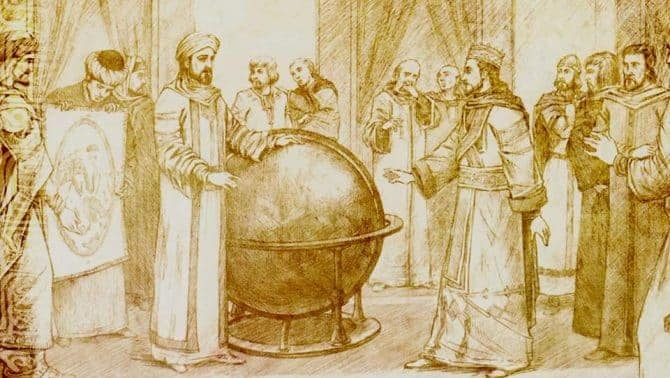
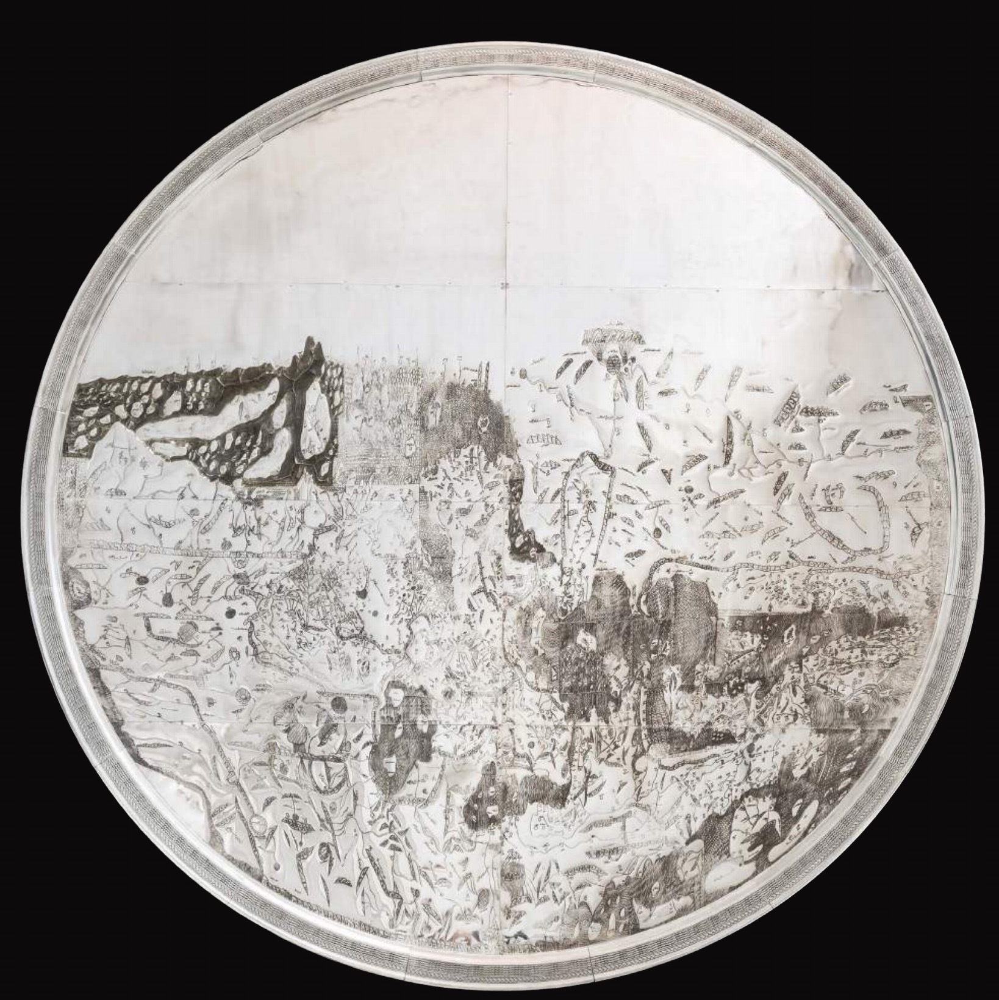
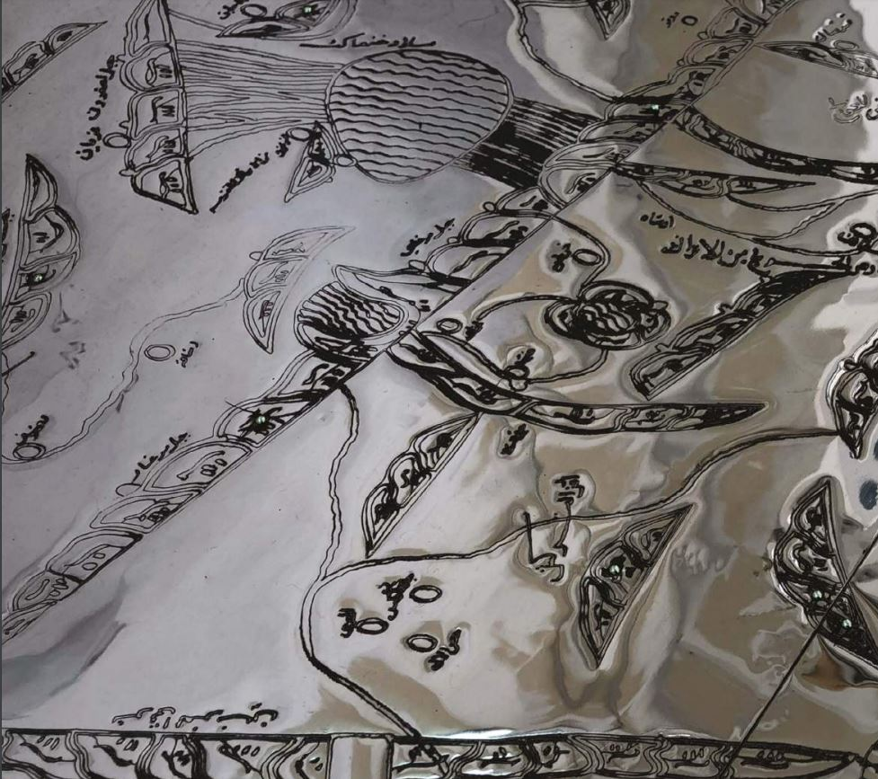
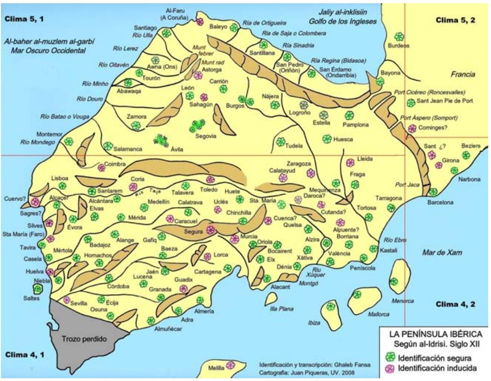

# al-Idrîsî

Su obra *Nuzhat al-mushtāq fi'khtirāq al-āfāq*, cuya traducción sería *Entretenimiento para quien anhela viajar por el mundo* se llama también *Libro de Roger*, *Tabula Rogeriana* o *Kitab Rudjar*, ve la luz en enero de 1154.
Se trata de un atlas que describe los países, sus principales ciudades, sus carreteras y fronteras, mares, ríos y montañas del mundo del siglo XII. No solo describe el mundo desde el punto de vista de la geografía, sino también desde el punto de vista económico y comercial, histórico y religiosa. Fue encargado por el rey normando **Roger II de Sicilia** a este geógrafo nacido en  Ceuta.

El llamado *Libro de Roger*, *Tabula Rogeriana* o *Kitab Rudjar* en honor al patrocinador, se imprime en Occidente por primera vez en caracteres árabes en Roma en 1592. En 1619 se publica en latín. Luego cae en el olvido y no fue hasta el siglo XIX cuando se redescrubrió y se tradujo al francés.

Se conservan diez manuscritos de Geografía, escritos entre principios del siglo XIV y finales del siglo XVI. De estas diez, seis contienen al comienzo un mapa circular del mundo. Cinco conservan el texto completo y ocho tienen mapas.

La Biblioteca Nacional de Francia tiene dos. El más antiguo, copiado alrededor del 1300 en papel en escritura magrebí, proviene de la colección de 1515 manuscritos árabes traídos por **Asselin de Cherville**, agente consular en Egipto, adquiridos por la Biblioteca en 1833.

https://gallica.bnf.fr/ark:/12148/btv1b52000446t

 Este manuscrito consta de trescientos cincuenta y dos folios y reúne setenta mapas, cada uno pintado en un doble página en un marco dorado. Utiliza una amplia y variada gama de colores. Los nombres de países y regiones están dibujados en rojo. El mar es de color azul con una red ondulada blanca. Los lagos y ríos de agua dulce son verdes. Las montañas están representadas en muchos tonos, desde el ocre hasta el púrpura. Las ciudades están marcados por rosetones realzados con oro.

 
 [España cristiana (5º clima 1ª sección) - BnF Ms Arab 2221 - 255v-256r](https://gallica.bnf.fr/ark:/12148/btv1b52000446t/f518.item.zoom)

 
 [Al-Andalus (4º clima 1ª sección) - BnF Ms Arab 2221 - 184v-185r](https://gallica.bnf.fr/ark:/12148/btv1b52000446t/f376.item.zoom)

En la Bodleian Library de Oxford se conserva una copia del original realizada en El Cairo en  1456, (Mss. Pococke 375), y que Edward Pococke trajo a Oxford en 1692. Esta copia contiene un mapa circular del mundo.

*Bodleian Library MS. Pococke 375 fol. 3b-4a [🔗 enlace](https://digital.bodleian.ox.ac.uk/inquire/p/cc2debab-70f5-4b82-9bab-7235fdb89e43).*

En la Biblioteca de Hakim Ugli de Estambul se conserva una edición ampliada de una copia que se hizo para el sucesor de Roger II, Guillermo I en 1192, llamada *Uns al-muhay wa-rawd al-furay*. De formato más pequeño, **Konrad Miller** la bautizó como el «Pequeño al-Idrîsî».

Una de las copias o interpretaciones más importante de la obra de al-Idrîsî es la que publicó en 1926 el alemán Konrad Miller [1844-1933] basándose en el ejemplar de la Bodleian Library, cuya copia se conserva en la *Library of Congress*.

*Weltkarte des Idrisi vom Jahr realizada por Konrad Miller en 1927 y publicada en Stutgart en 1928. Mide 195x92 cm [🔗 enlace](https://www.loc.gov/item/2007626789/)*.

## Contexto historico. Sicilia

Normandos o vikingos son los nombres utilizados para denominar a los legendarios guerreros que realizaban incursiones de saqueos, provenientes de los pueblos nórdicos originarios de Escandinavia. Surgen en el siglo VIII. Famosos por ser grandes navegantes, se extienden por todas las costas europeas, e incluso tierra adentro remontando ríos. A traves de los cauces fluviales rusos llegarán incluso al Mar Negro y asediarán Constantinopla.

En 878, invadieron y se asentaron en Inglaterra. Después de su fallido ataque a París en 945, se establecieron en la desembocadura del Sena. El rey Carlos el Calvo les concedió las tierras de la futura *Normandía*. 

La enorme isla de Sicilia está situada en el centro del mar Mediterráneo. Fenicios, griegos, cartagineses, romanos, bizantinos y árabes desde el año 831 se sucedieron dejando numerosos restos arqueológicos.  Los normandos llegaron a Italia a principios del siglo XI, asentándose en el sur. **Robert de Hauteville** se apoderó del ducado de Nápoles en 1049, y su hermano **Roger** capturó Sicilia a los árabes entre 1061 y 1091, donde se erigió conde. Los normandos supieron aprovechar las disputas entre los emires. Frente a una población predominantemente musulmana, pero que también incluye a muchos judíos y cristianos ortodoxos, los normandos desempeñan el papel de árbitro. Nuestro protagonista, su hijo **Roger II**, lo sucedió en 1101 y se convirtió en el primer rey de Sicilia. Durante su reinado, la isla disfrutó de un período de gran prosperidad económica y cultural.

## Roger II

El reinado del rey Roger II se caracterizó por una tolerancia religiosa ante la gran variedad de credos de la isla. Adopta las costumbres locales y se vuelve gradualmente hacia Bizancio. En una época donde las Cruzadas fomentaban el enfrentamiento entre reliones por el control, de Tierra Santa, Roger II integra a los musulmanes en la corte y centraliza todos los órganos de poder, toda autoridad en la capital, Palermo. Establece libertad de culto. En la corte se hablaba árabe, latín y griego, que el rey dominaba a la perfección.

Establece relaciones con el califato abbasí y fomenta el desarrollo de la cultura árabe. La corte de Palermo da la bienvenida a excelentes artistas y académicos como al-Idrîsî. 

## al-Idrîsî

Abu Abdullah Muhammad Ibn al-Idrîsî nace en el actual Marruecos, en la ciudad de Sabtah (Ceuta) en el año 1100. Estudió en Córdoba, en aquellos días el primer centro cultural del Islam occidental. Estudia medicina, latín, habla griego y escribe algunos libros, incluido un tratado sobre medicina. 

En 1139 es llamado por el rey Roger II y se traslada a Palermo, donde emprende bajo la dirección del rey, una labor de levantamiento y recopilación geográfica que duraría dieciocho años. al-Idrîsî está convencido que la dinastía del rey normando, los *Hauteville*, está destinada a suceder a los califas abasíes y de que Palermo reeemplazará a Bagdad como centro cultural y académico del mundo islámico. Por ello en el prólogo del libro se lo dedica como *sabio soberano y servidor del conocimiento*. La redacción del Libro de Roger comenzó en 1154. Pero seis meses después, Roger II muere. La geografía se completará bajo Guillermo I, probablemente alrededor de 1157, después de lo cual perdemos por completo la pista de al-Idrîsî. Se supone que murió entorno al 1165.

### Metodología de trabajo

al-Idrîsî analiza los trabajos de dos geógrafos previos, Paulo Orosio y Claudio Ptolomeo. Su primera impresión es la cantidad de omisiones y discrepancias que hay entre ellos. Por ello decide investigar por su cuenta.

Su fuente de trabajo son eruditos y viajeros experimentados, cuyas afirmaciones contrata enviando en ocasiones emisarios a tal fin. La ubicación de Sicilia en el centro de MEditerráneo ayuda a disponer de una gran cantidad de viajeros. Para asegurar la veracidad de los datos que lo corroboran, dibuja un mapa graduado, usando una brújula de hierro, en una mesa de dibujo. Traza un mapa del mundo orientado al sur y dividiendo la latitud en siete climas y la longitud en diez secciones. Los climas, zonas térmicas paralelas al ecuador, tinen la anchura desigual y el atlas muestra una deformación característica: el mundo es muy grande, casi extendido en longitud, de oeste a este, en comparación con su extensión en latitud.

*Índice de mapas de la Tabula rogeriana según Konrad Miller*

al-Idrîsî interroga a todos los comerciantes o emisarios que pasan por Palermo. Ofrece a quienes abandonan la capital una cuadrícula de información específica que deberán completar. Esto permitirá incluir información verificada sobre Europa, la primera vez que sucede en la cartografía islámica.

A los mapas acompaña una descripción geográfica de todos los elementos que no puede representar: descripción de la naturaleza, caminos, distancias, arquitectura, comercio, maravillas, modales y costumbres. El número de topónimos supera los 5000.

La cartografía islámica tenía principalmente un propósito administrativo. Su utilidad principal reside en ser un material de referencia para la recaudación de impuestos, por lo que describe los caminos imperiales siguiendo un itinerario, como una guía de viajes y las provincias, ciudades y campos que atraviesan. Todo lo que no puede verificar se descarta, y sólo en los confines del mapa se permite licencias sobre historias legendarias. Confecciona la primera descripción "moderna" del mundo conocido, con un caracter enciclopédico que incluye información de toda índole, geográfica, por supuesto, pero también económica y comercial, histórica y religiosa.

Según afirmó Freyheer F.v. Zach en 1806, sin usar fuentes, el globo terráqueo más antiguo se fabricó para el rey Roger II de Sicilia en el siglo XII. Incluso cita que el globo se hizo con 400 libras de plata. hizo una descripción de algo parecido en su obra *Nothatol mostak*.

*Grabado recreando el momento en el que al-Idrîsî presenta el globo a Roger II.*

*Facsimil del posible globo con el mapa de al-Idrîsî.*

Sin embargo los estudioso actuales concluyen que la descripción de al-Idrîsî correspondería más concretamente a un gran disco grabado en plata de unos 80 pulgadas de diámetro, que usó para presentar a Roger II el resultado de los trabajos.

*Recreación por Factum Arte del disco descrito por al-Idrîsî para la exposición Talking Maps en la Bodleian Library*

*Detalle de la cartografía grabada en plata*

Lamentablemente en 1160, los barones sicilianos se rebelaron contra Guillermo II y el libro original fue destruido, junto con la representación en plata, que seguramente fue troceado y fundido. Esta rebelión afectó a los musulmanes de isla, por lo que al-Idrîsî huyó al norte de África donde murió seis años después. En su huída pudo salvar gran parte de sus escritos.

## Descripción cartográfica

El mundo habitado que dibuja al-Idrîsî corresponde a 180 grados de los 360 de  la esfera terrestre en longitud, desde el océano Atlántico al mar de hina, al igual que hizo Ptolomeo. En latitud, abarca 64 grados, desde el ecuador al océano Ártico. Su dibujan las fuentes del Nilo, conocidas por los exploradores musulmanes, con un trazado de sus fuentes surgiendo de los llamados Montes de la Luna. El norte de Europa se dibuja con mayor precisión que Ptolomeo, al igual que las islas Británicas, posiblemente por el conocimiento normando de aquellas tierras.

La zona sur de Italia se dibuja de mayor tamaño que el norte, y por supuesto la isla de Sicilia destaca notablemente en el centro del Mediterráneo. Describe algunas de las ciudades históricas de la zona del sahel africano, como Silla, Tacrour, Barisa, Ghana, en donde ya menciona la existencia de un comercio de esclavos y describe las grandes minas de oro.

El comercio con la región del Sudán explica la descripción que hace del Nilo, que se divide en «dos Nilos» según sus anotaciones, algo que mejora con respecto a Ptolomeo que no contemplaba la división del gran río. También menciona el *Nilo de los Negros*, una posible referencia al río Senegal o al río Níger, pero que en vez de desembocar en el Atlántico, conecta con el Nilo egipcio.

Describe y representa los principales ríos europeos: Danubio, Rhin y el Elba, con noticias recibidas muy posiblementes de los comerciantes normandos. En el Bático sitúa la isla de las Amazonas. Habla de la importancia de los pueblos de Francia.

Al contrario que Ptolomeo, no muestra un océano Índico cerrado, sino abierto al este, descripción hecha basándose, seguramente, en información de marineros chinos y árabes, cuyos viajes comerciales llegaron hasta las costas de Zanzíbar.

### Península Ibérica

*Transcripción de los topónimos de la Península Ibérica, por Juan Piqueras y Ghaleb Fabsa, 2008*

## Conclusiones

Las obras de Idrisi son de una precisión cartográfica excepcional cuando se las compara con otras obras contemporáneas, tanto por su riqueza de detalles, como por el *método científico* que empleó. Las descripciones de su obra son muy rígidas con respecto a las divisiones que marcó en el mapa, siete climas y diez secciones, por lo que ciertas características geográficas, étnicas, lingüisticas o religiosas no se encuentran descritas de una manera harmonizada.

La obra de Idrisi no tuvo una gran difusión en su época, en parte porque no hubo una traducción al latín que permitiera su conocimiento. Aún así sus textos ayudaron a poner luz en el conocimeinto que había en Europa de China y el lejano oriente.

## Fuentes

* 🏛 Exposición de la BnF, *al-Idrîsî. la Méditerranée au XIIe siècle* , dossier y catálogo [🔗 enlace](http://classes.bnf.fr/idrisi/index.htm)
* 📕 Karen Pinto. The Maps Are the Message: Mehmet II’s Patronage of an Ottoman Cluster,
Imago Mundi, 63:2 20l, pp. 157-176 [🔗 enlace](https://www.academia.edu/1153026/The_Maps_Are_the_Message_Mehmet_IIs_Patronage_of_an_Ottoman_Cluster)
* 📕 Juan Piqueras Haba. Cartografía islámica de Sharq Al-Andalus. Siglos X-XII. Al-Idrisi y los precursores. Cuadernos de geografía, 2009, Número 86: 137-163 [🔗 enlace](http://roderic.uv.es/handle/10550/31376)
* 📕 Juan Piqueras y Ghaleb Fansa. La Península Ibérica en el gran atlas de al-Idrisi. Segon Congrés Català de Geografia. 29 – 31 de maig de 2008 [🔗 enlace](https://publicacions.iec.cat/repository/pdf/00000070/00000087.pdf)
* 📕 S. Maqbul Ahmad (1984): Cartography of al-Sharif al Idrísí, in J.B. Harley and D.
Woodward: The History of Cartography, Vol.2: Cartography in the Tradicional
Islamic and South Asian Societies, pp. 156-172. [🔗 enlace](https://press.uchicago.edu/books/HOC/HOC_V2_B1/HOC_VOLUME2_Book1_chapter7.pdf)
* 📕 Jim Siebold. World Maps of al-Idrisi [🔗 enlace](https://www.myoldmaps.com/early-medieval-monographs/219-al-idrisi-world-maps/219-al-idrisi.pdf)

