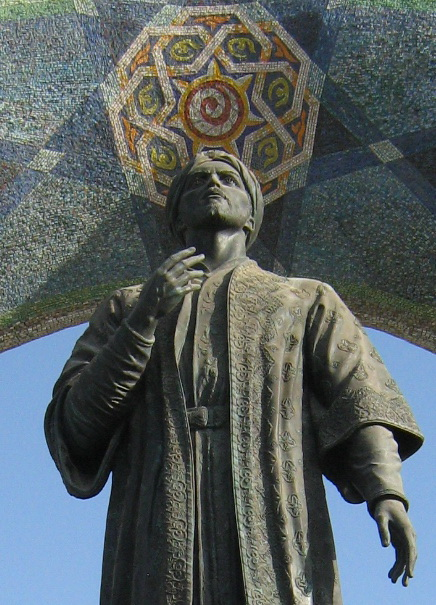
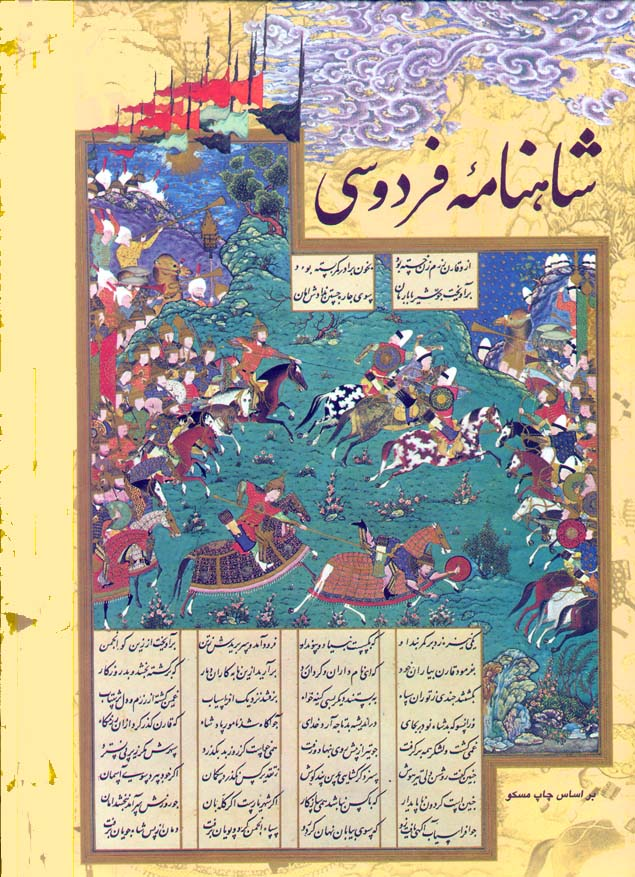
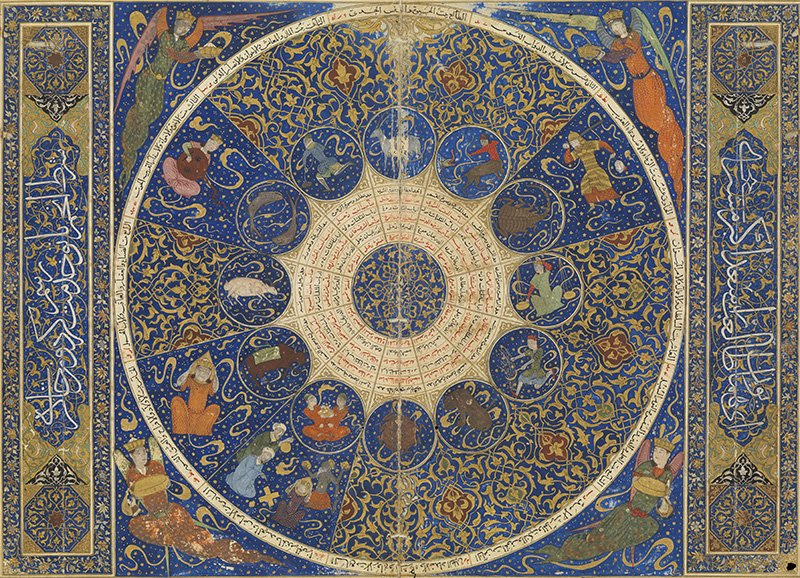
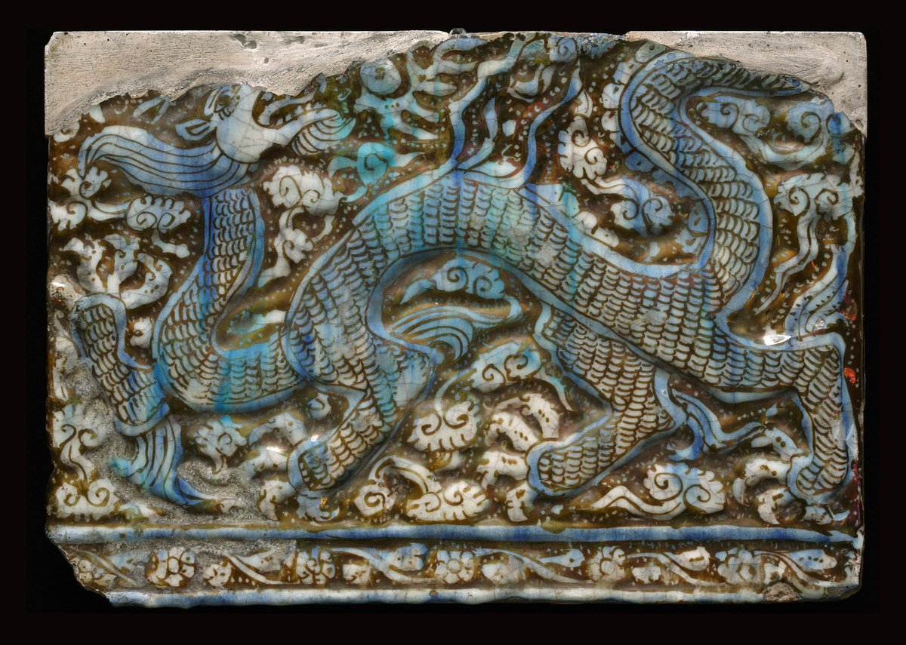
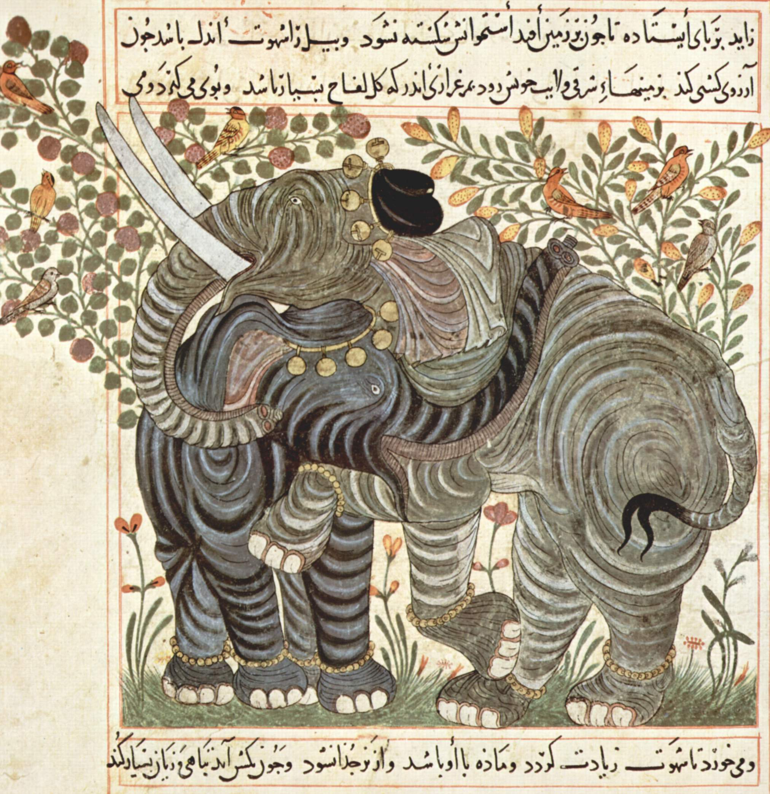
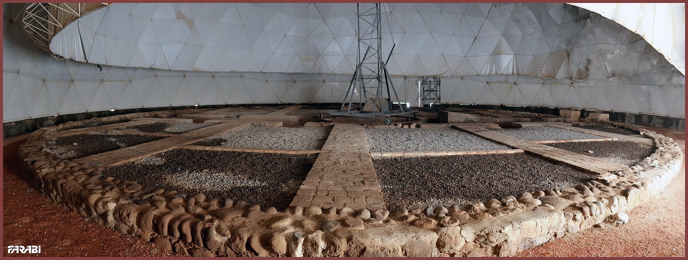
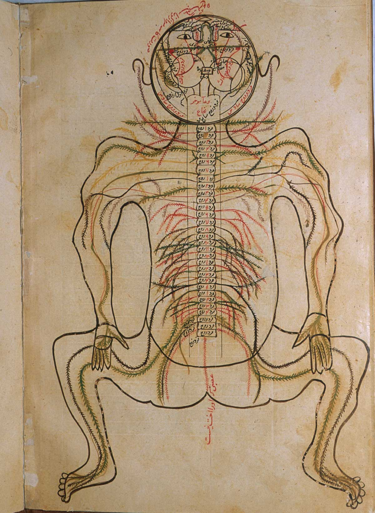
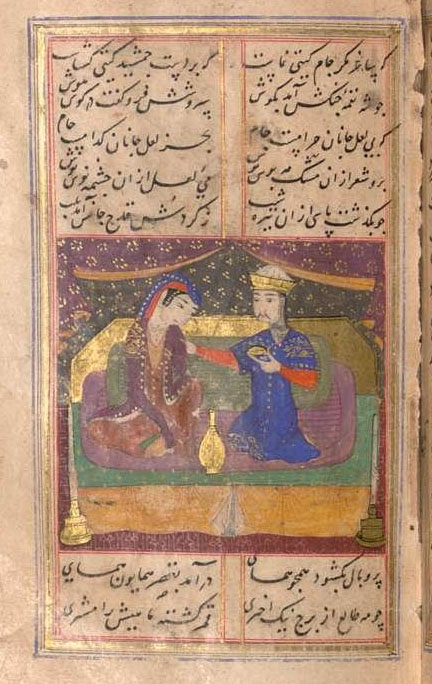
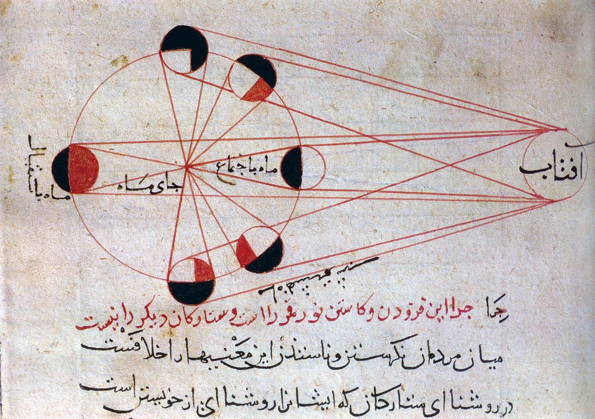

# Cartografía islámica

## Divisiones del mundo en el Islam
La división del mundo por líneas religiosas no viene descrita en el **Corán** ni en los *hádices* o «dichos» de Mahoma, que son la base de la jurisdcción islámica.

* *Dar al-Islam, دار الإسلام* es traducible por «tierra del islam», o literalmente «casa del islam» son las tierras controladas por gobiernos musulmanes (mundo islámico), 
* *Dar al-Harb* es un concepto que se traduce 'casa de la guerra'), las tierras habitadas por los no musulmanes. Los que viven aquí son infieles. A su vez esta se dice en:
  * *Darl el-Ahd*: los lugares donde el gobierno promueve y profesa el islam.
  * *Dar el-Suhl*: las tierras donde el islam es respetado pero los líderes no son musulmanes.
  * *Dar al-Dawa*: los lugares donde los musulmanes no gozan de reconocimiento ni sus líderes se vinculan con el islam.

## 🕌 Persia, clave en el estudio de la ciencia en el mundo islámico

🔶 Se inventa el idioma que conocemos como "persa moderno" actualmente. En el siglo VIII, en un movimiento de recuperación cultural frente a "lo árabe", el poeta Rūdakī encabeza la marcha hacia la creación de un idioma nuevo.

👆 Estatua de Rūdakī en Dushabe, Tajikistan

🔶 En 1010 se termina el Shāhnāmeh, "Libro de los Reyes", la obra mitológica en poesía más larga escrita por un único autor, el poeta Ferdowsi.

🖼️ Shāhnāmeh of Shāh Tahmāsp, c. 1525, fol. 102v

🔶 Horóscopo de nacimiento de Iskandar Sultan, nieto de Timur-e Lang, más conocido en Occidente como Tamerlán. Muestra la diisposición planetas el 25 de abril de 1384.

🖼️ Wellcome Library reference: MS Persian 474

🔶 Ibn Sina (980-1037) conocido en occidente como Avicena, escribe su *Qanun* ó «Canon» de medicina, un libro tan revolucionario para su época que continuó usándose hasta el siglo XVIII. Médicos de todo el mundo acudían a Esfahán a estudiar con él en el bimarestán (el hospital).

🔶 Entre 1090 y 1275, aparecen los ismaelíes Nizari, una secta minoritaria del chiismo, a su vez minoritario en un país eminentemente sunní en aquella época. El gran centro de poder ismaelí era el Califato Fatimí, con sede en El Cairo. En el año 1090, para ponerse a salvo de las persecuciones, y dirigidos por el carismático Hasan-i Sabbah, tomaron la fortaleza de Alamut, una posición inexpugnable en las montañas, al sur del mar Caspio. Des de entonces se los conoció como los Asesinos de Alamût.

🔶 Bajo las instrucciones de **Rashīd al-Dīn** (1247–1318) , se pone en marcha el complejo de [Rab'-e Rashīdī](https://en.wikipedia.org/wiki/Rab%27-e_Rashidi), que estaba dedicado en su gran mayoría a la producción de libros ilustrados.

🔶 El matemático **Omar Khayyam** (1048-1131) da con la primera teoría general para resolver ecuaciones cúbicas geométricamente.

🔶 Ḥāfeẓ (c. 1315/17-1390) escribe muchísimos 'ghazal', poemas cortos que más adelante se compilarán en su «divan» o conjunto de obra poética. Revoluciona la poesía.

🔶 Hacia 1077, más o menos, en la ciudad de Nishapur el farmacéutico y poeta **Farīd ad-Dīn ʿAṭṭār** termina Manṭiq-uṭ-Ṭayr, «La Conferencia de los Pájaros». Esta obra es fundamental para el desarrollo del sufismo en Irán, que lo comvertirá en el futuro en un país de mayoría chií.

🔶 Tras la muerte de Gengis Khan el imperio se dividió entre sus hijos, formando muchas dinastías: los Yuan en China, los iljánidas en Irán y la Horda de Oro en el norte de Irán y sur de Rusia. Los dos últimos se convirtieron al Islam en pocas décadas. El Ilkhanato en Irán se establece entre 1257-1335 tras la invasión mongola, bajo las órdenes de **Hulagu Khan** y sus descendientes. A partir de entonces la influencia de China será mucho mayor, apareciendo los dragones o las nubes chi.

🔶 En el siglo XIII el astrónomo y matemático **Qotb al-Din al-Shirazi** (1236–1311) mejora el modelo de movimiento planetario creado por Ptolomeo, proponiendo nuevas teorías sobre los planetas y las estrellas.

🔶 En 1294-1299 se ilustra el Manāfiʻ al-ḥayawān, «Los beneficios de los animales», una enciclopedia del mundo natural con un estudio de los animales que no se había visto hasta entonces.

👆 Manāfiʻ al-ḥayawān - MS M.500, fol. 13 - Pierpont Morgan Library

🔶 En 1259, bajo el patrocinio de **Hulgagu Khan**, se funda [el observatorio de Maragheh](https://en.wikipedia.org/wiki/Maragheh_observatory) uno de los más grandes del mundo en su tiempo. Estaba dirigido por **Nasir al-Din al-Tusi**, influyente astrónomo y matemático.

👆 Restos del observatorio de Maragheh bajo la cúpula que lo conserva

🔶 Abdallāh Shīrāzī, más conocido como Saʿdī (1210-1291/92) escribe sus dos grandes obras: el Būstān y el Golestān, donde hace una profunda crítica a la sociedad de su tiempo que a día de hoy sigue siendo muy utilizada como elemento de reflexión.

🔶 **Manṣūr Ibn Ilyās** publica hacia 1390 su «Tashrīḥ-i badan-i insān», uno de los tratados anatómicos más completos del momento que incluye descripciones detalladas de huesos, músculos, venas, nervios y muchísimo más.

👆 Dibujo del sistema nervioso - Tashrih-i badan-i insan - U.S. Library of Medicine

🔶 Hacia 1331 **Khwāju Kermāni** escribe «Humāy y Humāyun», una historia de amor protagonizada por el príncipe **Humāy**.

[👆 Copia de Humāy y Humāyun del año 1428](https://bildsuche.digitale-sammlungen.de/index.html?c=viewer&bandnummer=bsb00036317&pimage=00231&l=es)

🔶 El polifacético erudito al-Bīrūnī (973-c.1050) desarolla un nuevo sistema para determinar el radio de la Tierra, observando las cimas de las montañas del actual Pakistán y utilizando la trigonometría. Y solo se equivocó en un 2%.

[👆 Fases de la Luna - Kitab al-Tafhim - Museum and Document Center of Iran Parliament](https://www.akg-images.co.uk/archive/-2UMDHUP5HBAD.html)

🔶 **Suhrawardī** (1154–1191) resucita la filosofía pre-islámica en Irán, recogiendo el pensamiento fundamentalmente zoroastriano y mazdeo, creando la Escuela de la Iluminación.

🔶 El ajedrez («shatranj» en persa) es uno de los juegos de mesa más populares en Irán. Las piezas, especialmente las de Nishapur, viajan por todo el Mediterráneo junto con la tradición de jugar. 

## Recursos

* Astronomical instruments at the Istanbul Observatory from Shahinshahnāme (Book of the King of Kings), Istanbul University Library, F 1404, fol. 57a. The observatory was built in the 16th century by Mūrad III for Taqī al-Dīn, clockmaker and astrologer.

[👆 Descripción de las fases de la Luna]()

* Kitāb al-masālik wa-'l-mamālik [🔗 Enlace](https://dhb.thulb.uni-jena.de/receive/ufb_cbu_00011296?&derivate=ufb_derivate_00010485) conservado en Forschungsbibliothek Gotha. The Persian Sea (Bahr Faris) it is! The sea encompasses the Red Sea (right corner), the Persian Gulf (middle) and the Indian Ocean. This map is therefore oriented west, showing the African shore on the lefthand side. It's from the Arabic "Book of Routes and Realms" by al-Istakhrī (fl. 10th c.) that is the first extant combination of text and maps in the Islamicate world. This is one of the earliest copies with a date (1193), held at @ubleiden, check it out: https://bit.ly/3mjWsYY This is the Persian Sea in the oldest dated copy (1172) that became part of the #MemoryoftheWorld by the @UNESCO in 2015. The manuscript is held at @FBGotha (with a page from the copy in their profile pic 😊), check it out: https://bit.ly/3bPHq8h  al-Istakhrī's book has 21 chapters: world (+map) & territories under Muslim rule in 20 chapters - from al-Andalus in today's Spain to Sindh in today's Pakistan. Each region got a map and details about cities, history, trade, distances etc.#Twitteristorian #twitterstorians The book was translated into Persian+Ottoman & was copied for almost a millennium! Quite a hit, I'd say Smiling face with smiling eyes Shamelessly tooting my own horn: You can read all about this wonderful book in Nov. 20: https://brill.com/view/title/58945 
nd