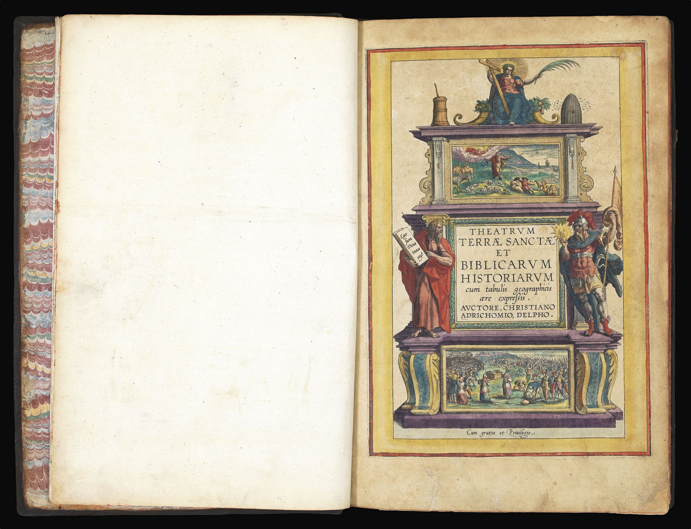
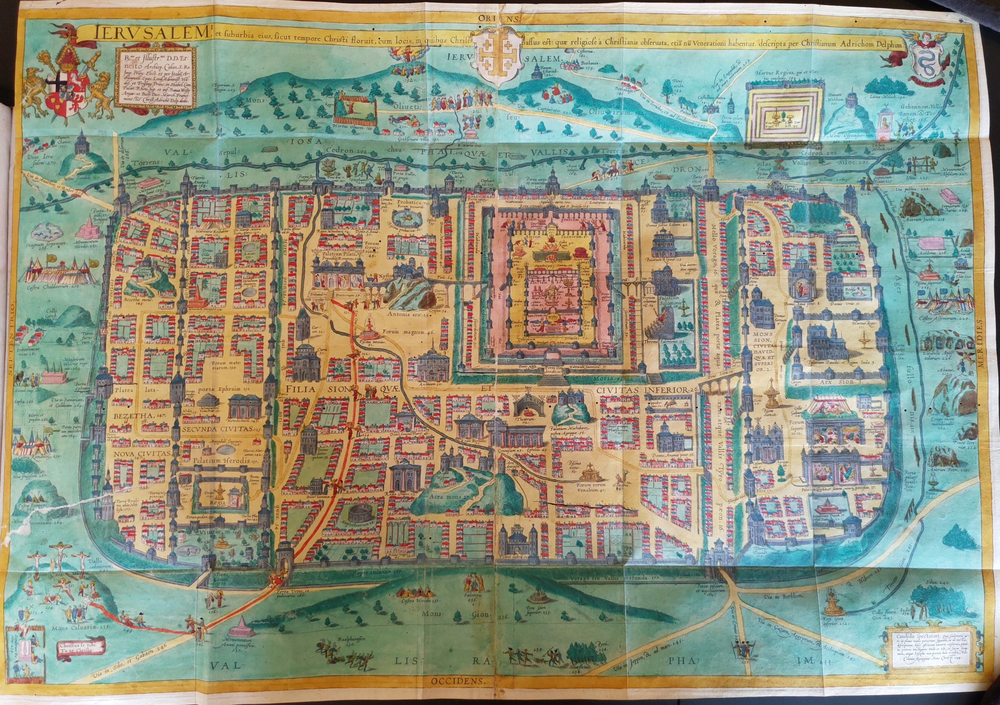
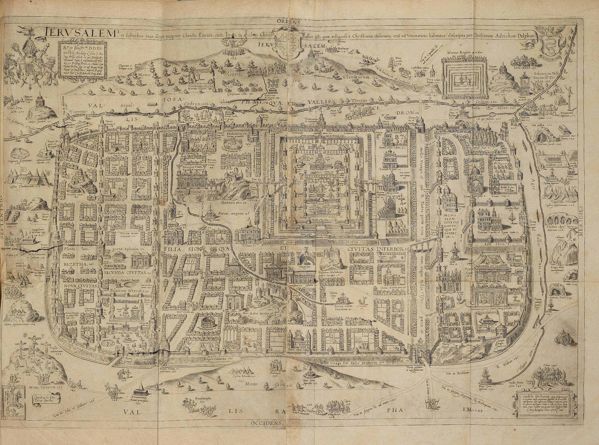

# Notas generales

## Theatrum Terrae Sanctae de Christiaan Adrichem

Durante el siglo XVI, el conocimiento sobre la geografía de los eventos bíblicos se consideraba un logro importante para cualquier estudioso de la Biblia. El atlas de Tierra Santa de **Christiaan van Adrichem** se enmarca dentro de esta categoría de geografía sagrada, como lo atestigua su título: *Teatro de Tierra Santa y de historias bíblicas*, expresadas con grabados geográficos sobre cobre.

La palabra *Theatrum* que aparece en el título significa ventana, ya que el libro tiene por objeto ofrecer una ventana a la geografía histórica de la Biblia. La cartoteca de la Universidad de Leyden posee una copia. En particular este ejemplar destaca por la iluminación de sus grabados y por el propietario original del ejemplar, **Isaac Vossius** (1618-1689), un conocido erudito holandés y coleccionista de libros, famoso por su destacada biblioteca privada. La *biblioteca de Vossius* incluía una gran colección de mapas y atlas, la mayoría de los cuales aún se conservan en las colecciones de la Universidad de Leiden: unos 25 atlas (incluidos los de Adrichem) y alrededor de 180 mapas. El ejemplar acredita su pertenencia a este erudito por una mención que dice: *Ex bibliotheca Viri Illustris Isaac Vossii*. 

Su autor **Christiaan Kruik van Adrichem**,  1533 a 1585-jun-20, nació en la ciudad holandesa de Delft en 1533. Sacerdote católico a los treinta años, también sirvió como confesor de las monjas del convento de Santa Bárbara en Delft). Tras la revuelta holandesa de finales del XVI, Van Adrichem se mudó varias veces dentro de los Países Bajos, antes de establecerse finalmente en Colonia, Alemania. Allí se centró en el estudio de la geografía de Tierra Santa, publicando primero una descripción geográfica de Jerusalén en la época de Cristo en 1584. Este libro incluye un mapa desplegable, en la parte superior, y fue reimpreso varias veces (en 1584, 1588 y 1592) después de la muerte de Van Adrichem en 1585. Su trabajo fue publicado por primera vez en 1590 y editado por **Gerardus Bruyns**, canon de Deventer; las otras ediciones se publicaron en 1593, 1600, 1613 y 1682. Se tradujo a muchos idiomas, alcanzando una enorme popularidad e influencia. Su mapa de Tierra Santa fue el modelo de aquellos terriotorios durante casi 200 años, y copiado por cartógrafos como  Hondius, Jansson, Visscher o Stoopendahl.

De acuerdo con la orientación religiosa del autor, es posible detectar una perspectiva católica sobre la topografía de Jerusalén, que destaca los lugares sagrados venerados por los católicos y la meditación sobre la Pasión de Cristo y su *vía crucis*.

Como es típico en los primeros atlas modernos, Jerusalén y Tierra Santa se presentan a través de una combinación de descripciones textuales y espectaculares mapas desplegables. El siguiente mapa se encuentra dividido según los territorios que ocupaban las doce tribus de Israel, resaltados en diferentes colores. Podemos imaginar fácilmente cómo esta combinación de texto e imagen puede haber sido útil para académicos ansiosos por comprender mejor la geografía histórica de la Biblia. La popularidad del atlas de Tierra Santa de Van Adrichem se atestigua no solo por sus varias ediciones sino también por su influencia duradera en los mapas de Jerusalén y Tierra Santa del siglo XVII, muchos de los cuales de alguna manera se inspiraron en el Theatrum.

El río Cison (Kishon de hoy) se muestra como la conexión del lago de Tiberíades con el mar Mediterráneo. Se muestran muchos ríos inexistentes: un río que conecta Jerusalén con el Mar Muerto. En el Mar Muerto se muestran cuatro ciudades en llamas: Sodoma, Gomorra, Seboim y Adama. 

## 📚 Referencias

* Rubin, Rehav. Image and Reality: Jerusalem in Maps and Views (Jerusalem: Magnes, 1999).
* Shalev, Zur. *Early Modern geographia sacra in the Context of Early Modern Scholarship*,  en la **The Oxford Handbook of the Bible in Early Modern England**, c. 1530-1700, editado por Kevin Killeen, Helen Smith, and Rachel Willie (Oxford University Press, 2015).
* Vries, Dirk de, *Atlases and maps from the library of Isaac Vossius (1618-1689)*, International Yearbook of Cartography 21 (1981): 171-94.
* *Adrichem, Christiaan van*,  editada ppr A.J. van der Aa, continuada por K.J.R. van Harderwijk & G.D.J. Schotel (Haarlem, 1852-1878).
* Laor, Eran, and Shoshana Klein. *Maps of the Holy Land: Cartobibliography of Printed Maps*, 1475-1900 (New York: Liss, 1986).