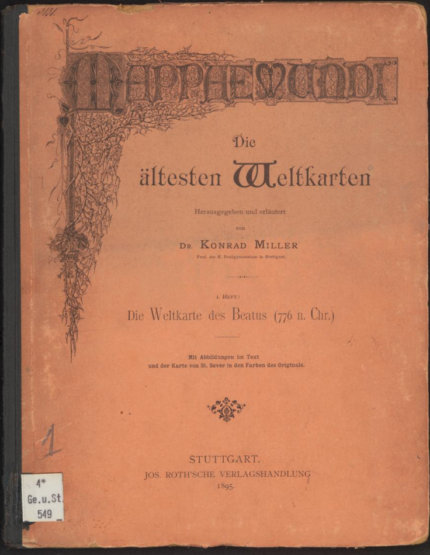
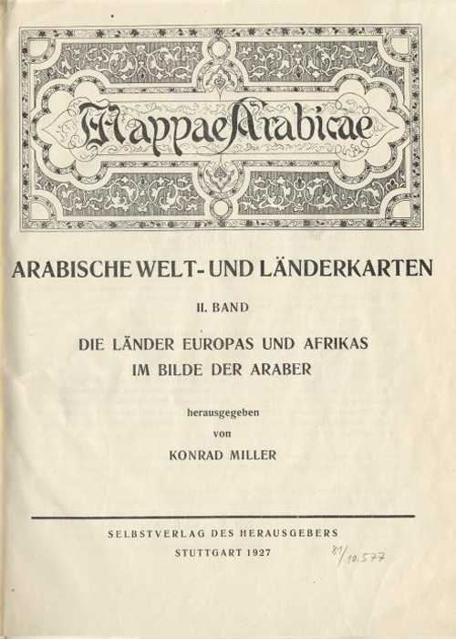
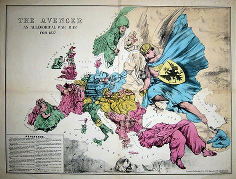
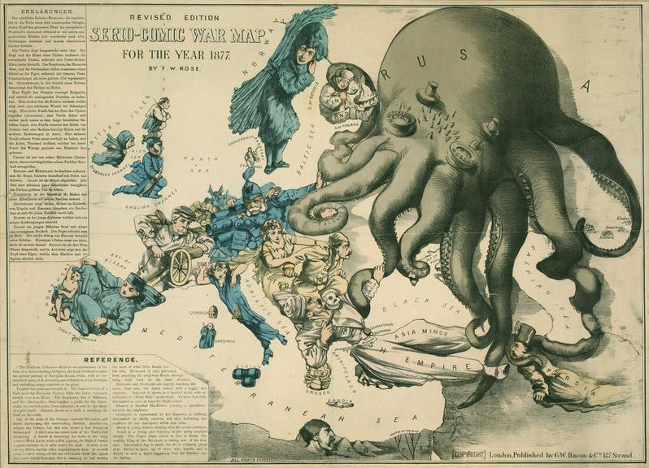
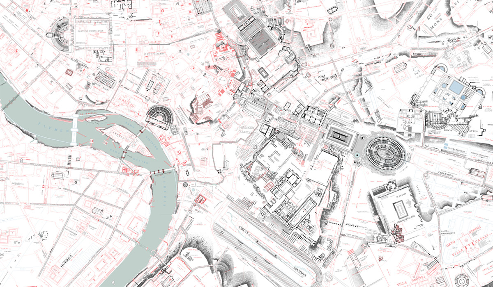
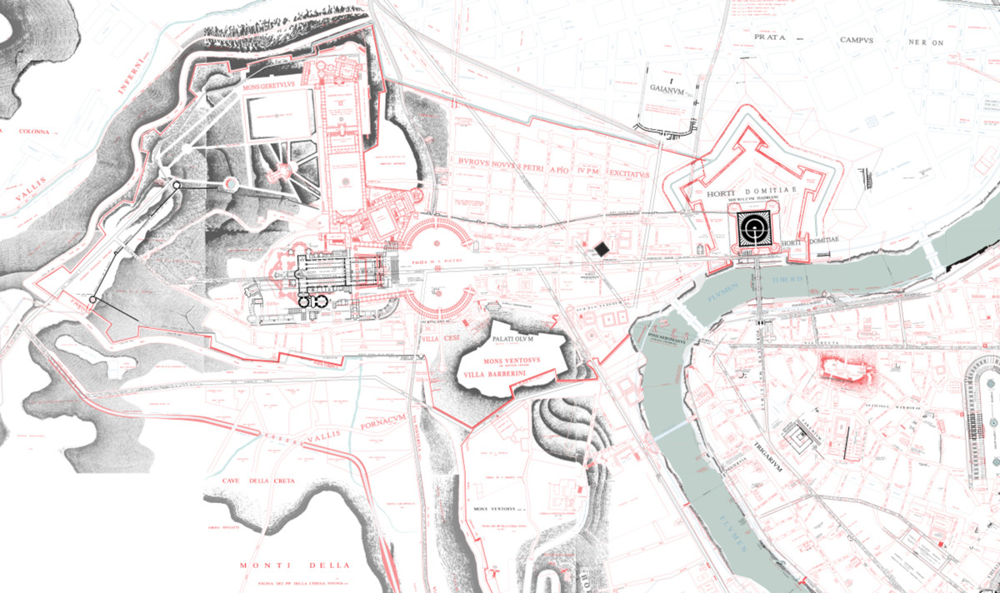
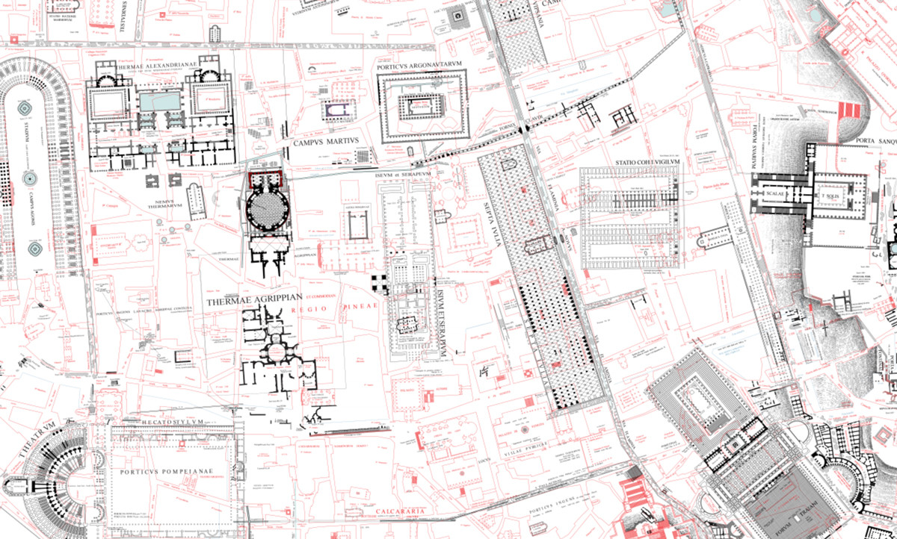

# Siglo XIX

## ✍ Artículos genericos

* [Los mapas de la persuasión](https://www.bl.uk/maps/articles/maps-for-display-and-persuasion)
* [Los mapas satíricos](https://www.bl.uk/maps/articles/satirical-maps)
* [Los mapas fantásticos](https://www.atlasobscura.com/articles/fantastical-maps-to-escape-into)
* [Los orígenes en la visualización de datos](https://culturacientifica.com/2019/08/01/los-origenes-de-la-visualizacion-de-datos/)

## 🎨 Levi Walter Yaggy (1848-1912)

Las "infografías" del norteamericano Levi Walter Yaggy fueron un recurso pedagógico de primer orden para la enseñanza de las Ciencias de la Tierra. Esta ilustración (1893) muestra cómo se entendía la Tierra a finales del XIX, antes de la Tectónica de Placas.
https://alpoma.net/carto/?p=7151

## 🎨 Konrad Miller (1844-1933)

Konrad Miller (🍼 21-11-1844, Oppeltshofen; 🏁 25-05-1933,Stuttgart). Teólogo católico, científico natural e historiador de la cartografía. Entre sus principales logros figura en el estudio y redescubrimiento de antiguos documentos cartográficos, como el de la Tabula Peutingeriana del siglo IV. Fue ordenado sacerdote en 1868 y destinado como vicario en Schramberg. En 1870 Miller recibió su doctorado de Friedrich August von Quenstedt en Tübingen con una tesis sobre El Terciario en Hochstrasse. En el mismo año aprobó la segunda parte del examen de enseñanza de matemáticas y ciencias naturales para la educación superior en zoología, mineralogía, geología y geografía matemática.

En 1872 se hizo cargo de la parroquia Unteressendorf como capellán del pastor **Joseph Probst**. Probst también fue un científico natural y es considerado un pionero en la investigación de la geología y paleontología de la Alta Suabia. Esto permitió a Miller continuar con sus estudios de Historia Natural Creó colecciones naturales y se dedicó a la flora y fauna local. A partir de 1880 se volvió cada vez más hacia la arqueología, realizando numerosas excavaciones.

En 1882 fue elegido para llevar una cátedra de ciencias naturales en el Dillmann Realgymnasium de Stuttgart en 1882. Allí introdujo excursiones de historia natural y caminatas geológicas, llevó a sus estudiantes con él a las excavaciones y luego hizo que le ayudaran a corregir sus ediciones de mapas. En 1887 publicó la Tabula Peutingeriana, un calco de un mapa de carreteras antiguo tardío del siglo XII, completo y en color. A esta le siguieron la *Mappaemundi*, la *Itineraria Romana*, la *Mappae Arabicae* y la *Charter Rogeriana*. Sus obras fueron recibidas con gran expectación. Miller publicó ediciones de mapas para usar en las escuelas, como ayudas visuales para las lecciones de geografía. 

### Obra principal

* Die Peutingersche Tafel oder Weltkarte des Castorius. Stuttgart 1916.
* Mappae Arabicae 1. Stuttgart 1926.
* Weltkarte des Arabers Idrisi vom Jahre 1154 in drei Teilen. 1928.
* Mappaemundi : die ältesten Weltkarten. Stuttgart: Roth, 1895-.  La primera colección y representación completa de los mapas latinos de la Edad Media.
	* Die Weltkarte des Beatus, 1895 [digitalización Henrich Heine Universität Düsseldorf](https://digital.ub.uni-duesseldorf.de/ihd/content/titleinfo/2553468)
	* Atlas von 16 Lichtdruck-Tafeln [digitalización Henrich Heine Universität Düsseldorf](https://digital.ub.uni-duesseldorf.de/ihd/content/titleinfo/2553457)
	* Die kleineren Weltkarten [digitalización Henrich Heine Universität Düsseldorf](https://digital.ub.uni-duesseldorf.de/ihd/content/titleinfo/2553435)
	* Die Herefordkarte, 1896 [digitalización Henrich Heine Universität Düsseldorf](https://digital.ub.uni-duesseldorf.de/urn/urn:nbn:de:hbz:061:1-66799)
	* Die Ebstorfkarte, 1896 [digitalización Henrich Heine Universität Düsseldorf](https://digital.ub.uni-duesseldorf.de/ihd/content/titleinfo/2553404)
	* Rekonstruierte Karten. 1898 [digitalización Henrich Heine Universität Düsseldorf](https://digital.ub.uni-duesseldorf.de/ihd/content/titleinfo/2553389)
	* Rekonstruierte Karten. 1898 [digitalización en E-rara Platform](https://www.e-rara.ch/zut/content/titleinfo/11583511)

## 🎨 J.H.Kramers

Johannes Hendrik Kramers,  (🍼 1891-02-26, Rotterdam; 🏁 1951-12-17,Oegstgeest). Abogado, arabista, orientalista, islamólogo y profesor de árabe e instituciones del Islam en la Universidad de Leiden. Trabajó como intérprete para la legación holandesa en Estambul.Posteriormente Kramers fue nominado para un puesto vacante de profesor en Leiden y pronunció su discurso de apertura sobre la historiografía de los turcos otomanos. Fue intérprete de turco en la Conferencia de Lausana (1922-1923) e intérprete de kurdo en el Comité de la Sociedad de Naciones para la Mediación de Mosul y la frontera entre Turquía e Irak.

## 🎨 Fred W. Rose (1849-1915)

+ [Artículo sobre su obra](https://ashrarebooks.wordpress.com/2014/12/18/fred-w-rose-1850-1915/)

## 🎨 Rodolfo Lanciani (1845-1929) y la *Forma Urbis Romae*

Fue un arqueólogo italiano, pionero en el estudio de la topografía de Roma. Aplicó las técnicas de construcción de mapas de la época, apoyándose en sus trabajos arquelógios, para levantar el plano de la anigua Roma. Desde  1893 a 1901 trabajó en su proyecto *Forma Urbis Romae*. El la segunda mitad el siglo XIX, el proceso de unificación de Italia conllevó un redescubrimiento de todo lo concerniente a Roma. **Rodolfo Lanciani** fue uno de los arquélogos más famosos de su tiempo, y el primero en palicar técnicas topográficas la arqueología.

La obra se puede consultar [aquí](https://t.co/TLh6ULuW26?amp=1). Se trata de un mapa enorme de cinco metros de alto por siete de largo. Un mapa enorme constituido por 46 cuadrículas distintas. En su composición utilizó tres colores: negro para los edificios de la Roma Antigua, destruidos o enterrados por el paso del tiempo y del urbanismo futuro. Rojo para las estructuras visibles de la Edad Media y los siglos posteriores, en el corazón de la Roma moderna y azul para las estructuras de su tiempo, posteriores a 1871.

* [Artículo de National Geographic](https://www.nationalgeographic.com/news/2017/07/map-rome-history-lanciani-artifact/)
* [Descarga del mapa](https://digilander.libero.it/amareroma/furtav.htm)
* [Visualizador](https://t.co/TLh6ULuW26?amp=1)

## 🎨 Adolf Erik Nordenskiöld (1832-1901)

Helsinki, 18 de noviembre de 1832 - Dalby, Escania, 12 de agosto de 1901.  Geólogo, geógrafo, naturalista, mineralista, y explorador polar sueco de origen finés. Era el padre de Erland Nordenskiöld.
