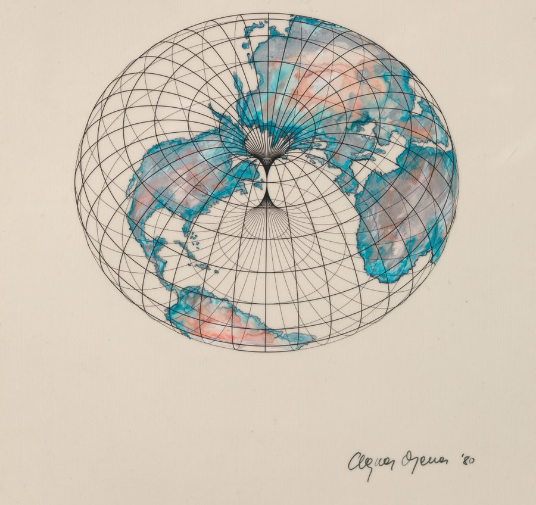
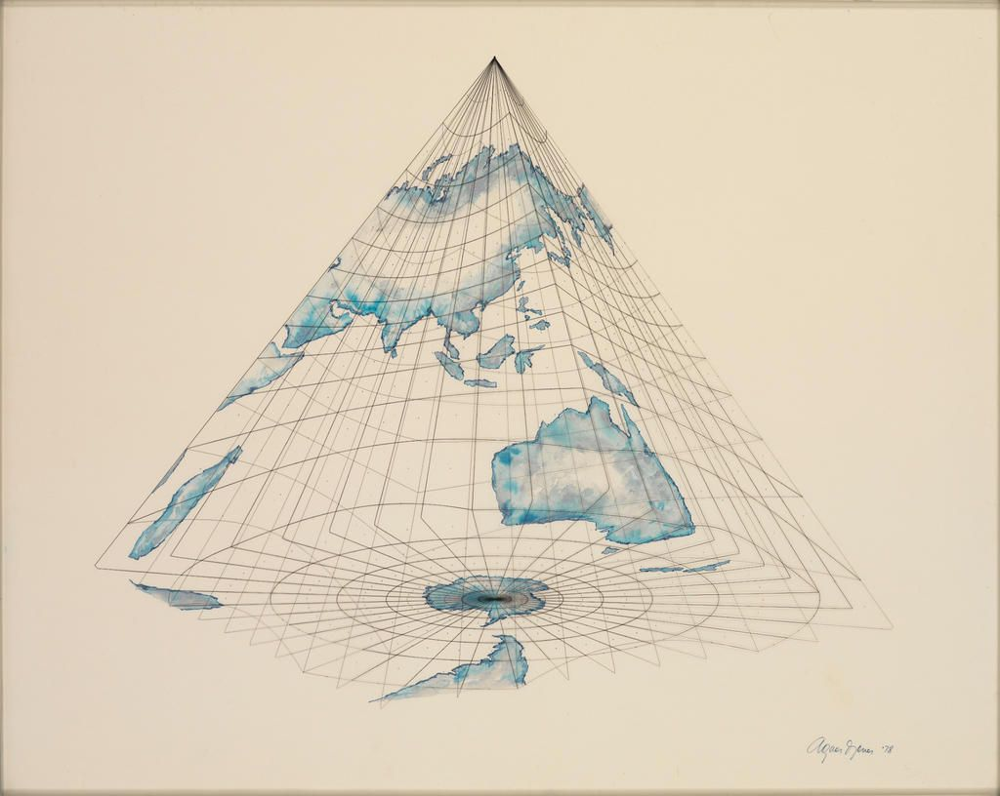
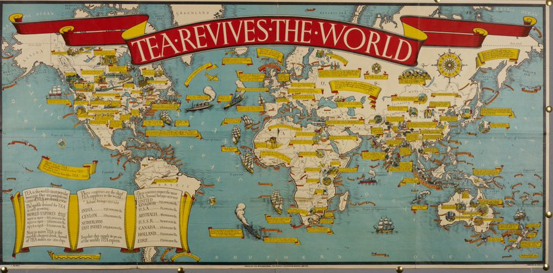
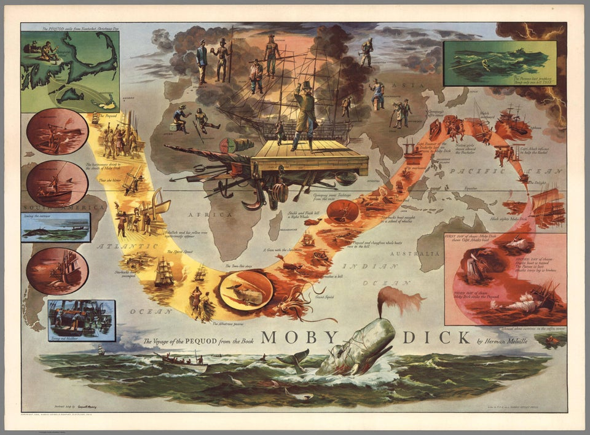

# Siglo XX - Cartografía y Arte

## ✍ Artículos genericos

* [The map of the world in the 20th century, by Tom Harper - British Library](https://www.bl.uk/maps/articles/the-map-of-the-world-in-the-20th-century)

## 🎨 Agnes Denes

* [ Biografía en Wikipedia](https://es.wikipedia.org/wiki/Agnes_Denes)
  

Doughnut-shaped Earth, Agnes Denes - MetMuseum [🔗 Enlace](https://www.metmuseum.org/art/collection/search/492301)

Isometric-shaped Earth, Agnes Denes - MetMuseum[🔗 Enlace](https://www.metmuseum.org/art/collection/search/492300)

# 🎨 MacDonald Gill

* [🎨 Fuente British Library](https://www.bl.uk/collection-items?creator_sorted=Leslie*Gill)
* [✍ The life and legacy of MacDonald Gill](https://www.bl.uk/maps/articles/the-life-and-legacy-of-macdonald-gill)

# 🎨 Edward Everett Henry (1893-1961)

* [🎨 Fuente Barron Maps](http://www.barronmaps.com/edward-everett-henry-1893-1961/)

