# Siglo XX - Cartografía y Arte

## ✍ Artículos genericos

* [The map of the world in the 20th century, by Tom Harper - British Library](https://www.bl.uk/maps/articles/the-map-of-the-world-in-the-20th-century)
* [La geografía en las aulas: curiosidades cartográficas en la BNE](http://blog.bne.es/blog/la-geografia-en-las-aulas-curiosidades-cartograficas-en-la-bne/)
* [El cartógrafo Enrique d´Almonte en la Biblioteca Nacional de España](http://blog.bne.es/blog/el-cartografo-enrique-dalmonte-en-la-biblioteca-nacional-de-espana/)
* Exposición Bending Lines: Maps and data from Distortion to Deception [🔗 Enlace](https://www.leventhalmap.org/digital-exhibitions/bending-lines/) en la Boston Public Library.
* El mapa de París [🔗 Enlace](https://www.geografiainfinita.com/2016/04/de-como-el-autor-del-mapa-de-metro-de-londres-fracaso-con-el-de-paris/?fbclid=IwAR1_CsJQsJe0ysthKCM_egXfGY-IJX3bKBAIKVIrm2ezOmNOZon-Dn84-Gc)
* Los mapas turísticos del Lago Constanza de Joseph Ruep [🔗 Enlace](https://blog.nationalmuseum.ch/en/2019/04/the-iconic-lake-constance-and-rhine-poster/)
* Las guías Michelin [🔗 Enlace](https://www.lavanguardia.com/comer/al-dia/20200902/33084/hallan-guia-michelin-espana-portugal-1910-valorada-18-000-euros.html)
* [Las primeras guías turísticas: Baedeker y Murray](https://www.geografiainfinita.com/2017/07/las-primeras-guias-modernas-de-viaje/)
* Los mapas de Heinrich Berann (Marie Tharpe - Ocean´s Floor) y James Niehues (Estaciones de esquí)

---

## 🎨 Marie Tharpe

* [Story Map de Marie Tharpe](https://storymaps.arcgis.com/stories/232257acdac6409a907abd77b3d83f89)

---

## 🎨 Agnes Denes

* [ Biografía en Wikipedia](https://es.wikipedia.org/wiki/Agnes_Denes)
  

Doughnut-shaped Earth, Agnes Denes - MetMuseum [🔗 Enlace](https://www.metmuseum.org/art/collection/search/492301)

Isometric-shaped Earth, Agnes Denes - MetMuseum[🔗 Enlace](https://www.metmuseum.org/art/collection/search/492300)

---

## 🎨 Leslie MacDonald Gill (1884–1947)

Arquitecto, rotulador, pintor de murales y artista gráfico británico de principios del siglo XX. Hermano del tipógrafo Eric Gill, creador de la tipografía Gill Sans. Quizás sea más conocido por sus mapas de carteles pictóricos, incluido el caprichoso "Wonderground Map" de 1914, que resultó tan popular entre los pasajeros que se convirtió en el primer cartel del metro de Londres.

* [🎨 Fuente British Library](https://www.bl.uk/collection-items?creator_sorted=Leslie*Gill)
* [✍ The life and legacy of MacDonald Gill](https://www.bl.uk/maps/articles/the-life-and-legacy-of-macdonald-gill)
* [📕 MacDonald Gill: Charting a Life de Caroline Walker](https://www.amazon.com/o/ASIN/1912690896/maproom-20)

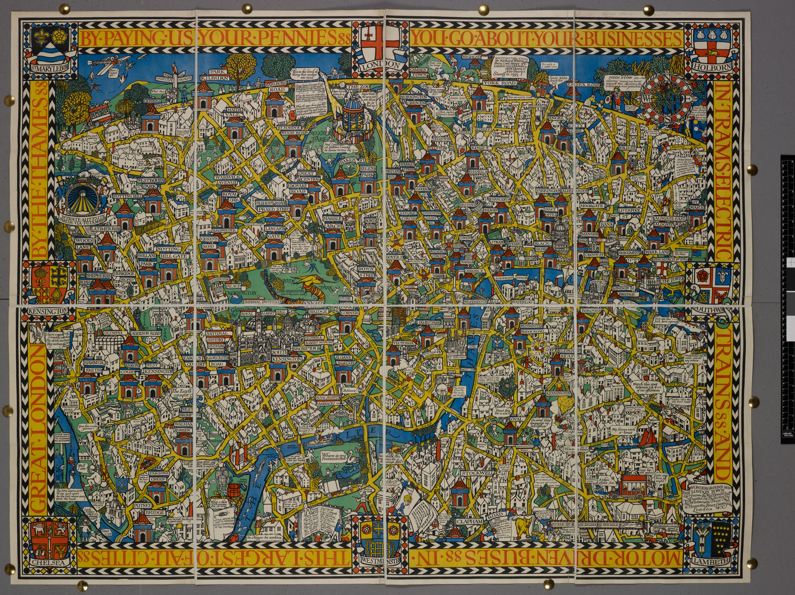

[👆 1915 - Wonderground Map of London Town](https://www.bl.uk/collection-items/wonderground-map)

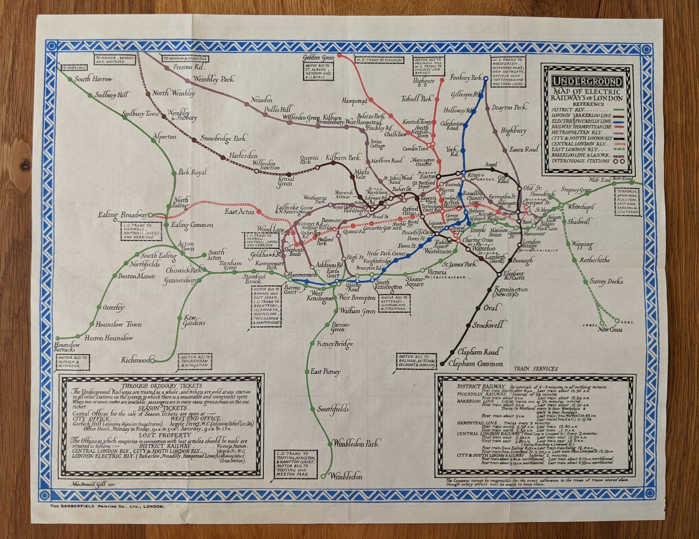

---

## 🎨 Edward Everett Henry (1893-1961)

* [🎨 Fuente Barron Maps](http://www.barronmaps.com/edward-everett-henry-1893-1961/)

---

## 🎨 Joseph Ferdinand Keppler (1893-1961)

* [🎨 Fuente Cornell University Library](https://digital.library.cornell.edu/catalog/ss:19343487)

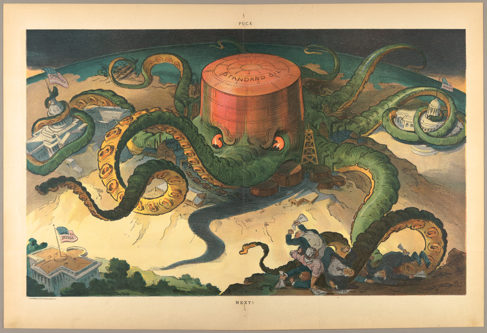

---

## 🎨 Harold Fisk (ca.1944)

Entre 1944-1947 el geólogo Harold Fisk confeccionó para el Cuerpo de Ingenieros del Ejército de los EEUU mapas geológicos del curso bajo del Misisipi (2.000 millas Illinois-Louisiana) en base a trabajo de campo, mapas antiguos y fotos aéreas.
Los antiguos lechos "aparecieron".

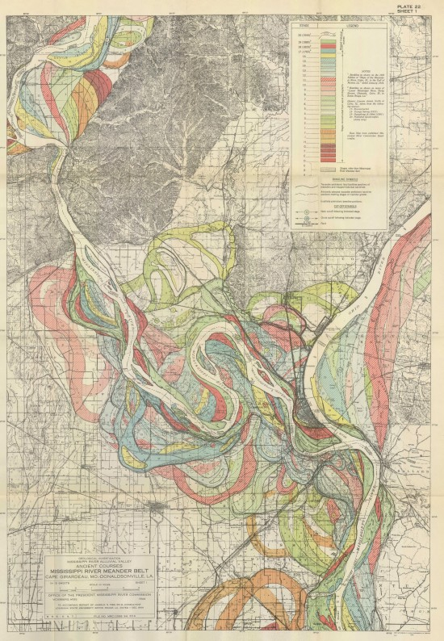
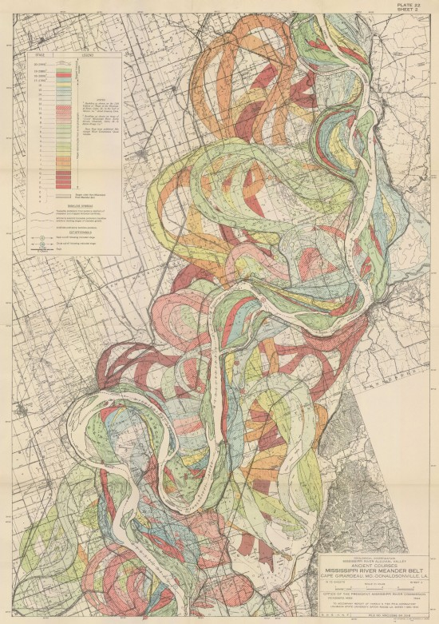

* [🎨 Mapas de Harold Fisk en alta resolución](http://www.radicalcartography.net/index.html?fisk)
* [🎨 Los mapas del río Mississippi](https://losmapasmolanmil.wordpress.com/2019/04/30/los-cambios-del-rio-mississippi/)

---

## 🎨 Los mapas modernos de Nathan Yau

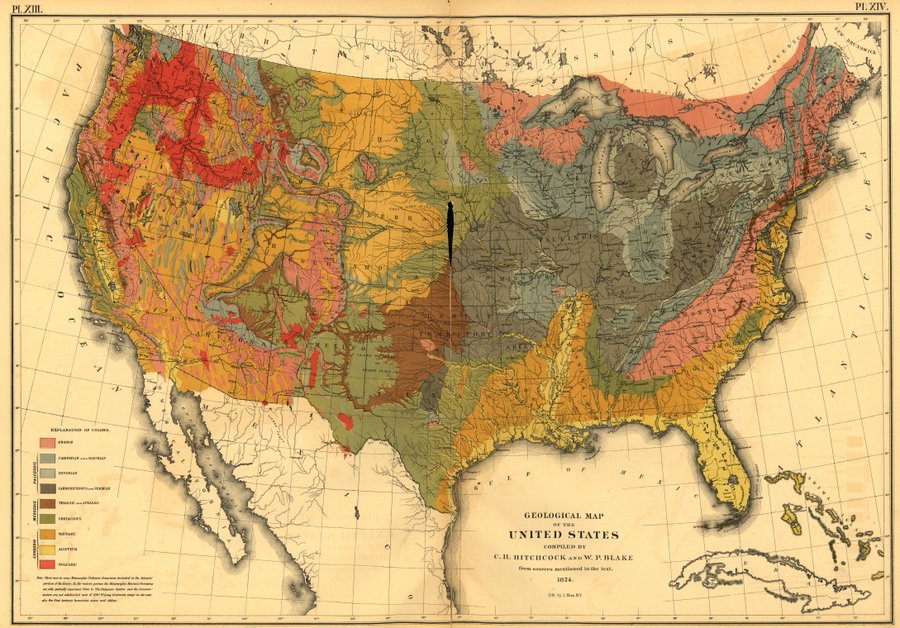

* [Sobre los mapas de censo actual de estilo antiguo de **Nathan Yau**](https://www.geografiainfinita.com/2015/11/los-datos-geograficos-actuales-de-estados-unidos-puestos-en-el-mapa-del-censo-de-1870/)
* [Página web con su obra]()

---
# Los mapas en los mundos inventados - Juegos de computación

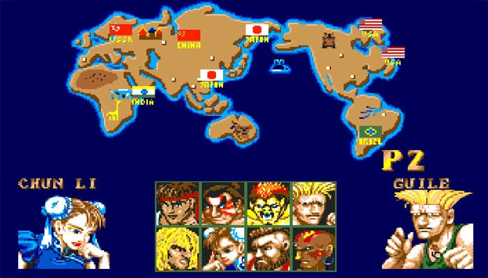
* [Mapas en los tiempos del ZX Spectrum](https://www.orbemapa.com/gis-sociedad/mapas-en-los-tiempos-del-zx-spectrum-o-por-que-los-goonies-nunca-dicen-muetto/)
* [Los mapas de los videojuegos](https://geoinnova.org/blog-territorio/mapas-de-videojuegos/)

---
## 🎨 Paula Scher

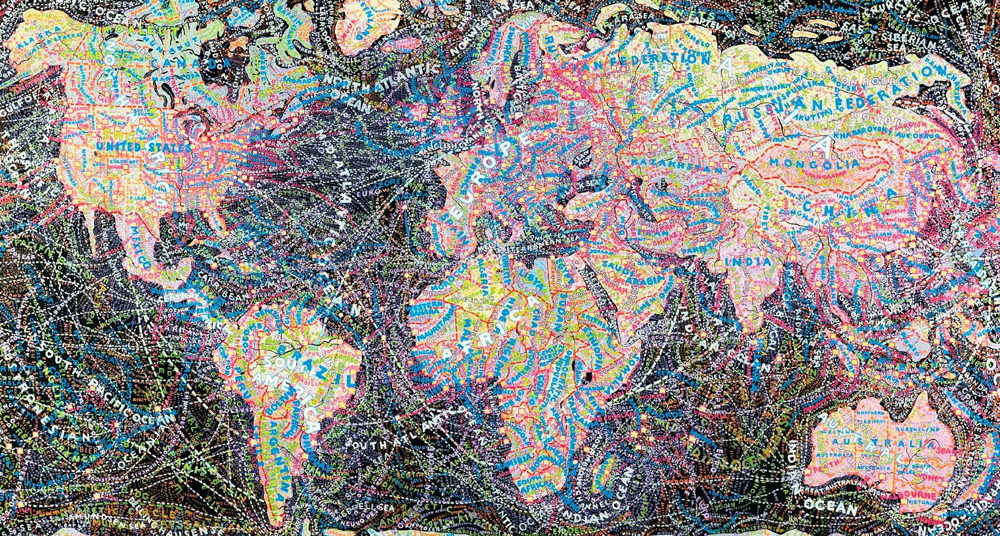

https://twitter.com/ANAISABELGONZL2/status/1261675707996024832

---

## 🎨 Lucien Boucher (1889-1971)

Pintor e ilustrador francés. Impresor y diseñador. Se graduó en *Sèvres Ceramics School* y comienza su carrera tras la Primera Guerra Mundial, trabajando como ilustrador de comics en el semanario *Le Rire*. También trabajó en la revista *Fantasio*. En los años veinte trabaja como diseñador de carteles para cine y publicidad publicando litografías con un estilo inspirado en el Surrealismo.

*The Blue Pink Poster* es una de una serie de ocho carteles encargados por **Air France** con caracter publicitario, a modo de posters. Estos «planisferios» se produjeron por primera vez en 1934 y mostraban las rutas de viaje en constante expansión de Air France. Boucher creo varios de estos carteles entre 1934 y 1962. En algunos añadió constelaciones y zodiacos. Muchos presentaban pequeñas escenas locales de varios países para demostrar la variedad de destinos a los que llegaba Air France en ese momento.

Por lo general, estos carteles se distribuían a las agencias de viajes de todo el mundo como artículos promocionales. Los detalles finos y las ilustraciones coloridas hacen que estos mapas sean muy deseables para los coleccionistas. Entre otros autores que realizaron estos posters se encuentran Cocteau, Mathieu, Brenet, Picart Ledoux o Vasarely.

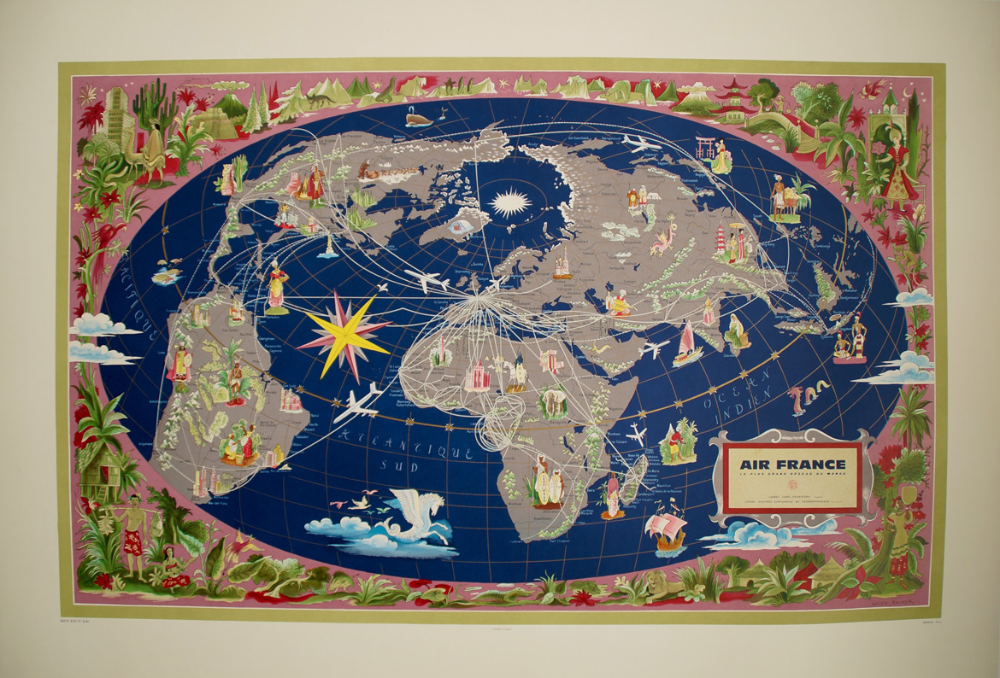
Este mapa de 1961 ☝️ sugiere un movimiento circular alrededor del polo

Boucher creo un total de 14 planisferios, cuatro de ellos de gran formato. Los planisferios eran la mejor herramienta para mostrar la cobertura global de las líneas aéreas. Cada nueva edición requería un cambio en la escala cromática, símbolos y alegorías de cada continente, además de, por supuesto, una actualización en la lista de destinos que crecía año tras año.

Otros diseñadores con los que trabajó Boucher para Air France fueron: Jean Colin (Norteamérica), Paul Colin (África), Jacques Dubois (Sudamérica), Guy Gerget (Lejano Oriente), Eric Lancaster (Paris), Hervé Morvan (Europa) o Jean Picart Le Doux (Francia) y Georges Mathieu.

Boucher no destaca sólo por sus planisferios. Realiza varios mapas particulares como este de la Indochina francesa de 1945.👇
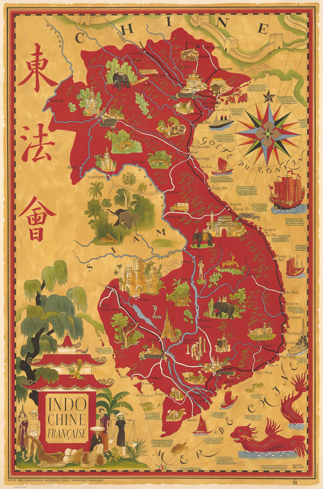

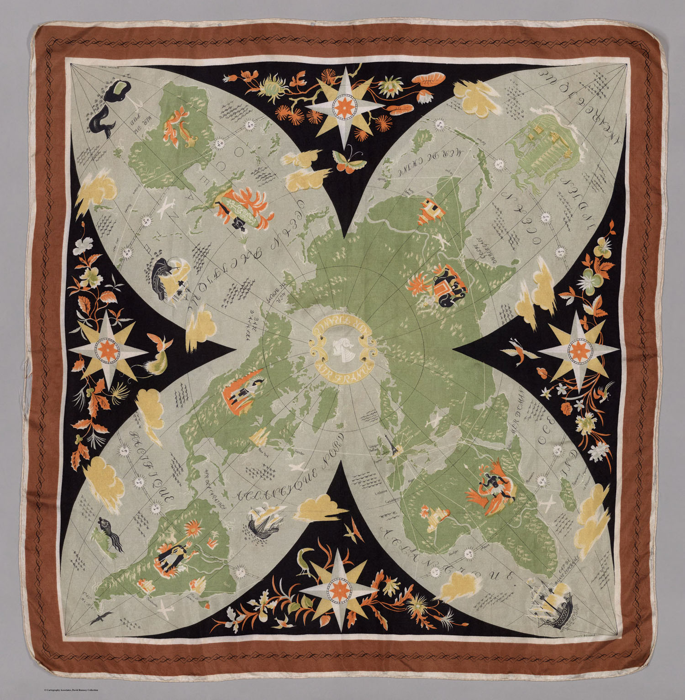
Y sus diseños no se reducen a cartelería. Este ☝️ es un pañuelo promocional de 1948 de la adquisición de la aeronave Constellation que permitió ampliar los vuelos sin escala

### ⛲ Fuentes

* The History of Air France Posters by: Marianne Hermann of Paris City Art [🔗 Enlace](https://www.youtube.com/watch?v=RejZ1ny4_-w)
* Mapas de Lucien Boucher en David Rumsey [🔗 Enlace](https://www.davidrumsey.com/luna/servlet/view/search?q=author%3D%22Boucher%2C%20Lucien%20%281889-1971%29%22&os=0)
---

## 🎨 Richard Edes Harrison

La Segunda Guerra Mundial supuso para el mundo de la cartografía un enorme boom de ventas en Estados Unidos. La demanda de mapas explicando la situación geográfica de los teatros de acción del conflicto bélico se dispararon, y revistas como National Geographic y la prensa en general publicaron decenas de mapas. **Susan Shulten** cuenta el 1 de septiembre de 1939, los nazis invadieron Polonia y, al final del día, los mapas de Europa estaban complemanete agotados en todo Estados Unidos. La editorial Rand McNally informó haber vendido más mapas y atlas de los teatros europeos en las dos primeras semanas de septiembre que en todos los años desde el armisticio de 1918. 

La guerra siempre ha fomentado el interés por la geografía, pero la Segunda Guerra Mundial fue diferente. El pueblo americano necesitaba comprender por qué el presidente Roosevelt estaba estacionando tropas en Islandia o enviando flotas al Océano Índico. Los estadounidenses habían sido criados en el mapa Mercator del mundo, una proyección del siglo XVI diseñada para la navegación pero que creaba inmensas distorsiones en las latitudes lejanas al norte y al sur. Estaban tan acostumbrados a ver el mundo cartografiado en la proyección de Mercator que cualquier otra proyección de representación encontró rechazo en colegios y las salas de estar. Pero la aparación de la aviación y la ampliación del teatro bélico oligaba a buscar nuevos puntos de vista.

Tuvo que ser un ilustrador más que un cartógrafo, Richard Edes Harrison, quien ideara estos nuevos puntos de vista para comprender el mundo. A finales de la década de 1930, Richard Edes Harrison dibujó una serie de imágenes elegantes y apasionantes de un mundo en guerra, y en el proceso persuadió al público de que la aviación y la guerra realmente habían alterado fundamentalmente la naturaleza de la geografía. Formado en diseño, llegó a Nueva York durante la Depresión y se ganó la vida creando de todo, desde botellas de whisky hasta ceniceros. Un día, un amigo de Time le pidió que hiciera algunas ilustraciones para la publicación hermana, Fortune. Harrison utilizó técnicas de perspectiva y color para traducir la tierra redonda en papel plano. De hecho, Harrison consideraba que su falta de formación en cartografía era una ventaja, ya que no tenía una comprensión fija de cómo debería ser un mapa. 

Sus geo-visualizaciones artísticas de las crisis políticas en Europa y Asia. La decisión clave que tomó fue rechazar la proyección de Mercator, que había sobrevivido a su propósito. En cambio, se basó en otras proyecciones, como esta de 1941, centrada en el polo norte y que unió a Eurasia y América del Norte, aunque distorsionando el hemisferio sur como resultado.

[The World divided, 1941 - David Rumsey Collection](https://www.davidrumsey.com/luna/servlet/detail/RUMSEY~8~1~274103~90047834)

Harrison ennegreció a toda la Unión Soviética como parte del Eje para reflejar la reciente invasión alemana. Para Harrison, la proyección polar era la nueva realidad geográfica, una que requería del internacionalismo estadounidense.

El legado más notable de Harrison fue una serie de imágenes coloridas y a veces desorientadoras (no del todo mapas) que enfatizaban las relaciones entre ciudades, naciones y continentes en el corazón de la guerra. Estos mapas se publicaron en Fortune y luego se publicaron en un atlas que se convirtió en un éxito de ventas instantáneo en 1944.

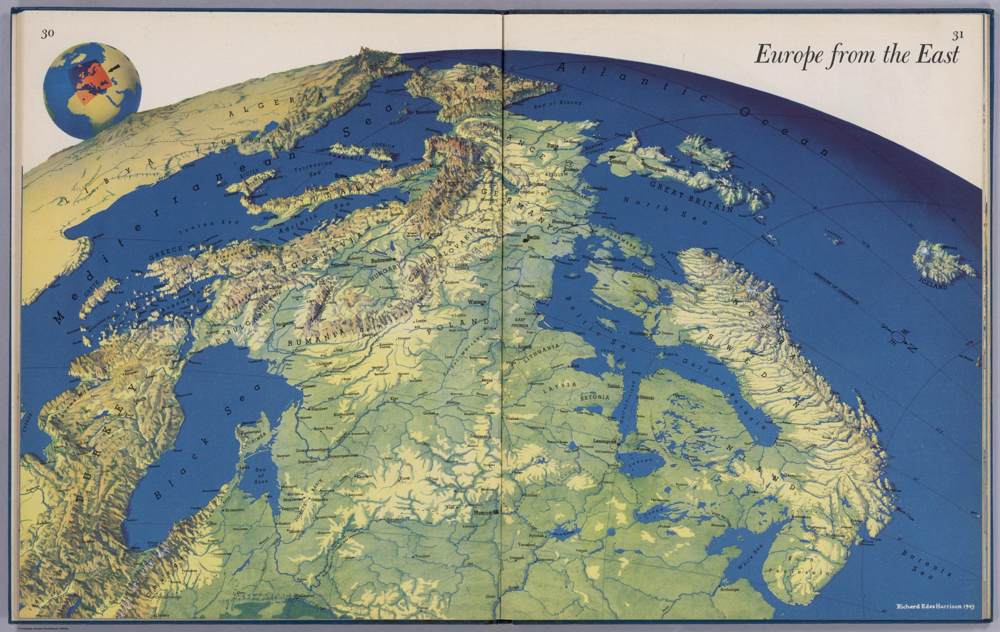
[Europe from East, 1944 - David Rumsey Collection](https://www.davidrumsey.com/luna/servlet/detail/RUMSEY~8~1~266329~5504885)

Una de sus imágenes más impactantes fue esta visión de Europa desde el este 👆. Se trata de un anticipo de los que décadas después llegará de la mano de Google Earth. Aquí Harrison reintrodujo una dimensión esférica en el mapa, centrándose en los escenarios de guerra de una manera que, por ejemplo, representaba el lugar central del Mediterráneo y los obstáculos topográficos que enfrenta cualquier invasión del sur de Europa. Las fronteras nacionales eran secundarias y proponía al observador un punto de vista nuevo.

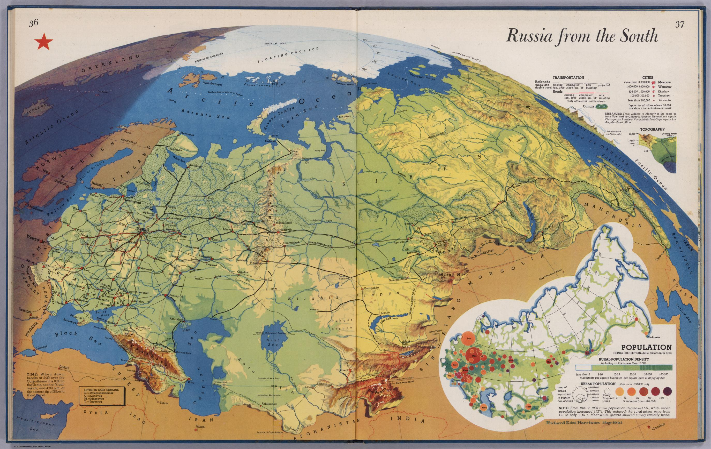
[Russia from the South, 1944 - David Rumsey Collection](https://www.davidrumsey.com/luna/servlet/detail/RUMSEY~8~1~266332~5504888)

La capacidad de Harrison para jugar con la escala evoca la perspectiva de un piloto, pero colocado a una distancia infinita. Los cartógrafos se apresuraron a señalar que tal perspectiva no existía en la naturaleza. Sin embargo, al dibujar la topografía con tanto cuidado, Harrison hizo que el terreno fuera mucho más real de lo que había sido en la representación abstracta de montañas utilizada en mapas tradicionales. Su mapa de Rusia desde el sur 👆, dibujado justo antes del final del Pacto Hitler-Stalin, ilustra poderosamente el tamaño de la Unión Soviética y su población. Richard hace uso de luces y sombras para representar las múltiples zonas horarias abarcadas por la masa continental rusa, mientras que el gráfico de la parte inferior derecha captura el crecimiento masivo de la población urbana en las regiones occidentales.

Harrison emplea un uso imagintivo del color para crear la sensación de perspectiva y 3D. De esta manera dio al público una imagen vívida de lugares que de otra manera permanecían extranjeros, como este detalle de primer plano de su mapa de Japón desde Siberia 👇.

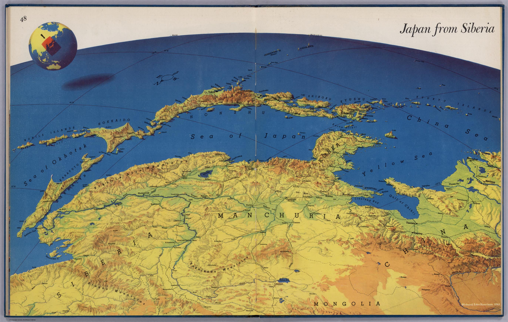
[Japan from Siberia, 1944 - David Rumsey Collection](https://www.davidrumsey.com/luna/servlet/detail/RUMSEY~8~1~266338~5504894)

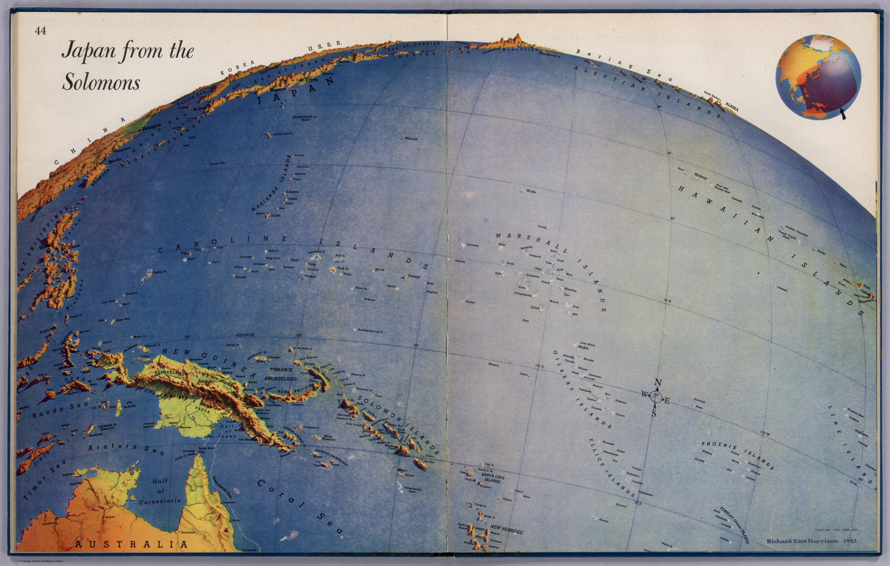
[Japan from Salomon Islands, 1944 - David Rumsey Collection](https://www.davidrumsey.com/luna/servlet/detail/RUMSEY~8~1~266336~5504892)

Sus sorprendentes vistas de Japón desde Alaska 👇 y las Islas Salomón 👆 descubrieron a los estadounidenses la proximidad del Eje a su casa y prepararon al público para una lucha tenaz en el Pacífico. Tal vista estaba completamente ausente de los mapas tradicionales del Pacífico norte, que distanciaban cómodamente a Japón y Asia de América del Norte a través de un enorme océano Pacífico .

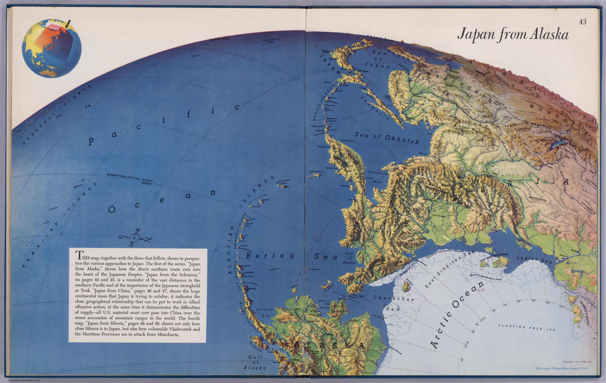
[Japan from Siberia, 1944 - David Rumsey Collection](https://www.davidrumsey.com/luna/servlet/detail/RUMSEY~8~1~266335~5504891)

Las sucesivas ediciones de los atlas de Harrison se gotaron rápidamente en tiendas y librerías.  La mayoría de los cartógrafos profesionales celebraron su estilo provocador por su capacidad para fomentar una comprensión más dinámica de las relaciones geográficas, y los militares contrataron a Harrison para hacer mapas para los soldados en el campo y para ayudar a entrenar a los pilotos para comprender las regiones que aún no habían sido fotografiadas desde el aire. No pasó mucho tiempo antes de que revistas como Time o Newsweek comenzaran a experimentar con nuevas técnicas de mapeo visual popularizadas por Harrison.

Los críticos con Harrison afirmaron que su trabajo era más propagandístico y pictórico que científico y fiable, representando caricaturas del globo en lugar de fidelidad a la latitud y longitud. Pero su objetivo era sacar a los estadounidenses de un sentido bidimensional de la geografía y adoptar una comprensión de la perspectiva y la dirección.

En una entrevista a Harrison en Nueva York al final de su vida en 1993, se consideraba artista en lugar de cartógrafo, porque desdeñaba las técnicas restringidas de los cartógrafos que estaban sujetos a las convenciones. Podemos ubicar su obra entres el arte y la cartografía, proporcionando el eslabón perdido entre el mundo y el mapa. Hoy en día el término "global" es un cliché, pero en el caso de Harrison es una caracterización adecuada. Al volver a dibujar el mapa del mundo, Harrison contribuyó a reconsiderar el papel de Estados Unidos en ese mundo.

### ⛲ Fuentes

* World War II Led to a Revolution in Cartography. These Amazing Maps Are Its Legacy, Susan Schulten. [🔗 Enlace](https://newrepublic.com/article/117835/richard-edes-harrison-reinvented-mapmaking-world-war-2-americans)
* MApas de Richard Edes HArrison en David Rumsey Map Collection [🔗 Enlace](https://www.davidrumsey.com/luna/servlet/view/search?q=author=%22Harrison%2C%20Richard%20Edes%22)