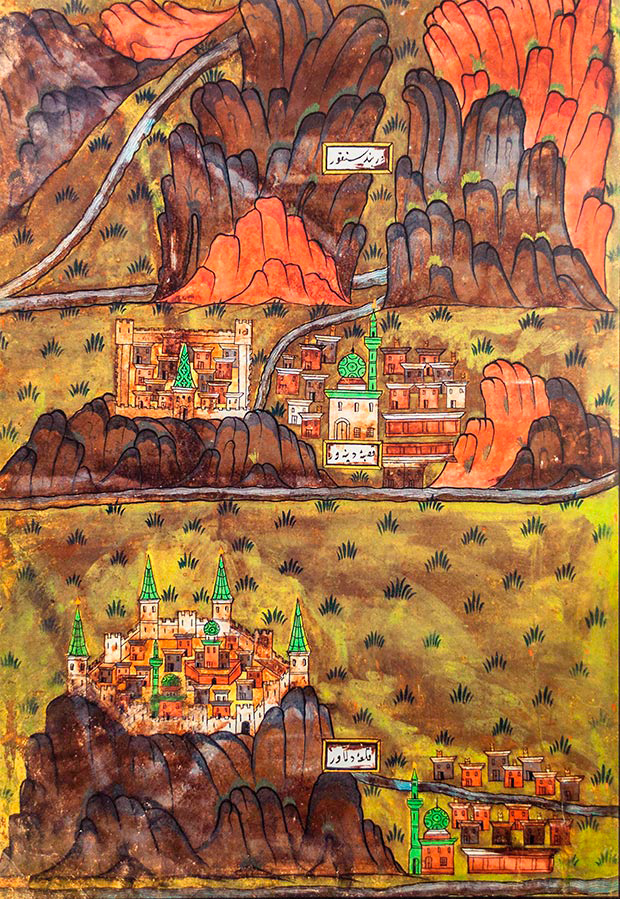

# Matrakçı Nasuh

Nasuh bin Karagöz bin Abdullah al-Visokavi al-Bosnavi, o Nasuh al-Matrakči ibn Karađoz ibn Abdullah al-Visokavi al-Bosnevi, comúnmente conocido como Matrakçı Nasuh por su competencia en el juego de Matrak, inventado por él mismo (también conocido como Nasuh al-Silâhî, Nasuh el espadachín, debido a su talento con las armas; 1480 - c. 1564) fue un estadista bosnio del Imperio Otomano del siglo XVI, erudito, matemático, maestro, historiador, geógrafo, cartógrafo, espadachín, navegante, inventor, pintor, agricultor y miniaturista. Fue llevado a Estambul después de ser reclutado por los exploradores otomanos en Rumelia, educado, sirvió a varios sultanes otomanos y se convirtió en maestro en la escuela Enderun.

Matrakçı Nasuh (bin Abdullah; hijo de Abdullah), nacido en la ciudad bosnia de Visoko, fue un talentoso jenízaro que pasó por el sistema de infantería y devşirme, un talentoso espadachín y francotirador bien conocido por su intelecto; hablaba cinco idiomas y fue reclutado en la Armada Otomana.

Después de un largo período de estudios sobre matemáticas y geometría, escribió sus obras Cemâlü'l-Küttâb y Kemalü'l-Hisâb y las presentó al sultán otomano Selim I. También escribió los dos libros llamados Mecmaü't-Tevârih y Süleymannâme . Tratan de la historia del período 1520-1543. También escribió un artículo histórico sobre la campaña persa de Suleiman I titulado Fetihname-i Karabuğdan. Un estudio reciente de su libro Umdet-ul Hisab reveló un hecho desconocido de que Matrakçı había inventado algunos métodos de multiplicación genuinos. Uno de los resultados significativos que se muestran en este libro fue que el método de celosía había sido ampliamente utilizado en la Escuela Enderun casi 50 años antes de que John Napier lo reintrodujera en Europa.

Además de sus trabajos sobre matemáticas e historia, es famoso por sus miniaturas. Creó un estilo naturalista que se centra en vistas panorámicas de paisajes y ciudades pintadas con el mayor detalle (su obra más famosa, la imagen del paisaje de Estambul, muestra casi todas las calles y edificios de la ciudad). En el arte en miniatura otomano, esto se conoció más tarde como el "estilo Matrakçı". El más importante de sus cuatro volúmenes históricos de miniaturas es el que trata sobre la guerra safávida de Suleiman I, sobre el que había escrito su obra histórica Fetihname-i Karabuğdan. Además de ilustrar la marcha del ejército otomano desde Estambul a Bagdad y luego a Tabriz y su regreso a través de Halab y Eskisehir, Nasuh también incluye todas las ciudades que encontró el ejército en el camino. La Biblioteca de la Universidad de Estambul alberga la única copia de este trabajo.

## ⛲️ Fuentes

* https://youtu.be/Rrnow7pS-Fs

Durante la campaña de Irakeyn de Solimán el Magnífico entre 1533 y 1536, el sultán y su ejército se quedaron en las ciudades del rango turco-islámico ubicadas entre Estambul y Tabriz. El historiador otomano **Matrakçı Nasuh** describió las ciudades más importantes en su obra, cuyo nombre completo es Beyân-ı Menâzil-i Sefer-i Irâkeyn-i Sultan Süleyman Han. Esta obra consta de 109 hojas, es decir, 218 páginas. Hay 107 miniaturas y 25 textos ilustrados en 132 páginas. Este estudio de Nasuh contiene información sobre la topografía de las ciudades de Anatolia, Irán occidental e Irak.

## Ciudad antigua de Estambul 

La primera ciudad que pintó en su obra es Estambul, donde comienza la ruta. Mientras que toda la hoja derecha cubre las murallas históricas de la ciudad, Gálata y el Cuerno de Oro se ven en la hoja izquierda. Si miramos los detalles de las estructuras en la muralla de la ciudad; Se ve que pintó el Palacio de Topkapi, el histórico Hipódromo donde se encuentra el antiguo palacio bizantino, o cientos de edificios en la Plaza del Caballo uno por uno.

# Retorno de la campaña, Sultan alojado en Adana Ramazanoğlu Palace

Según la crónicas de la época Solimán el Magnífico, el martes 14 de diciembre de 1535, a su regreso de la campaña "Irakeyn", permaneció en Adana durante dos noches, pasó un tiempo cazando y abandonó Adana al tercer día. Se cree que residió en el palacio Ramazanoğlu, una parte del cual permanece en Adana hoy. Matrakçı también pintó edificios pertenecientes a los períodos Ramazanoğulları y Otomano en la ciudad rodeados por muros en los cuatro lados.

## Una ciudad en un valle, Bitlis

Matrakçı Nasuh describió el valle de Bitlis, emplazado entre dos montañas desde la antigüedad hasta el presente, exactamente de acuerdo con las condiciones naturales. A la luz de la información que se ha reportado desde el día en que se fundó la ciudad, el castillo que Alejandro Magno mandó construir a su comandante por Bidlis es el punto focal de la pintura. El edificio, que sigue en pie hoy y es la columna vertebral de la ciudad, está representado como un castillo interior y exterior en miniatura. Las estructuras del interior del castillo, según se pueden detectar, son respectivamente; Mezquita Ulu, Complejo Şerefiye, Baño Han.

## Erzincan con el río Éufrates en el medio

En 1534, el ejército pasó por Sivas en dirección a Erzincan. Matrakçı Nasuh se centró en el río Éufrates, que atraviesa la ciudad de Erzincan. Mostró a Erzincan, rodeado de murallas rectangulares, como una ciudad llana y verde entre las montañas. Se puede ver en la imagen que las paredes están rotas en algunos lugares; Matrakçı también incluía mezquitas con dos o un minarete, grandes edificios y casas en el castillo.

## Complejo y baños Kurşunlu de Eskişehir

En la pintura Eskişehir de Matrakçı Nasuh, Kurşunlu Kulliye, rodeado por una muralla blanca construida por el pastor Mustafa Pasha entre 1517 y 1525, se ve en el centro. Hoy, cuando visitamos la región, vemos que algunas de las obras pertenecientes al complejo, especialmente la mezquita, aún se encuentran en su lugar. Matrakçı llamó la atención sobre la fuente de agua y los baños que pasaban por Eskişehir. Esta área, donde se representan los baños, se conoce hoy como la 'Calle del Baño'.

## Termas de Erzurum y Sky Domes

En el mapa de Erzurum de Matrakçı Nasuh, el nombre de la ciudad estaba escrito en el centro como 'Ilıca-i Erzurum'; La subida del agua que llega a la ciudad desde su fuente se muestra en la esquina superior izquierda de la imagen. Siguiendo la vía fluvial, las fuentes en las calles de la ciudad se pueden examinar en la imagen. También se observaron las mezquitas y madrasas decoradas por las cúpulas del cielo en la ciudad rodeadas por muros en los cuatro lados.

## Majestuoso castillo de Alepo

Matrakçı Nasuh se centró en el Castillo de Alepo y los bazares que reflejan la riqueza de la ciudad en la ciudad, que quedó bajo el dominio otomano con la Guerra Mercidabık durante el reinado de Yavuz Sultan Selim. La representación de estos planos arquitectónicos en el mapa de la ciudad, famosa por sus tiendas y posadas, llama la atención sobre la riqueza económica de la ciudad. El castillo interior de la ciudad, que está rodeado por murallas en cuatro lados, está protegido por una muralla de fortificación separada rodeada de agua; Matrakçı también pintó los elementos de seguridad de la ciudad.

## La ciudad asediada por los castillos y el espíritu de Mevlana, Konya

El primer elemento sorprendente en la pintura de Konya de Matrakçı Nasuh es el castillo de Gevale, uno de los primeros castillos que los selyúcidas compraron para dominar Konya, en las colinas. En el lado derecho de la ciudad rodeada por el Castillo Interior, se representan la cúpula verde 'kubbetü'l hadra' y la Tumba de Mevlana. El edificio de dos cúpulas en el centro de la pintura es la Mansión del Sultán Alaeddin. Además de estas obras, en la imagen también se ven obras como İnce Minareli Madrasa, Owner Ata Mosque y İplikçi Mosque.

## Bagdad con el cruce del Tigris y su clima

Bagdad, uno de los importantes centros científicos y culturales del mundo islámico, fue anexado a las tierras otomanas por Suleiman el Magnífico en 1534. Matrakçı Nasuh debe haber sido influenciado por su naturaleza mientras pintaba esta ciudad. El río Tigris que atraviesa la ciudad se convirtió en el punto focal. En el clima de Bagdad, los veranos son secos y muy calurosos, los inviernos son suaves y frescos; La posible razón del uso intenso del tono amarillo en Matrakçı es que la región está cerca del clima desértico. En la pintura de Bagdad también se ven animales como leopardos, gacelas y conejos del desierto, que se adaptan al clima de esa región.

## La ciudad rodeada de murallas y puertas, Diyarbakir

A la vuelta de la campaña de Irakeyn (1535), el ejército se detuvo en Diyarbakir. En la miniatura de Diyarbakir de Matrakçı Nasuh, se ve un castillo interior de la ciudad rodeado de murallas; Las grandes estructuras que se muestran aquí deben pertenecer al palacio del Castillo Interior. En el centro de la imagen, hay cinco mezquitas, además de la Mezquita Ulu con su patio. En el castillo interior de Matrakçı, las grandes puertas de la ciudad; Una de ellas es la Puerta Oğrun que se abre al Tigris, la otra es la Puerta Kupeli que conduce a los molinos, y las dos últimas son las puertas Fatih y Saray que se abren a la ciudad. No descuidó pintar los árboles frutales frente a la puerta del castillo de la ciudad.

Nota: Esta obra de Matrakçı Nasuh llamada “Beyân-ı Menâzil-i Sefer-i Irâkeyn” se conserva en la Biblioteca de la Universidad de Estambul con el número TY, 5964.

## Dinever

## Hereke Kalesi - Castillo de Hereke

## Zanjan

## Sultanije

