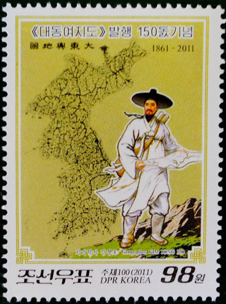
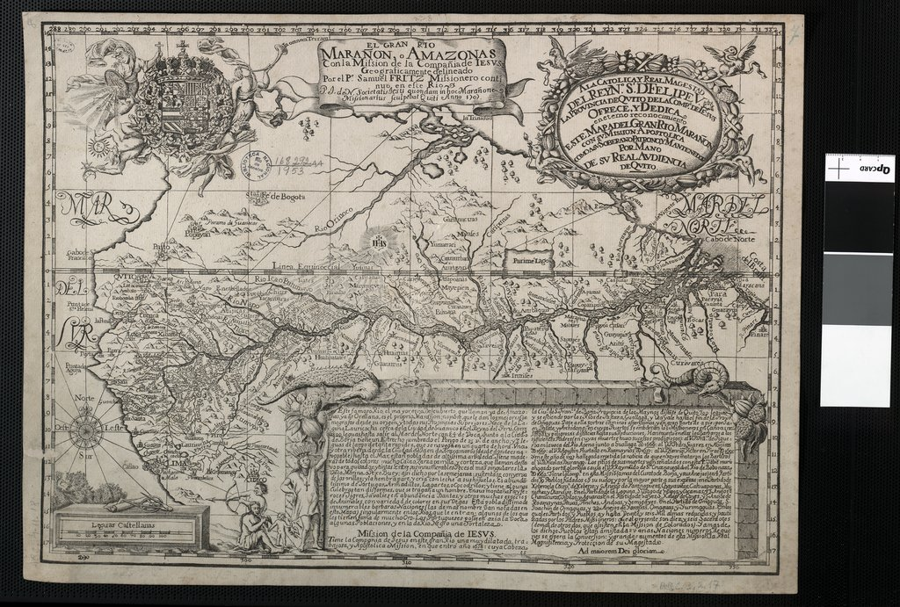
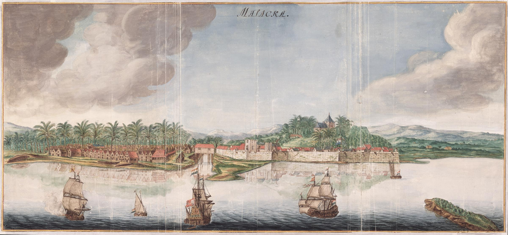
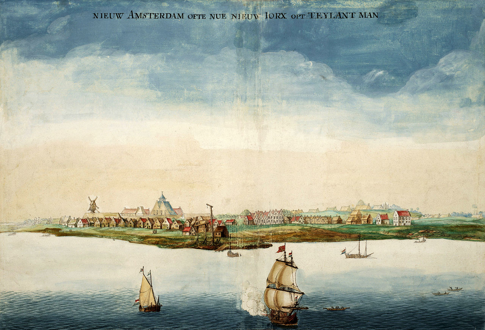
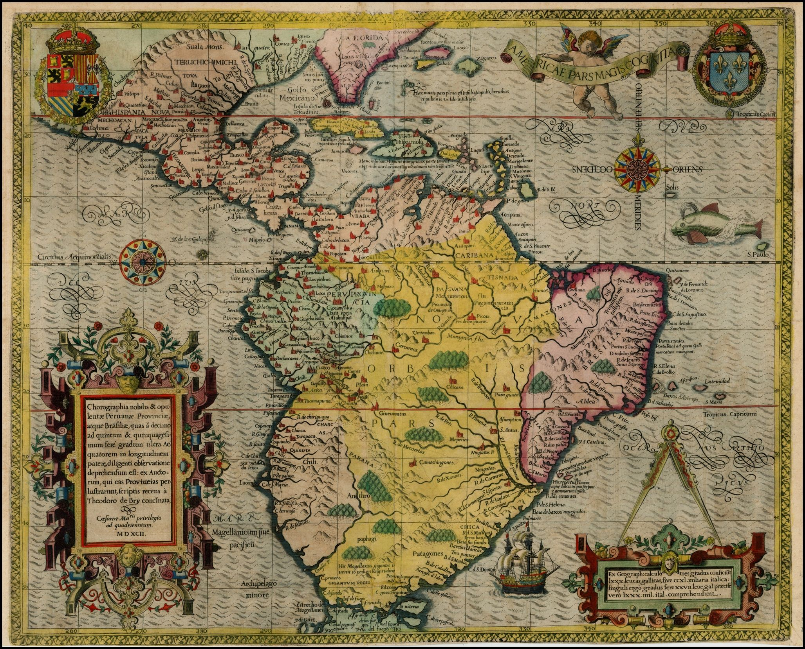
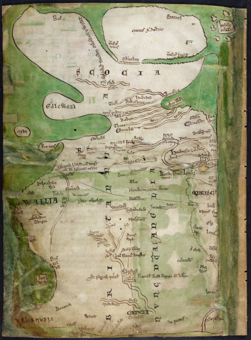
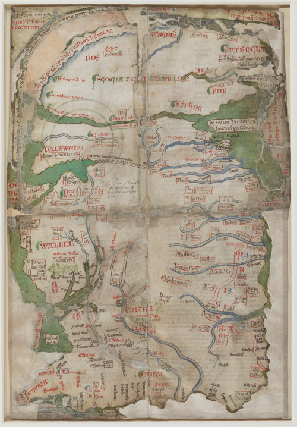
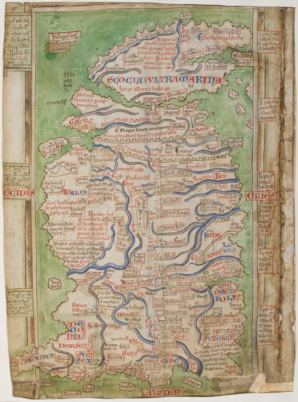

# Cartógrafos

## Kim Jeong Ho (1804–1866?)

Nacido en Hwanghaedo, 1804. Reailizó un mapa de Corea que fue publicado en 1861, de la que posteriormente se hizo una versión de una sola hoja, el [Daedongyeojijeondo](https://en.wikipedia.org/wiki/Daedongyeojido). Para la toma de datos, Kim Jeong Ho caminó a lo largo y ancho de la península de Corea, a través de montañas y valles. La plancha original de madera para su xilografía se puede encontrar en la Universidad de Soongsil y también en la Universidad de Corea.

La figura de Kim Jeong Ho es un tanto controvertida hoy en día en Corea del Sur. Estudiosos dicen que en realidad su proyecto fue propaganda naciionalista en una época en la que la penínsla coreana estaba invadida por Japón. Los pocos datos que se tienen de su vida tampoco ayudan a aclarar la veracidad de su historia. En el año 2009 el escritor coreano [Park Bum Shin](https://es.wikipedia.org/wiki/Park_Bumsin) publicó su novela [The Map Maker](https://koreanliteraturenow.com/fiction/reviews/park-bum-shin-geographer-who-pulled-miracle-map-maker-park-bum-shin) donde realiza un relato de ficción sobre la vida de este personaje.

### Recursos

* Mapa Daedongyeojido interactivo 🔗[enlace](http://kostma.aks.ac.kr/e-map/mapSearch_AN.aspx?lang=ko&mType=anciNm&sType=anSearch&sWord=)

## Samuel Fritz (1654-1728)

Cartógrafo y misionero jesuita. [📕 Diccionario de la RAH](http://dbe.rah.es/biografias/17895/samuel-fritz)

[👆 1707 - Amazonas - National Library of Brazil ](https://www.wdl.org/es/item/1137/) Se grabó en una prensa manual que tenían los jesuitas en el Colegio de Quito, en el año 1707, y está dedicado a Felipe V, rey de España. Empezó a cartografiar la región como parte de un proyecto destinado a aclarar los límites entre las tierras misioneras, las tierras españolas y las tierras portuguesas. 

## Johannes Vinckeboons  (1616–1670)

Cartógrafo holandés famoso por su empleo de la acuarela, técnica heredada de su pade, pintor. Realiza una serie de acuarelas sobre ciudades vinculadas con la Compañía Neerlandesa de las Indias Orientales, principalmente los puertos en Asia.

[👆 1665 - Vista de la ciudad de Malaca - Österreichische Nationalbibliothek, Vienna, inv. nr. 39:15 ](https://ca.m.wikipedia.org/wiki/Fitxer:AMH-6156-NA_Map_of_the_city_of_Malakka.jpg)

[👆 1664 - Vista de Nueva Amsterdam - Geheugen van Nederland (Memory of The Netherlands ](https://commons.wikimedia.org/wiki/File:GezichtOpNieuwAmsterdam.jpg)

## Theodore de Bry (1528-1598)

Orfebre, grabador, autor y editor belga, nacido en Lieja en 1528. Pertene a una familia de reconocidos orfebres. De Bry se mudó a Estrasburgo, donde se empezó a interesar por el grabado. Más tarde, se mudó a Amberes con su familia. En Amberes vivía cerca del taller de Christopher Plantin, uno de los principales editores de la Europa del momento. Eso le hizo interesarse aún más por el grabado, y empezó a dedicarse a ello de manera más seria. Pero, en 1585, la familia marcha a Londres, donde De Bry realiza grabados para obras tan importantes como la edición inglesa de "The Mariners Mirrour" (1588).

[👆 1592 - Chorographia nobilis et opulentae Peruanae provinciae atque Brasiliae](https://gallica.bnf.fr/ark:/12148/btv1b8446665f)

Pero hubo dos personas que llevaron a De Bry a crear su obra principal: los artistas Jacques Le Moyne y John White. El primero, al que De Bry conoce en 1586, había ido a Florida en los años '60, ilustrando todo lo que había visto, tanto la naturaleza como los nativos. Después de la muerte de Le Moyne en 1588, De Bry pide a su viuda las ilustraciones para poder publicarlas. Y la viuda accede. El segundo personaje, John White, era un artista que había viajado a la colonia de Roanoke, en la que los colonos habían desaparecido misteriosamente. Tras regresar a Londres con un amplio material de ilustraciones que representaban la región de Roanoke de una manera positiva y optimista, con el objetivo de convencer a posibles colonos para que marcharan a América, White necesitaba a un buen grabador. Así, tras una temporada en Frankfurt, De Bry y sus hijos publican en la ciudad alemana "America", también llamada "Viajes a las Indias Occidentales". Un gran compendio de ilustraciones que mostraban, en nueve volúmenes, una completa imagen de América. Una imagen totalmente alterada, por supuesto. Basada en los relatos de los viajeros que habían ido a América, y representando el Nuevo Mundo y sus habitantes de manera idealizada, tópica, casi legendaria. "America" se convirtió en un gran éxito. Traducida a numerosos idiomas, fue la obra que enseñó el Nuevo Mundo a un enorme número de europeos, que observaban entre maravillados y aterrados cómo vivían los nativos.

[🔗 1588 - The Mariner's Mirrour, British Library - Maps C.8.b.4. ](https://www.bl.uk/collection-items/the-mariners-mirrour-1588)

[🔗 1590 - America, British Library - C.115.h.2.(1.) ](https://www.bl.uk/collection-items/engravings-of-native-americans-and-europeans-in-de-brys-america)

## Matthew Paris (fl. ca 1200 - ca 1259)

Fue un monje de la abadía benedictina de St Albans en Hertfordshire. Fue cronista, escribano e iluminador. Se le atribuyen los primeros mapas de Gran Bretaña.

[👆 1200-1259 -  Chronica maiora and Historia Anglorum - Royal MS 14 C VII](https://www.bl.uk/manuscripts/Viewer.aspx?ref=royal_ms_14_c_vii_f001v)

[👆 1250-1260 -  Collectanea of John of Wallingford - Cotton MS Julius D VII/1](https://www.bl.uk/manuscripts/Viewer.aspx?ref=cotton_ms_julius_d_vii!1_f001r)

[👆 1255-1259, St Albans - Cotton MS Claudius D VI/1 f.12v](https://www.bl.uk/manuscripts/Viewer.aspx?ref=cotton_ms_claudius_d_vi!1_f012r)

### Fuentes

* [Matthew Paris en Wikipedia](https://en.wikipedia.org/wiki/Matthew_Paris)
* [La obra de Matthew Paris en la British Library](https://blogs.bl.uk/digitisedmanuscripts/2020/07/the-maps-of-matthew-paris.html)