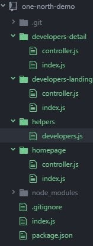

# Configurar un stack de desarrollo para NodeJS + ExpressJS

Tenemos nodeJS. Vamos a crear un proyecto con un servidor usando Express. Usaremos el puerto 3000.

Creamos el directorio foo para la aplicación. Nos metemos dentro.

```bash
git init #Iniciamos git dentro del directorio de trabajo foo
npm init #creamos el fichero package.json para el proyecto
npm install express --save #Instalamos express. La opción --save indica que esto se guardará en package.json
```
En el fichero *.gitignore*, metemos el directorio **node_modules**, porque si luego vamos a usar un repositorio git no nos va a interesar meter todo el entorno de desarrollo.

Ahora vamos con un código básico para que un servidor nodeJS escuche por un puerto de la máquina, y que al conectarnos envía Hola Mundo. Para arrancarlo usamos node index.js , siendo index.js el nombre del fichero. Lo podemos verificar con un browser y escribiendo http://localhost:3000

```javascript
var express = require('express');
  app = express();
app.get('/', function (req,res){
  res.send('Hola Mundo desde la App')
})
app.listen(3000, function(){
  console.log('Web lista en puerto 3000.');
  console.log('Abre un browser y escribe http://localhost:3000');
});
```

Cada vez que guardamos el código fuente con modificaciones y correcciones, es necesario parar y arrancar el servicio. Esto acaba siendo muy tedioso. Por ello, instalamos un demonio que va testeando cuando guardamos los fuentes, y se encarga de hacerlo por nosotros, Así siempre tenemos cargada la última versión en el browser.

```bash
npm install nodemon –-save-dev #Instalamos nodemon. La opción –save-dev indica que esto se guardará en package.json pero sólo en el despliegue de desarrollo. Para producción no se utilizará.
```

Para arrancar el servicio ahora usamos node node_modules/nodemon/bin/nodemon.js index.js
Podemos comprobar en la consola que cada vez que guardamos se reinicia el servidor
Vamos a hacer algo más. Que a una petición liste una serie de objetos, y que al solicitar información de uno de ellos lo devuelva.

```javascript
var express = require('express');
  app = express();

app.get('/', function (req,res){

  res.send('Hola Mundo desde la App');

});

app.get('/developers', function (req,res){
  //Obtenemos una lista con los objetos desarrollador.
  //Después de cada objeto extraemos el nombre en un array de nombres, que luego concatenamos para mostrar
  var developers = getAllDevelopers();
  var developerIds = Object.keys(developers);
  var developerNames= developerIds.map(function(id){
    return developers[id].name;
  });
  var developerNameString=developerNames.join(', ');
  res.send(`Lista de todos Developers ${developerNameString}`);

});

 
app.get('/developers/:developerId', function (req,res){

  var developerId = req.params.developerId;
  var developer = getDeveloperById(developerId);
  res.send('Información de ' + developer.name);
  //Podemos usar notación express si usamos en vez de la comilla simple el acento invertido
  //res.send(`Lenguaje favorito: ${developer.favouriteLanguage}`);

});

function getDeveloperById(id){
  var developers = getAllDevelopers();
  var developer = developers[id];
  if(developer===undefined){
    return {
      name: 'Nobody',
      favouriteLanguage: 'Nothing',
      gender: 'neither'
    };
  } else {
    return developer;
  }
}

function getAllDevelopers(){
  return {
    'ryan':{
        name: 'Ryan Johnson',
        favouriteLanguage: 'Java',
        gender: 'male'
    },
    'erik':{
      name: 'Erik Svansson',
      favouriteLanguage: 'Python',
      gender: 'male'
    },
    'emma':{
      name: 'Emma Collins',
      favouriteLanguage: 'Objective-C',
      gender: 'female'
    },
    'olivia':{
      name: 'Olivia Hunttington',
      favouriteLanguage: 'Go',
      gender: 'female'
    }
  };
}

app.listen(3000, function(){
  console.log('Web lista en puerto 3000.');
  console.log('Abre un browser y escribe http://localhost:3000');
});
```

Esto sería lo necesario, Ahora bien, esto no está estructurado según el patrón MVC. Vamos a refactorizarlo, mediante una serie de directorios y ficheros. La idea es tener el código más ordenado que nos permita depurar mejor los posibles errores. Utilizaremos convenciones standard.
 
Para trabajar con una estructura MVC, refactorizamos el código. Cambiamos

```javascript
var express = require('express');
  app = express();

app.get('/', function (req,res){
  res.send('Hola Mundo desde la App');
});

por
var express = require('express');
  app = express();

var homepageController = require('./homepage/controller');
app.get('/', homepageController);

donde hemos creado un directorio homepage donde metemos el controlador en el fichero controller.js
module.exports = function(reg, res){
  res.send('Hola Mundo desde la App');
}

Esto a su vez puede refactorizarse por convención de la siguiente manera
var express = require('express');
  app = express();
var homepage = require('./homepage');
app.get('/', homepage.controller);

Y al fichero controller.js, en el mismo directorio añadimos un index.js
module.exports = {
  controller: require('./controller') //OjO, no lleva punto y coma al final
};
```



Esto ya es una estructura más convencional. Pero sólo hemos tratado la página de bienvenida. En este proyecto trabajamos con una página de bienvenida, otra de listado de los desarrolladores y una tercera del detalle del desarrollador. Luego tendríamos que crear la misma estructura  para la página del listado de objetos y otra para el detalle. Algo así como la estructura de la izquierda.

En el código original, hay dos funciones llamadas getDeveloperById y getAllDevelopers  a las que tenemos que llamar en algún momento desde los controladores. Estas funciones compartidas se guardan por convenio en la carpeta helpers, y como son funciones para trabajar con el objeto developer, las guardamos en el fichero developers.js. Derntro se guardan en una estructura de objeto de la siguiente manera.
 
Fichero del directorio helpers developers,js

```javascript
module.exports = {
  getDeveloperById: function(id){
    var developers = this.getAllDevelopers();//This indica que la función está dentro de este objeto
    var developer = developers[id];
    if(developer===undefined){
      return {
        name: 'Nobody',
        favouriteLanguage: 'Nothing',
        gender: 'neither'
      };
    } else {
      return developer;
    }
  },
  getAllDevelopers: function(){
    return {
      'ryan':{
          name: 'Ryan Johnson',
          favouriteLanguage: 'Java',
          gender: 'male'
      },
      'emma':{
        name: 'Emma Collins',
        favouriteLanguage: 'Objective-C',
        gender: 'female'
      },
      'olivia':{
        name: 'Olivia Hunttington',
        favouriteLanguage: 'Go',
        gender: 'female'
      }
    };
  }
}
```

Ya podemos llamar a las funciones del directorio helpers desde los controladores. En el controlador developers-detail:

```javascript
//Definimos un objeto para acceder a las funciones del directorio helpers
var developersHelper = require('../helpers/developers');
//La estructura es la misma que en la del controlador homepage
module.exports = function (req,res){
  var developerId = req.params.developerId;
  var developer = developersHelper.getDeveloperById(developerId);//Así llamamos a la función
  res.send('Información de ' + developer.name);//Usamos comillas simples, así que no utilizamos sintaxis express
}
```

Y en el fichero controller.js del controlador developers-detail:

```javascript
var developersHelper = require('../helpers/developers')

module.exports = function (req,res){
  //Obtenemos una lista con los objetos desarrollador.
  //Después de cada objeto extraemos el nombre en un array de nombres, que luego concatenamos para mostrar
  var developers = developersHelper.getAllDevelopers();
  var developerIds = Object.keys(developers);
  var developerNames= developerIds.map(function(id){
    return developers[id].name;
  });
  var developerNameString=developerNames.join(', ');
  res.send(`Lista de todos Developers ${developerNameString}`);
}
```
 
Nuestro fichero principal ahora queda de la siguiente manera 

```javascript
var express = require('express');
app = express();
var homepage = require('./homepage');
var developersLanding = require('./developers-landing');
var developersDetail = require('./developers-detail');

//Definimos los controladores que usamos
app.get('/', homepage.controller);
app.get('/developers', developersLanding.controller);
app.get('/developers/:developerId', developersDetail.controller);

//Ponemos el puerto a escuchar
app.listen(3000, function(){
  console.log('Web lista en puerto 3000.');
  console.log('Abre un browser y escribe http://localhost:3000');
});
```

Por último, vamos a mejorar ligeramente la función del  helper para la carga de datos. De esta manera podremos utilizar el atributo id como elemento para hacer búsquedas

```javascript
module.exports = {
  getDeveloperById: function(id){
    var developers = this.getAllDevelopers();//This indica que la función está dentro de este objeto
    
    var developersWithId = developers.filter(function(developer){
      return (developer.id===id);
    });
    var developer=developersWithId[0];

    if(developer===undefined){
      return {
        name: 'Nobody',
        favouriteLanguage: 'Nothing',
        gender: 'neither'
      };
    } else {
      return developer;
    }
  },
  getAllDevelopers: function(){
    return [
      {
          id: 'ryan',
          name: 'Ryan Collins Jr',
          favouriteLanguage: 'Java',
          gender: 'male',
          image: 'http://www.cronicadelnoa.com.ar/web/wp-content/uploads/2016/05/john-snow-120x120.jpg'
      },
[……]
      {
        id:'olivia',
        name: 'Olivia Hunttington',
        favouriteLanguage: 'Go',
        gender: 'female',
        image:'http://i2.cdn.cnn.com/cnnnext/dam/assets/170726180510-game-of-thrones-small-11.jpg'
      }
    ]
  }
}
```

Los datos incluyen en el modelo una propiedad id para referirnos a ellos y una imagen. Si vemos, la estructura también cambia ligeramente, pasando a ser un array.  La lectura también cambia ligeramente. 

|||
|---|:--|
||Seguimos avanzando. Vamos a incluir en nuestro desarrollo un motor de plantillas. Utilizaremos Pug, [https://pugjs.org](https://pugjs.org), que es el nombre que se ha dado a la nueva versión de Jade. Los primeros pasos consisten en bajarse los módulos mediante npm|

```bash
npm install pug --save #Instalamos el motor de plantillas pug
```

En el fichero index.js configuramos el nuevo motor de plantillas. Insertamos las líneas:

```javascript
var developersLanding = require('./developers-landing');
var developersDetail = require('./developers-detail');

//Así la plantilla estará en el mismo directorio que el controller que la invoca
app.set('views','.');
//Ahora definimos el tipo de motor de plantillas, que ya hemos dicho era Pug
app.set('view engine','pug');

app.get('/', homepage.controller);
app.get('/developers', developersLanding.controller);
app.get('/developers/:developerId', developersDetail.controller);

Para el listado de desarrolladores, developer-landing, antes teníamos los datos dentro del controlador. Ahora los definimos en el modelo, sacándolos del archivo controlador.

module.exports = function(title,subtitle,developers){
  //Este modelo tiene dos objetos string y un objeto developer
  return{
    title: title || 'Developers',
    subtitle: subtitle,
    developers: developers
  };
};
```

Modificamos su correspondiente controlador

```javascript
var developersHelper = require('../helpers/developers') //Variable para accede a las funciones
var model = require('./model'); //Accedemos al modelo model.js. No es necesaria la extensión

module.exports = function (req,res){
  //Obtenemos una lista con los objetos desarrollador.
  var developers = developersHelper.getAllDevelopers();
  /*
    Ahora mandamos al motor de render de la plantilla, la vista y el modelo con los datos.
    El modelo contiene dos objetos string y un objeto developer
  */
  res.render('developers-landing/view',model('My Company','Desarrolladores',developers));
}
```

A la derecha está el árbol de directorios del proyecto. Tenemos una carpeta por cada terna MVC.
Para definir la plantilla, además de usar el motor de plantillas Pug, utilizaremos una librería con un framework para definir páginas con responsive design. Usaremos Bulma, aunque Bootstrap también podría haber sido una opción.

Cuando se utilizan motores de plantillas. Una opción es dejar en el raíz una plantilla con el esqueleto o scaffolding de las pantillas, con los scripts, hojas de estilo, etcétera), y luego en cada MVC se almacenan los trozos de plantilla que se incrustarán en la principal, a la que se refieren con la partícula extend. 
 
Un scaffold sería el fichero index.pug

```pug
html
  head
    title='My Company'
    link(rel='stylesheet' href='https://cdnjs.cloudflare.com/ajax/libs/bulma/0.5.1/css/bulma.min.css')
    meta(name="viewport" content="width=device-width, initial-scale=1")
    block head
  body
    block content
      
    script(src='https://unpkg.com/vue/dist/vue.js')
    
    block script
```

Y la plantilla que se insertaría dentro de block content sería

```pug
  /*Podemos crear un fichero index.pug con la definición de librerías y scripts
  que usa la página, para no repetirla en cada plantilla.*/

/*Así hacemos referencia al fichero con el scaffold*/
extends ../index.pug  
block content	//Esto se insertaría en el block content
    section.hero.is-primary.is-bold.is-medium
      .hero-body
        .container
          h1.title= title
          h2.subtitle= subtitle
          
    ul.container(style={'padding-top':'20px'})
      each developer in developers
        a(href="/developers/" + developer.id)
          article.media(style={'padding-top':'10px','padding-left':'10px'})
            figure.media-left
              //Esto oculta la imagen en un dispositivo móvil
              p.image.is-128x128.is-hidden-mobile 
                img(src=developer.image)
              p.image.is-64x64.is-hidden-tablet 
                img(src=developer.image)
            .media-content
              .content
                h3.title.is-3= developer.name
                h5.subtitle.is-5= 'Lenguaje favorito: ' + developer.favouriteLanguage
```

Esta plantilla incluye un link que nos permite acceder al detalle. Este ha sido el motivo de cambiar la manera de leer los datos.